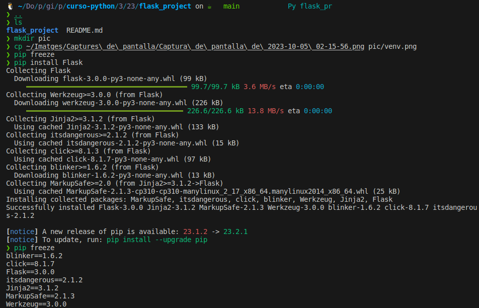

# Entorno virtual

Documento original en inglés: [Virtual Environment](https://github.com/Asabeneh/30-Days-Of-Python/blob/master/23_Day_Virtual_environment/23_virtual_environment.md)

## Ejercicios

1. Crea un directorio de proyecto con un entorno virtual basado en el ejemplo dado arriba.

Solución:

Instalar la herramienta virtualenv con el comando:

```
pip install virtualenv
```

Crear carpeta para proyecto de Flask:
```
mkdir flask_project
```

Crear entorno virtual dentro de la carpeta flask_project:
```
cd flask_project
virtualenv venv
```


El comando `virtualenv venv` crea un nuevo entorno virtual llamado `venv` dentro de la carpeta `flask_project`. 

Activar el entorno virtual:

```
source venv/bin/activate
```

Después de activar el entorno virtual, deberías ver (venv) al principio de la línea de comandos en la terminal. Esto indica que el entorno virtual está activo. En mi caso tengo el nombre del entorno virtual con zsh en la derecha.

Instalar Flask en el entorno virtual:
```
pip install Flask
```

Verificar que se haya instalado correctamente escribiendo el siguiente comando:
```
pip freeze
```


Al terminar se debes desactivar el entorno virtual:
```
deactivate
```

Incluir la carpeta venv en el archivo [.gitignore](.gitignore) para evitar subirla al repositorio remoto.

[<< Day 22](../22_Web_scraping/README.md) | [Day 24 >>](../24_Estadísticas/README.md)
