# Día 3 - Programa un analizador de texto
Los strings en python tienen incorporados más de 30 métodos que nos permiten manipularlos y analizarlos. Aquí veremos algunos de los más importantes.

## Índice
- [Día 3 - Programa un analizador de texto](#día-3---programa-un-analizador-de-texto)
  - [Índice](#índice)
  - [3.1. - Index( )](#31---index-)
  - [3.2. - Substrings](#32---substrings)
  - [3.3. - Métodos para Strings](#33---métodos-para-strings)
    - [3.3.1. - Métodos de análisis](#331---métodos-de-análisis)
    - [3.3.2. - Métodos de transformación](#332---métodos-de-transformación)
    - [3.3.3. - Métodos de separación y unión](#333---métodos-de-separación-y-unión)
  - [3.4. - Strings: propiedades](#34---strings-propiedades)
  - [3.5. - Listas](#35---listas)
  - [3.6. - Diccionarios](#36---diccionarios)
  - [3.7. - Tuples](#37---tuples)
  - [3.8. - sets](#38---sets)
    - [3.8.1. - Métodos set](#381---métodos-set)
  - [3.9. - booleanos](#39---booleanos)
    - [3.9.1. - operadores lógicos](#391---operadores-lógicos)
  - [3.10. - Proyecto del Día 3](#310---proyecto-del-día-3)
  - [Ficheros y documentación del día 3](#ficheros-y-documentación-del-día-3)

## 3.1. - Index( )
Cada carácter de los strings tienen una posición en el índice:

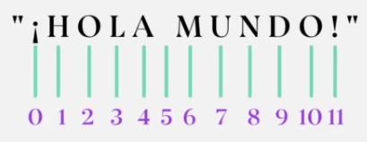

También podemos utilizar el índice reverso, que también empieza por cero pero luego todos los números están al revés con el signo menor.

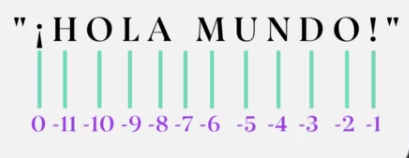

Utilizamos el método index( ) para explorar strings, ya que permite hallar el índice de aparición de un caracter o cadena de caracteres dentro de un texto dado. Sintaxis:

  	string.index(value, start, end)

- *string*: variable que almacena un string
- *value*: caracter(es) | buscado(s)
- *start*: las apariciones antes del índice start se ignoran
- *end*: las apariciones luego del índice end se ignoran

Búsqueda en sentido inverso. Sintaxis:

  	string.rindex(value, start, end)

Devuelve el caracter en el índice i*

  	string[i]

*: En Python, el índice en primera posición es el 0. 

## 3.2. - Substrings

Podemos extraer porciones de texto utilizando las herramientas de manipulación de strings conocidas como slicing (rebanar). Sintaxis:

  	string[start:stop:step]

- *start*: índice de inicio del sub-string (incluido)
- *stop*: índice del final del sub-string (no incluido)
- *step*:	paso

Ejemplos:

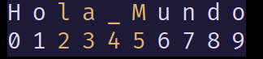

```python
saludo = H o l a _ M u n d o
print(saludo[2:6])
```
    la_M


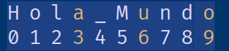

```python
print(saludo[3::3])
```
    auo

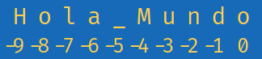

```python
print(saludo[::-1])
```

    odnuM_aloH

## 3.3. - Métodos para Strings

### 3.3.1. - Métodos de análisis
**count( ) **: retorna el número de veces que se repite un conjunto de caracteres especificado.
```python
"Hola mundo".count("Hola")
```

    1

**find( ) e index( )** retornan la ubicación (comenzando desde el cero) en la que se encuentra el argumento indicado. Difieren en que index lanza ValueError cuando el argumento no es encontrado, mientras find retorna
```python
"Hola mundo".find("world")
```

    -1  

**rfind( ) y rindex( )**.Para buscar un conjunto de caracteres pero desde el final.
```python
"C:/python36/python.exe".rfind("/")
```

    11

**startswith( ) y endswith( )** indican si la cadena en cuestión comienza o termina con el conjunto de caracteres pasados como argumento, y retornan True o False en función de ello.
```python
"Hola mundo".startswith("Hola")
```

    True

**isdigit( )**: determina si todos los caracteres de la cadena son dígitos, o
pueden formar números, incluidos aquellos correspondientes a lenguas
orientales.
```python
"abc123".isdigit()
```

    False

**isnumeric( )**: determina si todos los caracteres de la cadena son números, incluye también caracteres de connotación numérica que no necesariamente son dígitos (por ejemplo, una fracción).
```python
"1234".isnumeric()
```

    True

**isdecimal( )**: determina si todos los caracteres de la cadena son decimales; esto es, formados por dígitos del 0 al 9.
```python
"1234".isdecimal()
```

    True

**isalnum( )**: determina si todos los caracteres de la cadena son alfanuméricos.
```python
"abc123".isalnum()
```

    True

**isalpha( )**: determina si todos los caracteres de la cadena son alfabéticos.
```python
"abc123".isalpha()
```

    False

**islower()**: determina si todos los catacteres de la cadena son minúsculas.
```python
abcdef".islower()
```

    True

**isupper()**: determina si todos los catacteres de la cadena son mayúsculas.
```python
"ABCDEF".isupper()
```

    True

**isprintable( )**: determina si todos los caracteres de la cadena son imprimibles (es decir, no son caracteres especiales indicados por \...).
```python
"Hola \t mundo!".isprintable()
```

    False

**isspace( )**: determina si todos los caracteres de la cadena son espacios.
```python
"Hola mundo".isspace()
```

    False

### 3.3.2. - Métodos de transformación

En realidad los strings son inmutables; por ende, todos los métodos a continuación no actúan sobre el objeto original sino que retornan uno nuevo.

**capitalize( )** retorna la cadena con su primera letra en mayúscula.
```python
"hola mundo".capitalize()
```

    'Hola mundo'

**encode( )** codifica la cadena con el mapa de caracteres especificado y retorna una instancia del tipo bytes.
```python
"Hola mundo".encode("utf-8")
```

    b'Hola mundo'

**replace( )** reemplaza una cadena por otra.
```python
"Hola mundo".replace("mundo", "world") 
```

    'Hola world'

**lower( )** retorna una copia de la cadena con todas sus letras en minúsculas.
```python
"Hola Mundo!".lower()
```

    'hola mundo!'

**upper( )** retorna una copia de la cadena con todas sus letras en mayúsculas.
```python
"Hola Mundo!".upper()
```

    'HOLA MUNDO!'

**swapcase( )** cambia las mayúsculas por minúsculas y viceversa.
```python
"Hola Mundo!".swapcase()
```

    'hOLA mUNDO!'

**strip( ), lstrip( ) y rstrip( )** remueven los espacios en blanco que preceden y/o suceden a la cadena.
```python
" Hola mundo! ".strip()
```

    'Hola mundo!'

Los métodos **center( ), ljust( ) y rjust( )** alinean una cadena en el centro, la izquierda o la derecha. Un segundo argumento indica con qué caracter se deben llenar los espacios vacíos (por defecto un espacio en blanco).
```python
	"Hola".center(10, "*")
 ```
 
    '***Hola***'

### 3.3.3. - Métodos de separación y unión
**split( )** divide una cadena según un caracter separador (por defecto son espacios en blanco). Un segundo argumento en split( ) indica cuál es el máximo de divisiones que puede tener lugar (-1 por defecto para representar una cantidad ilimitada).
```python
"Hola mundo!\nHello world!".split()
```

    ['Hola', 'mundo!', 'Hello', 'world!']

**splitlines( )** divide una cadena con cada aparición de un salto de línea.
```python
"Hola mundo!\nHello world!".splitlines()
```

    ['Hola mundo!', 'Hello world!']

**partition( )** retorna una tupla de tres elementos: el bloque de caracteres anterior a la primera ocurrencia del separador, el separador mismo, y el bloque posterior.
```python
"Hola mundo. Hello world!".partition(" ")
```

    ('Hola', ' ', 'mundo. Hello world!')

**rpartition( )** opera del mismo modo que el anterior, pero partiendo de derecha a izquierda.
```python
"Hola mundo. Hello world!".rpartition(" ")
```

    ('Hola mundo. Hello', ' ', 'world!')

**join( )** debe ser llamado desde una cadena que actúa como separador para unir dentro de una misma cadena resultante los elementos de una lista.
```python
", ".join(["C", "C++", "Python", "Java"])
```

    'C, C++, Python, Java


## 3.4. - Strings: propiedades

Esto es lo que debes tener presente al trabajar con strings en Python:
- **Son inmutables**: una vez creados, no pueden modificarse sus partes, pero sí pueden reasignarse los valores de las variables a través de métodos de strings.

  Las variables varian, pero los string son inmutables.

  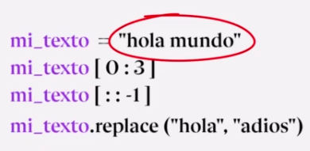

- **Concatenable**: es posible unir strings con el símbolo + 
- **Multiplicable**: es posible concatenar repeticiones de un string con el símbolo * 

  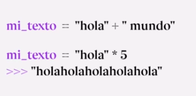

- **Multilineales**: pueden escribirse en varias líneas al encerrarse entre triples comillas simples (''' ''') o dobles (""" """)

  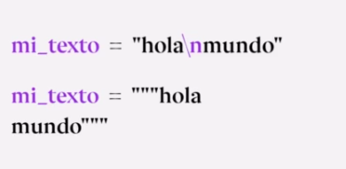

- **Determinar su longitud**: a través de la función len(mi_string)

  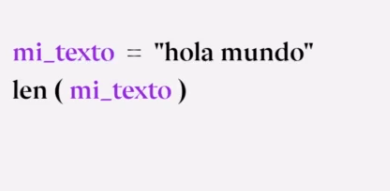

- **Verificar su contenido**: a través de las palabras clave in y not in. El resultado de esta verificación es un booleano (True / False).

  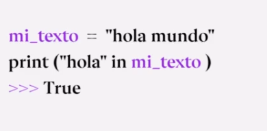

## 3.5. - Listas

Se pueden anidar listas. Se puede analizar y manipularlas, son mutables.

Una lista es de tipo `<class 'list'>`. Se pueden añadir tanto elementos str, int... todos juntos sin conflictos.

Igual que los strings, se puede seleccionar los elementos por su índice como un array:
```python
mi_lista[0:]
```

Se pueden concatenar las listas.
```python
lista_1 = ["C", "C++", "Python", "Java"]
lista_2 = ["PHP", "SQL", "Visual Basic"]
lista_3 = ["d", "a", "c", "b", "e"]
lista_4 = [5, 4, 7, 1, 9]
```

**función append( )**: agrega un elemento a una lista en el lugar
```python
lista_1.append("R")
print(lista_1)
```

    ["C", "C++", "Python", "Java", "R"]

**función pop( )**: elimina un elemento de la lista dado el índice, y devuelve el valor quitado
```python
print(lista_1.pop(4))
```

    "R"

**función sort( )**: ordena los elementos de la lista en el lugar
```python
lista_3.sort()
print(lista_3)
```

    ['a', 'b', 'c', 'd', 'e']

**función reverse( )**: invierte el orden de los elementos en el lugar. *
```python
lista_4.reverse()
print(lista_4)
```

    [9, 1, 7, 4, 5]

## 3.6. - Diccionarios
Los diccionarios son estructuras de datos que almacenan información en pares **clave:valor**. Son especialmente útiles para guardar y recuperar información a partir de los nombres de sus claves (no utilizan índices).

> mutable ✅		ordenado ❌*			admite duplicados❌:✅

```python
mi_diccionario = {"curso":"Python TOTAL","clase":"Diccionarios"}
```

Agregar nuevos datos, o modificarlos:
```python
mi_diccionario["recursos"] = ["notas","ejercicios"]
```

Acceso a valores a través del nombre de las claves
```python
print(mi_diccionario["recursos"][1])
```

    "ejercicios"

Métodos para listar los nombres de:

| Método    | Descripción           |
| --------- | --------------------- |
| keys( )   | las claves            |
| values( ) | los valores           |
| items( )  | los pares clave:valor |

*: A partir de Python 3.7+, los diccionarios son tipos de datos ordenados, en el sentido que dicho orden se mantiene según su orden de inserción para aumentar la eficiencia en el uso de la memoria.

Cuidado, las claves no se pueden repetir.
## 3.7. - Tuples

Los tuples o tuplas, son estructuras de datos que almacenan múltiples elementos en una única variable. Se caracterizan por ser ordenadas e inmutables. Esta característica las hace más eficientes en memoria y a prueba de daños, se procesan más rápido. Si se intentan cambiar devolverá un error.

> Mutable ❌		ordenado ✅		admite duplicados ✅

```python
mi_tuple = (1, "dos", [3.33, "cuatro"], (5.0, 6))
```

**indexado** (acceso a datos)
```python
print(mi_tuple[3][0])
```

      5.0

**casting** (conversión de tipos de datos)
```python
lista_1 = list(mi_tuple)
print(lista_1)
```

    [1, "dos", [3.33, "cuatro"], (5.0, 6)]		# ahora es una estructura mutable
**unpacking** (extracción de datos)
```python
a, b, c, d = mi_tuple
print(c)
```

    [3.33, "cuatro"]

## 3.8. - sets

Los sets son otro tipo de estructuras de datos. Se diferencian de listas, tuplas y diccionarios porque son una colección mutable de elementos inmutables, no ordenados y sin datos repetidos.

> mutable ✅		ordenado  ❌		admite duplicados  ❌

```python
mi_set_a = {1, 2, "tres"}
mi_set_b = {3, "tres"}
```

### 3.8.1. - Métodos set

```python
mi_set_a = {1, 2, "tres"}
mi_set_b = {3, "tres"}
```

**add(item)** agrega un elemento al set
```python
mi_set_a.add(5)
print(mi_set_a)
```

    {1, 2, "tres", 5}

**clear( )** remueve todos los elementos de un set
```python
mi_set_a.clear()
print(mi_set_a)
```

    set()

**copy( )** retorna una copia del set
```python
mi_set_c = mi_set_a.copy()
print(mi_set_c)
```

    {1, 2, "tres"}

**difference(set)** retorna el set formado por todos los elementos que únicamente existen en el set A
```python
mi_set_c = mi_set_a.difference(mi_set_b)
print(mi_set_c)
```

    {1, 2}

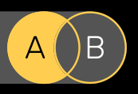

**difference_update(set)** remueve de A todos los elementos comunes a AyB
```python
mi_set_a.difference_update(mi_set_b)
print(mi_set_a)
```

    {1, 2}

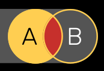

**discard(item)** remueve un elemento del set
```python
mi_set_a.discard("tres")
print(mi_set_a)
```

    {1, 2}

**intersection(set)** retorna el set formado por todos los elementos que existen en A y B simultáneamente.
```python
mi_set_c = mi_set_a.intersection(mi_set_b)
print(mi_set_c)
```

    {'tres'}


**intersection_update(set)** mantiene únicamente los elementos comunes a A y B
```python
mi_set_b.intersection_update(mi_set_a)
print(mi_set_b)
```

    {"tres"}

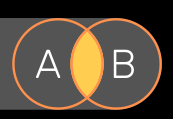

**isdisjoint(set)** devuelve True si A y B no tienen elementos en común
```python
conjunto_disjunto = mi_set_a.isdisjoint(mi_set_b)
print(conjunto_disjunto)
```

    False

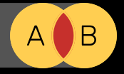

**issubset(set)** devuelve True si todos los elementos de B están presentes en A
```python
es_subset = mi_set_b.issubset(mi_set_a)
print(es_subset)
```

    False

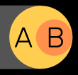

**issuperset(set)** devuelve True si A contiene todos los elementos de B
```python
es_superset = mi_set_a.issuperset(mi_set_b)
print(es_superset)
```

    False

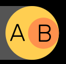

**pop( )** elimina y retorna un elemento al azar del set
```python
aleatorio = mi_set_a.pop()
print(aleatorio)
```

    {2}

**remove(item)** elimina un item del set, y arroja error si no existe
```python
mi_set_a.remove("tres")
print(mi_set_a)
```

    {1, 2}

**symmetric_difference(set)** retorna todos los elementos de A y B, excepto aquellos que son comunes a los dos
```python
mi_set_c = mi_set_b.symmetric_difference(mi_set_a)
print(mi_set_c)
```

    {1, 2, 3}

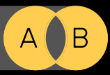

**symmetric_difference_update(set)** elimina los elementos comunes a A y B, agregando los que no están presentes en ambos a la vez
```python
mi_set_b.symmetric_difference_update(mi_set_a)
print(mi_set_b)
```

    {1, 2, 3}


**union(set)** retorna un set resultado de combinar A y B (los datos duplicados se eliminan)
```python
mi_set_c = mi_set_a.union(mi_set_b)
print(mi_set_c)
```

    {1, 2, 3, 'tres'}

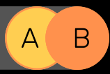

**update(set)** inserta en A los elementos de B
```python
mi_set_a.update(mi_set_b)
print(mi_set_a)
```

    {1, 2, 3, 'tres'}

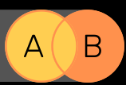

## 3.9. - booleanos

Los booleanos son tipos de datos binarios (True/False), que surgen de operaciones lógicas, o pueden declararse explícitamente.

### 3.9.1. - operadores lógicos

| Operador | Descripción                                  |
| -------- | -------------------------------------------- |
| `==`     | igual a                                      |
| `!=`     | no igual a                                   |
| `>`      | mayor que                                    |
| `<`      | menos que                                    |
| `>=`     | mayor o igual a                              |
| `<=`     | menor o igual a                              |
| `and`    | y (True si dos declaraciones son True)       |
| `or`     | o (True si al menos una declaración es True) |
| `not`    | no (invierte el valor del booleano           |

## 3.10. - Proyecto del Día 3

Analizador de texto.

La consigna es la siguiente: vas a crear un programa que primero le pida al usuario que ingrese un texto. Puede ser un texto cualquiera: un artículo entero, un párrafo, una frase, un poema, lo que quiera. 

Luego, el programa le va a pedir al usuario que también ingrese tres letras a su elección y a partir de ese momento nuestro código va a procesar esa información para hacer cinco tipos de análisis y devolverle al usuario la siguiente información:
1. Primero: ¿cuántas veces aparece cada una de las letras que eligió? Para lograr esto, te recomiendo almacenar esas letras en una lista y luego usar algún método propio de string que nos permita contar cuantas veces aparece un sub string dentro del string. Algo que debes tener en cuenta es que al buscar las letras pueden haber mayúsculas y minúsculas y esto va a afectar el resultado. Lo que deberías hacer para asegurarte de que se encuentren absolutamente todas las letras es pasar, tanto el texto original como las letras a buscar, a minúsculas.
2. Segundo: le vas a decir al usuario cuántas palabras hay a lo largo de todo el texto. Y para lograr esta parte, recuerda que hay un método de string que permite transformarlo en una lista y que luego hay una función que permite averiguar el largo de una lista. 
3. Tercero: nos va a informar cuál es la primera letra del texto y cuál es la última. Aquí claramente echaremos mano de la indexación.
4. Cuarto: el sistema nos va a mostrar cómo quedaría el texto si invirtiéramos el orden de las palabras. ¿Acaso hay algún método que permita invertir el orden de una lista, y otro que permita unir esos elementos con espacios intermedios? Piénsalo.
5. Y por último: el sistema nos va a decir si la palabra “Python” se encuentra dentro del texto. Esta parte puede ser algo complicada de imaginársela, pero te voy a dar una pista: puedes usar booleanos para hacer tu averiguación y un diccionario para encontrar la manera de expresarle al usuario tu respuesta.

## Ficheros y documentación del día 3
- [01_index.py](01_index.py)
- [02_sub_strings.py](02_sub_strings.py)
- [03_metodos.py](03_metodos.py)
- [04_string.py](04_string.py)
- [05_propiedades.py](05_propiedades.py)
- [06_listas.py](06_listas.py)
- [07_diccionarios.py](07_diccionarios.py)
- [08_tuplas.py](08_tuplas.py)
- [09_set.py](09_set.py)
- [10_booleanos.py](10_booleanos.py)
- [11_programa03.py](11_programa03.py)
- [__pycache__](__pycache__)

[Documentación curso](../doc_curso/03_analizador_de_texto/)
