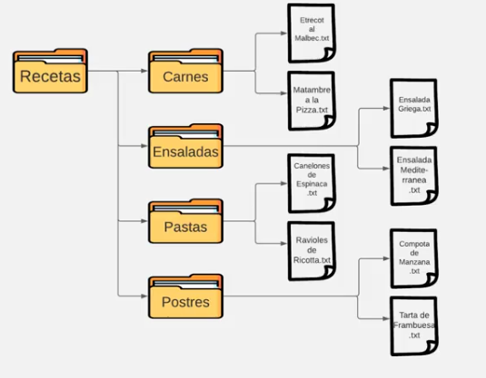

# Día 6 - Programa un recetario

## Índice
- [Día 6 - Programa un recetario](#día-6---programa-un-recetario)
  - [Índice](#índice)
  - [6.1. - Abrir y leer archivos](#61---abrir-y-leer-archivos)
  - [6.2. - Crear y escribir archivos](#62---crear-y-escribir-archivos)
  - [6.3. - Directorios](#63---directorios)
  - [6.4. - pathlib](#64---pathlib)
    - [6.4.1. - Navegación](#641---navegación)
    - [6.4.2. - Algunos métodos y propiedades sobre objetos Path](#642---algunos-métodos-y-propiedades-sobre-objetos-path)
  - [6.5. - Path](#65---path)
  - [6.6. - Limpiar la consola](#66---limpiar-la-consola)
  - [6.7. - Archivos + funciones](#67---archivos--funciones)
  - [6.8. - Proyecto del Día 6](#68---proyecto-del-día-6)
  - [Ficheros y documentación del día 6](#ficheros-y-documentación-del-día-6)

## 6.1. - Abrir y leer archivos

La manipulación de archivos desde Python se engloba bajo las funciones de E/S (entrada/salida) o I/O (en inglés: input/output). Comenzaremos explorando las funciones utilizadas para abrir, leer y cerrar archivos:

- **open(archivo, modo)**: abre un archivo, y devuelve un objeto de tipo archivo sobre el que pueden aplicarse métodos

- **read(bytes)**: devuelve un número especificado de bytes del archivo. De manera predeterminada (sin indicar un valor en el argumento bytes), devolverá el archivo completo (equivalente a escribir -1).

- **readline(bytes)**: devuelve una línea del archivo, limitada por el número indicado en el parámetro tamaño (en bytes).

- **readlines(bytes)**: devuelve una lista que contiene cada una de las líneas del archivo como item de dicha lista. Si el tamaño excede lo indicado en el parámetro bytes, no se devolverán líneas adicionales.

- **close( )**: cierra el archivo abierto, tal que no puede ser leído o escrito luego de cerrado. Es una buena práctica utilizar este método si ya no será necesario realizar acciones sobre un archivo.

Por lo general, un byte equivale a un caracter.

## 6.2. - Crear y escribir archivos

Para escribir en un archivo desde Python, deberemos elegir con cuidado el parámetro "modo de apertura".
```python
open(arhivo, modo)
```

Parámetros de *modo* de apertura:
- **"r"** - Read (Lectura) - Predeterminado. Permite leer pero no escribir, y arroja un error si el archivo no existe. 
- **"a"** - Append (Añadir) - Abre el archivo para añadir líneas a continuación de la última que ya exista en el mismo. Crea un archivo en caso de que el mismo no exista. 
- **"w"** - Write (Escritura) - Abre o crea un archivo (si no existe previamente) en modo de escritura, lo que significa que cualquier contenido previo se sobreescribirá. 
- **"x"** - Create (Creación) - Crea un archivo, y arroja un error si el mismo ya existe en el directorio.

El método **write( )** escribe un texto especificado en el argumento sobre el archivo.

**writelines(lista)** recibe el texto a ser escrito en forma de lista.

## 6.3. - Directorios

Trabajar sobre archivos que se encuentran en directorios diferentes al de nuestro código requiere del soporte del módulo OS, que contiene una serie de funciones para interactuar con el sistema operativo.
```python
import os
```

- **os.getcwd()**: obtiene y devuelve el directorio de trabajo actual. Será el mismo en el que corre el programa si no se ha modificado.
- **os.chdir(ruta)**: cambia el directorio de trabajo a la ruta especificada
- **os.makedirs(ruta)**: crea una carpeta, así como todas las carpetas intermedias necesarias de acuerdo a la ruta especificada.
- **os.path.basename(ruta)**: dada una ruta, obtiene el nombre del archivo (nombre de base)
- **os.path.dirname(ruta)**: dada una ruta, obtiene el directorio (carpeta) que almacena el archivo
- **os.path.split(ruta)**: devuelve una tupla que contiene dos elementos: el directorio, y el nombre de base del archivo.
- **rmdir(ruta)**: elimina el directorio indicado en la ruta.

En Windows, es necesario indicar las rutas con dobles barras invertidas (\\) para que sean correctamente interpretadas por Python.

## 6.4. - pathlib

El módulo pathlib, disponible desde Python 3.4, permite crear objetos Path, generando rutas que pueden ser interpretadas por diferentes sistemas operativos y cuentan con una serie de propiedades útiles.
```python
from pathlib import Path

ruta = Path("C:/Users/Usuario/Desktop")
```

A partir de una semántica sencilla, devuelve una ruta que el sistema puede comprender. Por ejemplo, en Windows, devolverá: C:\Users\Usuario\Desktop y en Mac: C:/Users/Usuario/Desktop

### 6.4.1. - Navegación
```python
ruta = Path("C:/Users/Usuario/Desktop") / "archivo.txt"
```

Es posible concatenar objetos Path y strings con el delimitador "/" para construir rutas completas.

### 6.4.2. - Algunos métodos y propiedades sobre objetos Path

- **read_text( )**: lee el contenido del archivo sin necesidad de abrirlo y cerrarlo
- **name**: devuelve el nombre y extensión del archivo
- **suffix**: devuelve la extensión del archivo (sufijo)
- **stem**: devuelve el nombre del archivo sin su extensión (sufijo)
- **exists( )**: verifica si el directorio o archivo al que referencia el objeto Path existe y devuelve un booleano de acuerdo al resultado (True/False)

## 6.5. - Path

La clase Path permite representar rutas de archivos en el sistema de archivos de nuestro sistema operativo. Se destaca por su legibilidad frente a alternativas semejantes.

*base = Path.home()*   → Devuelve un objeto Path representando el directorio base del usuario
```python
ruta = Path(base, "Europa", "Barcelona", "SagradaFamilia.txt")
```

Se aceptan strings y otros objetos Path
```python
ruta2 = ruta.with_name("LaPedrera.txt")
```

Devuelve un nuevo objeto Path cambiando únicamente el nombre de archivo

Cada invocación de la propiedad parent devuelve la ruta de jerarquía inmediata superior
```shell
C:\Users\...
|_ Europa
  |_Barcelona
     |_SagradaFamilia.txt
     |_LaPedrera.txt
```

```python
continente = ruta.parent.parent
print(continente)
```

    C:\Users\...\Europa

Devuelve el conjunto de archivos que coinciden con el "patrón"
```python
Path(ruta).glob("*.txt")
Path(ruta).glob("**/*.txt")
```

Búsqueda recursiva en subdirectorios

## 6.6. - Limpiar la consola

Para controlar la información mostrada al usuario en consola podemos limpiarla, eliminando los diferentes mensajes que han aparecido conforme se va ejecutando el programa.
```python
from os import system
```

En Unix/Linux/MacOS:
```python
system("clear")
```

En DOS/Windows:
```python
system("cls")
```

## 6.7. - Archivos + funciones

**Recordatorio**: puedes crear funciones para que ejecuten código cada vez que sean invocadas, evitando repeticiones y facilitando su lectura. Esto aplica para todo Python, y desde luego también cuando manipulamos archivos.

¿Qué hace la función?	   -     ¿Qué información necesita recibir?

```python
def manipular_archivo(ruta, nombre_archivo):

	# Código que convierte las entradas en salidas
	return
```
¿Cuál debe ser su salida?

## 6.8. - Proyecto del Día 6

Vas a crear un administrador de recetas. Básicamente esto es un programa a través del cual un usuario puede leer, crear y eliminar recetas que se encuentren en una base de datos.

Entonces, antes de comenzar, es necesario que crees en tu ordenador un directorio en la carpeta base de tu ordenador, con una carpeta llamada Recetas, que contiene cuatro carpetas y cada una de ellas contiene dos archivos de texto. Dentro de los archivos puedes escribir lo que quieras, puede ser la receta en sí misma o no, pero eso no es importante para este ejercicio. Lo importante es que escribas algo para poder leerlas cuando haga falta o, si prefieres, también puedes directamente descargar y descomprimir el archivo adjunto a esta elección y ubicarlo en tu directorio raíz si no tienes ganas de crearlo tú mismo.



Aquí viene la consigna: tu código le va a dar primero la bienvenida al usuario, le va a informar la ruta de acceso al directorio donde se encuentra nuestra carpeta de recetas, le va a informar cuántas recetas hay en total dentro de esa carpeta, y luego le va a pedir que elija una de estas opciones que tenemos aquí:

1. La opción 1 le va a preguntar qué categoría elige (carnes, ensaladas, etc.), y una vez que el usuario elija una, le va a preguntar qué receta quiere leer, y mostrar su contenido.
2. En la opción 2 también se le va a hacer elegir una categoría, pero luego le va a pedir que escriba el nombre y el contenido de la nueva receta que quiere crear, y el programa va a crear ese archivo en el lugar correcto.
3. La opción 3 le va a preguntar el nombre de la categoría que quiere crear y va a generar una carpeta nueva con ese nombre.
4. La opción 4, hará todo lo mismo que la opción uno, pero en vez de leer la receta, la va a eliminar.
5. La opción 5, le va a preguntar qué categoría quiere eliminar
6. Finalmente, la opción 6 simplemente va a finalizar la ejecución del código.

Este programa tiene algunas cuestiones importantes a considerar:
- Cada vez que el usuario realice exitosamente cualquiera de sus opciones, el programa le va a pedir que presione alguna letra para poder volver al inicio, por lo que el código se va a repetir una y otra vez, hasta que el usuario elija la opción 6. Esto implica que todo el menú debe estar dentro de un loop while que se repita una y otra vez hasta que no se cumpla la condición de que la elección del usuario sea 6
- Sería genial que cada vez que el usuario vuelva al menú inicial, la consola limpie la pantalla para que no se acumulen las ejecuciones anteriores. Recuerda que cuentas con system para poder reiniciar la pantalla y comenzar a mostrar todo desde cero.
- Si bien te he enseñado muchos métodos para administrar archivos, para este ejercicio vas a necesitar algunos que aún no has visto, pero que están incluidos en los objetos con los que hemos estado trabajando, por lo que en ocasiones deberás buscar entre los métodos que trae Path, por ejemplo, leer la documentación y aprender a implementarlo. Yo sé que sería mucho más fácil que yo te enseñe todo acerca de cada uno de los métodos, pero recuerda que también es importante que a medida que avanzamos vayas aprendiendo a gestionar tu propio aprendizaje. Es parte de la vida real y cotidiana del programador en el mundo en que vivimos.
- Utiliza muchas funciones, todas las que creas necesario. Las funciones ayudan a compartir, mentalizar el código y hacerlo mucho más dinámico, ordenado, repetible y más fácil de mantener.
- Recuerda comenzar con un diagrama de flujos o un gráfico hecho a mano que te permita visualizar con más facilidad el árbol de decisiones que necesitas ejecutar en tu código. Sin eso te vas a enredar más rápido de lo que crees y se te va a complicar bastante.
- Y, por último, no te frustres si no logras hacerlo o completarlo. Si logras hacer una parte, un par de funciones, algunas cosas sí y otras no, está muy bien. Siempre estamos aprendiendo y parte de aprender es no saber.

Mis desafíos siempre te van a estar ubicando en el borde de tus capacidades, sacándote del lugar de confort para que tu cerebro tenga que desconcertarse y descubrir cómo hacer algo nuevo. Tu avanza hasta donde puedas.

## Ficheros y documentación del día 6
- [01_abrir_manipular_archivos.py](01_abrir_manipular_archivos.py)
- [02_crear_escribir_archivos.py](02_crear_escribir_archivos.py)
- [03_directorios.py](03_directorios.py)
- [04_pathlib.py](04_pathlib.py)
- [05_path.py](05_path.py)
- [06_limpiar_consola.py](06_limpiar_consola.py)
- [07_programa06.py](07_programa06.py)
- [Europa](Europa/)
- [prueba.txt](prueba.txt)
- [Recetas](Recetas/)
- [Recetas.zip](Recetas.zip)

Documentación curso: [06_recetario](../doc_curso/06_recetario/)
