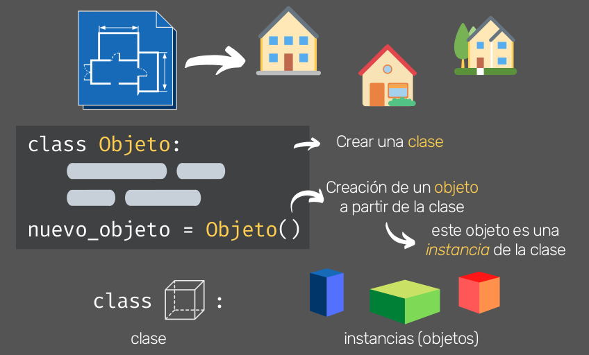
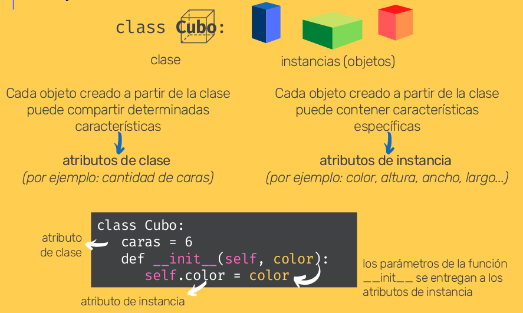
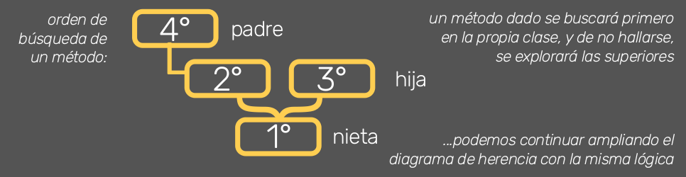

# Día 7 - Programa una cuenta bancaria
Principios de la programación orientada a objetos (POO):
- Herencia
- Polimorfismo
- Cohesión
- Abstracción
- Acoplamiento
- Encapsulamiento
## Índice
- [Día 7 - Programa una cuenta bancaria](#día-7---programa-una-cuenta-bancaria)
  - [Índice](#índice)
  - [7.1. - Clases](#71---clases)
  - [7.2. - Atributos](#72---atributos)
  - [7.3. - Métodos](#73---métodos)
  - [7.4. - Tipos de métodos](#74---tipos-de-métodos)
  - [7.5. - Herencia](#75---herencia)
  - [7.6. - Herencia extendida](#76---herencia-extendida)
  - [7.7. - Polimorfismo](#77---polimorfismo)
  - [7.8. - Pilares de la Programación Orientada a Objetos](#78---pilares-de-la-programación-orientada-a-objetos)
  - [7.9. - Métodos especiales](#79---métodos-especiales)
  - [7.10. - Proyecto del Día 7](#710---proyecto-del-día-7)
  - [Ficheros y documentación](#ficheros-y-documentación)

## 7.1. - Clases

Python es un lenguaje de Programación Orientado a Objetos (POO). Como tal, utiliza y manipula objetos, a través de sus métodos y propiedades. Las clases son las herramientas que nos permiten crear objetos, que "empaquetan" datos y funcionalidad juntos.
Podemos pensar a las clases como el "plano" o "plantilla" a partir del cual podemos crear objetos individuales, con propiedades y métodos asociados:



Las clases se definen con la palabra reservada `class`, seguida del nombre de la clase, y dos puntos. Por convención, los nombres de las clases se escriben con la primera letra en mayúscula, y el resto en minúsculas. Por ejemplo, `MiClase`.

## 7.2. - Atributos

Los atributos son variables que pertenecen a la clase. Existen **atributos de clase** (compartidos por todas las instancias de la clase), **y de instancia** (que son distintos en cada instancia de la clase).



Todas las clases tienen una función que se ejecuta al instanciarla, llamada `__init__()`, y que se utiliza para asignar valores a las propiedades del objeto que está siendo creado. self: representa a la instancia del objeto que se va a crear.

## 7.3. - Métodos

Los objetos creados a partir de clases también contienen métodos. Dicho de otra manera, los métodos son funciones que pertenecen al objeto.
```python
class Persona:
  especie = "humano"
  def __init__(self, nombre, edad):
    self.nombre = nombre
    self.edad = edad
  def saludar(self):
    print(f'Hola, mi nombre es {self.nombre}')
  def cumplir_anios(self, estado_humor):
    print(f'Cumplir {self.edad + 1} años me pone {estado_humor}')

juan = Persona("Juan", 37)

juan.saludar()

juan.cumplir_anios("feliz")
```

    Hola, mi nombre es Juan
    Cumplir 38 años me pone feliz

Cada vez que un atributo del objeto sea invocado (por ejemplo, en una función), debe incluirse self, que refiere a la instancia en cuestión, indicando la pertenencia de este atributo.

## 7.4. - Tipos de métodos

Los métodos estáticos y de clase anteponen un decorador específico, que indica a Python el tipo de método que se estará definiendo 

|                                              |                      |   @classmethod   |   @staticmethod   |
| -------------------------------------------: | :------------------: | :--------------: | :---------------: |
|                                              | Métodos de instancia | Métodos de clase | Métodos estáticos |
|    Acceso a métodos y atrbitutos de la clase |          Sí          |        Sí        |        No         |
|                       Requiere una instancia |          Sí          |        No        |        No         |
| Acceso a métodos y atributos de la instancia |          Sí          |        No        |        No         |


Así como los métodos de instancia requieren del parámetro **self** para acceder a dicha instancia, los métodos de clase requieren del parámetro **cls** para acceder a los atributos de clase. Los métodos estáticos, dado que no pueden acceder a la instancia ni a la clase, no indican un parámetro semejante.

Resumen sobre Decoradores:
- **Métodos de instancia**:
  ```python
  def mi_metodo(self):
		print('algo')
	mi_metodo
  ```
  - Acceden y modifican atributos del objeto.
  - Acceden a otro métodos.
  - Pueden modificar el estado de la clase.

- **Métodos de clase** - *@classmethod*:
  ```python
	def mi_metodo(cls):
		print('algo')
  ```

  - No están asociados a las instancias de la clase, sino a la clase en si misma
  - Pueden ser llamados desde la instancia y desde la clase
  - No pueden acceder a los atributos de instancia pero si a los de la clase

- **Métodos estáticos** - *@staticmethod*:  
  ```python
  def mi_metodo():
    print('algo')
  ```
  
  - No acepta como parámetro ni self ni cls
  - No pueden modificar ni el estado de la clase ni de la instancia
  - Pueden aceptar parámetros de entrada


## 7.5. - Herencia

La herencia es el proceso mediante el cual una clase puede tomar métodos y atributos de una clase superior, evitando repetición del código cuando varias clases tienen atributos o métodos en común. 
Es posible crear una clase "hija" con tan solo pasar como parámetro la clase de la que queremos heredar:
```python
class Personaje:
  def __init__(self, nombre, herramienta):
    self.nombre = nombre
    self.arma = arma

class Mago(Personaje):
  pass
hechicero = Mago("Merlín", "caldero")
```

Una clase "hija" puede sobreescribir los métodos o atributos, así como definir nuevos, que sean específicos para esta clase.

## 7.6. - Herencia extendida

Las clases "hijas" que heredan de las clases superiores, pueden crear nuevos métodos o sobrescribir los de la clase "padre". Asimismo, una clase "hija" puede heredar de una o más clases, y a su vez transmitir herencia a clases "nietas".

Si varias superclases tienen los mismos atributos o métodos, la subclase sólo podrá heredar de una de ellas. En estos casos Python dará prioridad a la clase que se encuentre más a la izquierda.

Del mismo modo, si un mismo método se hereda por parte de la clase "padre", e "hija", la clase "nieta" tendrá preferencia por aquella más próxima ascendente (siguiendo nuestro esquema, la tomará de la clase "hija").



**`Clase.__mro__`** - devuelve el orden de resolución de métodos

**`super().__init__(arg1, arg2,...)`** - hereda atributos de las superclases de manera compacta

## 7.7. - Polimorfismo

El polimorfismo es el pilar de la POO mediante el cual un mismo método puede comportarse de diferentes maneras según el objeto sobre el cual esté actuando, en función de cómo dicho método ha sido creado para la clase en particular.

El método len( ) funciona en distintos tipos de objetos: listas, tuplas, strings, entre otros. Esto se debe a que para Python, lo importante no son los tipos de objetos, sino lo que pueden hacer: sus métodos.
```python
class Perro:
  def hablar(self):
    print("Guau!")

class Gato:
  def hablar(self):
    print("Miau!")

hachiko = Perro()

garfield = Gato()

for animal in [hachiko, garfield]:
  animal.hablar()
```

	  Guau!
	  Miau!

## 7.8. - Pilares de la Programación Orientada a Objetos
Se ha visto Herencia y Polimorfismo en las prácticas anteriores. Información conceptual del resto:
- Cohesión: https://escueladirecta-blog.blogspot.com/2021/09/cohesion-pilares-de-la-programacion.html 
- Acoplamiento: https://escueladirecta-blog.blogspot.com/2021/10/acoplamiento-pilares-de-la-programacion.html 
- Abstracción: https://escueladirecta-blog.blogspot.com/2021/10/abstraccion-pilares-de-la-programacion.html 
- Encapsulamiento: https://escueladirecta-blog.blogspot.com/2021/10/encapsulamiento-pilares-de-la.html 

## 7.9. - Métodos especiales

Puedes encontrarlos con el nombre de métodos mágicos o dunder methods (del inglés: dunder = double underscore, o doble guión bajo). Pueden ayudarnos a sobrescribir métodos incorporados de Python sobre nuestras clases para controlar el resultado devuelto.
```python
class Libro: 
  def __init__(self, autor, titulo, cant_paginas):
    self.autor = autor
    self.titulo = titulo
    self.cant_paginas = cant_paginas

  def __str__(self):
    return f'Título: "{self.titulo}", escrito por {self.autor}'

  def __len__(self):
    return self.cant_paginas

libro1 = Libro("Stephen King", "It", 1032)

print(str(libro1))

print(len(libro1))
```

    Título: "It", escrito por Stephen King
    1032

## 7.10. - Proyecto del Día 7

Crear un código que le permita a una persona realizar operaciones en su cuenta bancaria. No te asustes que la consigna va a estar bien definida para que puedas hacerlo en poco tiempo.

Primero vas a crear una clase llamada Persona, y Persona va a tener solo dos atributos: nombre y apellido. Luego, vas a crear una segunda clase llamada Cliente, y Cliente va a heredar de Persona, porque los clientes son personas, por lo que el Cliente va a heredar entonces los atributos de Persona, pero también va a tener atributos propios, como número de cuenta y balance, es decir, el saldo que tiene en su cuenta bancaria.

Pero eso no es todo: Cliente también va a tener tres métodos. El primero va a ser uno de los métodos especiales y es el que permite que podamos imprimir a nuestro cliente. Este método va a permitir que cuando el código pida imprimir Cliente, se muestren todos sus datos, incluyendo el balance de su cuenta. Luego, un método llamado Depositar, que le va a permitir decidir cuánto dinero quiere agregar a su cuenta. Y finalmente, un tercer método llamado Retirar, que le permita decidir cuánto dinero quiere sacar de su cuenta.

Una vez que hayas creado estas dos clases, tienes que crear el código para que tu programa se desarrolle, pidiéndole al usuario que elija si quiere hacer depósitos o retiros. El usuario puede hacer tantas operaciones como quiera hasta que decida salir del programa. Por lo tanto, nuestro código tiene que ir llevando la cuenta de cuánto dinero hay en el balance, y debes procurar, por supuesto, que el cliente nunca pueda retirar más dinero del que posee. Esto no está permitido.

Recuerda que ahora que sabes crear clases y objetos que son estables y que retienen información, no necesitas crear funciones que devuelvan el balance, ya que la instancia de cliente puede saber constantemente cuál es su saldo debido a que puede hacer sus operaciones llamando directamente a este atributo y no a una variable separada.

Para que tu programa funcione, puedes organizar tu código como quieras, hay muchas formas de hacerlo, pero mi recomendación es que básicamente, luego de crear las dos clases que te he mencionado, crees dos funciones una que se encarguen de crear al cliente pidiéndole al usuario toda la información necesaria y devolviendo, a través del return, un objeto cliente ya creado.

La otra función (que puede llamarse inicio, o algo por el estilo), es la función que organiza la ejecución de todo el código: primero llama a la función “crear cliente” y luego se encarga de mantener al usuario en un loop que le pregunte todo el tiempo si quiere depositar, retirar o salir del programa y demostrarle el balance, cada vez que haga una modificación.

Para que este programa no se te haga súper largo o complejo, te propongo que esta vez no nos fijemos tanto en los controles, para ver si el usuario ha puesto opciones permitidas o no, si ha puesto números o no, si ha puesto mayúsculas o minúsculas, y creemos el código confiando en que el usuario va a ingresar siempre información apropiada. Por supuesto que si tú prefieres incluir todos esos controles, está genial.

## Ficheros y documentación

- [01_clases.py](01_clases.py)
- [02_atributos.py](02_atributos.py)
- [03_metodos.py](03_metodos.py)
- [04_tipos_metodos.py](04_tipos_metodos.py)
- [05_herencia.py](05_herencia.py)
- [06_herencia_extendida.py](06_herencia_extendida.py)
- [07_polimorfismo.py](07_polimorfismo.py)
- [08_metodos_especiales.py](08_metodos_especiales.py)
- [09_programa07.py](09_programa07.py)

[Documentación del curso](../doc_curso/07_cuenta_bancaria/)
