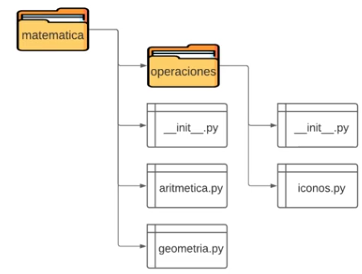

# Día 8 - Programa una consola de turnos

## Índice
- [Día 8 - Programa una consola de turnos](#día-8---programa-una-consola-de-turnos)
  - [Índice](#índice)
  - [8.1. - Instalar paquetes](#81---instalar-paquetes)
  - [8.2. - Módulos y paquetes](#82---módulos-y-paquetes)
  - [8.3. - Manejo de errores](#83---manejo-de-errores)
  - [8.4. - pylint](#84---pylint)
  - [8.5. - unittest](#85---unittest)
  - [8.6. - Decoradores](#86---decoradores)
  - [8.7. - Generadores](#87---generadores)
  - [8.8. - Proyecto del Día 8](#88---proyecto-del-día-8)
  - [Ficheros y documentación](#ficheros-y-documentación)

## 8.1. - Instalar paquetes

Una de las grandes ventajas de Python como lenguaje de programación, es que cuenta con un amplia comunidad activa, que desarrolla paquetes que añaden muchas más funcionalidades.

PyPi (Python Package Index) es el repositorio de referencia para hallar paquetes desarrollados por la comunidad. https://pypi.org/ 

Si ya conoces el nombre del módulo que quieres instalar, puedes obtenerlo de PyPi directamente desde la consola:
```shell
pip install <modulo>
```

También podrás actualizar los módulos que ya tengas instalados añadiendo --upgrade luego del nombre del paquete:
```shell
pip install <modulo> --upgrade
```

No dejes de utilizar Google para investigar nuevos paquetes y sus funcionalidades.

## 8.2. - Módulos y paquetes

Los módulos no son más que archivos .py, que almacenan funciones, variables y clases, y pueden ser importado por otros. Los paquetes agrupan estos módulos en carpetas, de los cuales uno debe ser `__init__.py`

Importar un módulo:
```python
import modulo1
```

Importar una función del módulo:
```python
from modulo1 import funcion
```

Ejecutar desde la consola
```shell
C:\... ruta> 	python modulo1.py
```

Importar un módulo de un (sub) paquete
```python
from paquete.subpaquete import modulo3
 ```

Todos los paquetes, para ser considerados como tales, deben contar con un archivo __init__.py (constructor)



## 8.3. - Manejo de errores
Existen estrategias para capturar y gestionar los errores que pueden presentarse al ejecutar un programa, a fines de evitar una falla mayor y controlar la información que es mostrada al usuario.
```python
try:
```

El código que se encuentra dentro de try se ejecuta hasta finalizar o hasta que se presenta un error (excepción)
```python
except:
```

Contiene el manejador de errores (respuesta del programa ante un error), atrapando las excepciones que se presentan durante la ejecución de try*
```python
else:
```

Engloba el código que se ejecutará únicamente cuando ninguna excepción haya sido detectada en la ejecución de try (sin errores) 
```python
finally:
```

Contiene código que se ejecuta siempre, se hayan presentado o no errores. *


Es buena práctica capturar y manejar las excepciones posibles individualmente y brindar  información acerca del error y su possible solución.
```python
except ValueError:
except TypeError:
except FileNotFoundError:
...
```

Documentación python de errores: https://docs.python.org/es/3/library/exceptions.html 

## 8.4. - pylint

Pylint es un verificador de código, errores y calidad para Python, siguiendo el estilo recomendado por PEP 8, la guía de estilo de Python. Es de gran utilidad en el trabajo en equipo.
```shell
pip install pylint
```

Ejecutar desde la consola:
```shell
	ruta> 		pylint modulo1.py -r y
```
archivo de Python a evaluar

Al ejecutarse, Pylint devuelve un reporte con las características que fueron evaluadas, errores y puntuaciones parciales
```shell
Your code has been rated at 6.67/10
```

A mayor puntaje, mayor será la calidad de tu código. Un umbral aceptable será >= 7.00/10

## 8.5. - unittest

Unit Testing es un método o herramienta utilizado en programación para determinar si un módulo o un conjunto de módulos de código funciona correctamente. Dicha evaluación se realiza en un archivo independiente. En Python, se implementa desde el módulo incorporado unittest.
```python
import unittest
import mimodulo

class NombrePrueba(unittest.TestCase):

  def test_prueba(self):
    primer_valor = {algo}
    segundo_valor = {salida de mimodulo.funcion}
    self.assertEqual(primer_valor, segundo_valor, mensaje)

if __name__ == '__main__':
  unittest.main()
```

Los primeros dos argumentos de assertEqual son dos valores que se comparan para establecer si hay igualdad entre ellos. Por eso, uno debe obtenerse a partir de una función del módulo evaluado, y otro ser la salida esperada para una misma entrada de información que en el primer caso. El tercer parámetro (mensaje), contendrá un string con información que se mostrará al usuario en caso de que el test falle.

Antes incluso de ejecutar el código, Python lee el archivo para definir algunas variables globales. Una de ellas es `__name__`, que toma el nombre "`__main__`" en caso que Python esté corriendo en dicho módulo de manera individual. Si por el contrario, el módulo fuera importado, la variable `__name__` toma el nombre del módulo. Este bloque de código evalúa que la prueba se esté ejecutando directamente.

## 8.6. - Decoradores

Los decoradores son patrones de diseño en Python utilizados para dar nueva funcionalidad a objetos (funciones), modificando su comportamiento sin alterar su estructura: **son funciones que modifican funciones**.

Las funciones en Python soportan operaciones tales como ser asignadas a una variable, pasadas como argumento, y ser devueltas por otra función como resultado.

También, es posible definir funciones dentro de funciones, sin que estén disponibles fuera de la función dentro de la cual fueron definidas.

Los decoradores permiten que una función se modifique ante determinados escenarios, sin duplicar código.
```python
def mostrar_informacion(funcion):		> Función como parámetro de una función

  def interior():				> Definición de una función dentro de otra
    print(f'Ejecutando la función {funcion.__name__}')
    funcion()
    print('Ejecución finalizada')

  return interior			> Función que devuelve otra función como resultado

def impresion():
  print("Hola Mundo")

funcion_decorada = mostrar_informacion(impresion) # Se asigna una función a una variable

funcion_decorada()					    # Ejecución de función decorada
```

    Ejecutando la función impresion
    Hola Mundo
    Ejecución finalizada> Funcionalidad extendida

## 8.7. - Generadores

Los generadores son tipos especiales de funciones que devuelven un iterador que no almacena su contenido completo en memoria, sino que "demora" la ejecución de una expresión hasta que su valor se solicita.
```python
def secuencia_infinita():

  num = 0
  while True:

    yield num

    num += 1
```

Dado que un ordenador no cuenta con memoria infinita, no podría generarse una secuencia de números sin límite sin la ayuda de un generador.

Lo mismo ocurre con datos que, sin ser infinitos, ocuparían demasiado espacio en memoria de almacenarse repentinamente.
```python
generador = secuencia_infinita()
print(next(generador))
print(next(generador))
print(next(generador))
```

	  0
	  1
	  2

## 8.8. - Proyecto del Día 8

El desafío de hoy, es que crees un software que funcione como el turnero de una farmacia.

En nuestro caso, vas a crear el tunero para una farmacia que tiene tres áreas de atención: perfumería, farmacia (que es donde venden los medicamentos), y cosméticos. Tu programa le tiene que preguntar al cliente a cuál de las áreas desea dirigirse, y le va a dar un número de turno según a qué área se dirija. Por ejemplo, si elige cosmética le va a dar el número C-54 (“C” de cosmética). Luego de eso, nos va a preguntar si queremos sacar otro turno. Esto, en realidad, es para simular si viene un nuevo cliente. Y repetirá todo el proceso.

Algunas cosas a tener en cuenta:

Los diferentes clientes van a ir sacando turnos para diferentes áreas (perfumería, farmacia, cosmética), en diferentes órdenes, por lo que el sistema debe llevar la cuenta de cuántos turnos ha dado para cada una de esas áreas, y producir el siguiente número de cada área a medida que se lo pida. ¿No te parece genial aprovechar la eficiencia de los generadores para poder hacer esto?

Por otro lado, el mensaje donde le comunicamos el número de espera al cliente, debería tener algo de texto adicional antes y después del número. Por ejemplo, “su turno es (-el número de turno con el del comienzo-)”, y luego algo así como “aguarde y será atendido”. Para que nuestro código no se repita, en vez de poner ese texto en cada una de las funciones que calculen los números, podemos aprovechar la flexibilidad de los decoradores para crear ese texto adicional una sola vez, y luego envolver a cualquiera de nuestras funciones con ese texto único.

Finalmente, deberías aprovechar que ahora ya sabes dividir tu programa en diferentes módulos, y entonces separar el código en dos partes: por un lado, un módulo que se puede llamar **números.py**, en el que vas a escribir todos los generadores y el decorador, y un segundo módulo que podemos llamar **principal.py**, donde vas a escribir las funciones que administran el funcionamiento del programa (como las instrucciones para elegir un área y para decidir si seguirá tomando nuevos turnos o si va a finalizar el programa). Recuerda que vas a necesitar importar el contenido de numeros.py dentro de principal.py para poder disponer de sus funciones.

## Ficheros y documentación
- [01_pruebas_modulos](01_pruebas_modulos/)
- [02_pruebas_paquete](02_pruebas_paquete/)
- [03_manejo_errores.py](03_manejo_errores.py)
- [04_probando_pylint.py](04_probando_pylint.py)
- [05_probando_pylint](05_probando_pylint/)
- [06_probando_unittest](06_probando_unittest/)
- [07_decoradores.py](07_decoradores.py)
- [08_generadores.py](08_generadores.py)
- [09_programa08](09_programa08/)

[Documentación del curso](../doc_curso/08_consola_turnos/)
