# APUNTES PYTHON Y CHATGPT


## Índice


[TEMA 1 - Introducción a ChatGPT y sus aplicaciones](#tema-1---introducción-a-chatgpt-y-sus-aplicaciones)
- [APUNTES PYTHON Y CHATGPT](#apuntes-python-y-chatgpt)
  - [Índice](#índice)
  - [TEMA 1 - Introducción a ChatGPT y sus aplicaciones](#tema-1---introducción-a-chatgpt-y-sus-aplicaciones)
    - [1.1. - ¿Qué es ChatGPT?](#11---qué-es-chatgpt)
    - [1.2. - ¿Cómo funciona?](#12---cómo-funciona)
    - [1.3. - Arquitectura](#13---arquitectura)
    - [1.4. - Casos de uso](#14---casos-de-uso)
  - [TEMA 2 - Configuración y Autenticación con la API de OpenAI](#tema-2---configuración-y-autenticación-con-la-api-de-openai)
    - [2.1. - Pasos para autenticarse a ChatGPT](#21---pasos-para-autenticarse-a-chatgpt)
    - [2.2. - Instalar y configurar las bibliotecas para OpenAI](#22---instalar-y-configurar-las-bibliotecas-para-openai)
    - [2.3. - Descripción y documentación de las bibliotecas](#23---descripción-y-documentación-de-las-bibliotecas)
  - [TEMA 3 - Interactuar con ChatGPT usando Python](#tema-3---interactuar-con-chatgpt-usando-python)
    - [3.1. - Realizar peticiones básicas a chatgpt](#31---realizar-peticiones-básicas-a-chatgpt)
  - [3.2. - Personalización de las peticiones de ChatGPT](#32---personalización-de-las-peticiones-de-chatgpt)
    - [3.2.1. - Temperatura (creatividad)](#321---temperatura-creatividad)
    - [3.2.2. - Tokens máximos (largo)](#322---tokens-máximos-largo)
    - [3.2.3. - Cantidad de respuestas](#323---cantidad-de-respuestas)
  - [3.3. - Procesar y analizar las respuestas de chatgpt](#33---procesar-y-analizar-las-respuestas-de-chatgpt)
    - [3.3.1. - Analizar la respuesta](#331---analizar-la-respuesta)
    - [3.3.2. - Utilizar la información extraída](#332---utilizar-la-información-extraída)
  - [TEMA 4 - Aplicaciones Prácticas de Python + ChatGPT](#tema-4---aplicaciones-prácticas-de-python--chatgpt)
    - [4.1. - Chatbot básico](#41---chatbot-básico)
    - [4.2. - Mantener contexto de las conversaciones](#42---mantener-contexto-de-las-conversaciones)
    - [4.3. - Generación de contenido y resúmenes automáticos](#43---generación-de-contenido-y-resúmenes-automáticos)
    - [4.4. - Análisis de sentimiento y clasificaciones](#44---análisis-de-sentimiento-y-clasificaciones)
    - [4.5. - Traducción](#45---traducción)
  - [TEMA 5 - Otras consideraciones para la integración](#tema-5---otras-consideraciones-para-la-integración)
    - [5.1. - Filtrar respuestas – Palabras prohibidas](#51---filtrar-respuestas--palabras-prohibidas)
    - [5.2. - Verificar respuestas – Relevancia](#52---verificar-respuestas--relevancia)
      - [5.2.1. - Calcular similitudes](#521---calcular-similitudes)
      - [5.2.2. - Vectorizar los valores](#522---vectorizar-los-valores)
      - [5.2.3. - Interceptar la respuesta](#523---interceptar-la-respuesta)

## TEMA 1 - Introducción a ChatGPT y sus aplicaciones
### 1.1. - ¿Qué es ChatGPT?

ChatGPT es un modelo de lenguaje desarrollado por OpenAI, basado en la arquitectura GPT-3.5. GPT significa Generatice Pre-trained Tranformer (Transformador Generativo Pre-enternado). Es un sistema de procesamiento del lenguaje natural (NLP) capaz de generar respuestas coherentes y contextualmente relevantes a partir de las entradas de texto que recibe. Utiliza el aprendizaje automático y está entrenado en una amplia variedad de datos textuales para comprender y generar texto en lenguaje natural.

### 1.2. - ¿Cómo funciona?

El funcionamiento de ChatGPT se basa en un enfoque llamado "aprendizaje automático" o "aprendizaje profundo". El modelo GPT-3.5, en el que se basa ChatGPT, es una red neuronal profunda que ha sido entrenada en una enorme cantidad de datos textuales para aprender patrones y características del lenguaje humano.

Cuando se le proporciona una entrada de texto, como una pregunta o una declaración, ChatGPT descompone el texto en unidades más pequeñas, como palabras o tokens. Luego, analiza el contexto de las palabras y utiliza esa información para generar una respuesta relevante. El modelo se entrena para predecir la siguiente palabra o el siguiente token en una secuencia de texto, dada la secuencia anterior.

ChatGPT tiene una estructura en capas. Cada capa procesa y extrae información del texto de entrada de manera gradual y compleja. A medida que la información se mueve a través de las capas, se capturan representaciones cada vez más abstractas y significativas del texto.

Es importante tener en cuenta que ChatGPT se basa en la información con la que ha sido entrenado y no tiene conocimiento directo del mundo real fuera de los datos que se le han proporcionado durante su entrenamiento. Además, aunque ChatGPT puede generar respuestas coherentes y contextuales, también es posible que ocasionalmente genere respuestas incorrectas o no adecuadas, por lo que siempre se debe usar con cautela y verificar la información en caso de duda.

### 1.3. - Arquitectura

La arquitectura subyacente de ChatGPT se basa en la versión GPT-3.5 de OpenAI, que es una red neuronal de transformador. Un transformador es un tipo de arquitectura de aprendizaje profundo que ha demostrado excelentes resultados en tareas de procesamiento del lenguaje natural.

El transformador consta de múltiples capas de atención y alimentación hacia adelante. Cada capa tiene una estructura similar, que incluye una subcapa de atención multi-cabeza y una red de alimentación hacia adelante.

La subcapa de atención multi-cabeza se encarga de analizar la relación entre las diferentes palabras en la secuencia de entrada. Utiliza múltiples "cabezas de atención" para capturar diferentes aspectos de la dependencia entre palabras. Esto permite que el modelo entienda mejor las relaciones a largo plazo y el contexto en el texto.

La red de alimentación hacia adelante es una capa de redes neuronales completamente conectadas que procesa las representaciones de salida de la capa de atención. Ayuda a capturar relaciones no lineales en el texto y mejorar la calidad de las representaciones de las palabras.

En cuanto al funcionamiento, ChatGPT se entrena utilizando un proceso llamado "aprendizaje autodirigido". Durante el entrenamiento, se proporciona al modelo una gran cantidad de datos textuales de diferentes fuentes, como libros, artículos de noticias, páginas web, conversaciones y más. El modelo aprende a predecir la siguiente palabra en una secuencia de texto, dado el contexto anterior. El entrenamiento tiene dos fases:
- Pre-entrenamiento
- Ajuste fino 

[Paper ChatGPT](https://cdn.openai.com/better-language-models/language_models_are_unsupervised_multitask_learners.pdf) 


### 1.4. - Casos de uso
- Chatbots y asistentes virtuales. Ejemplo https://my.replika.com/
- Generación de contenido. Ejemplo https://www.shortlyai.com/
- Resumen y parafraseo de textos. Ejemplo https://quillbot.com/
- Análisis de sentimiento. 
- Traducción automatica. DeepL utiliza IAs para sus resultados.

## TEMA 2 - Configuración y Autenticación con la API de OpenAI
### 2.1. - Pasos para autenticarse a ChatGPT


- Paso 1 – Registrarse en OpenAI https://platform.openai.com/ 
- Paso 2 – Obtener las credenciales API https://platform.openai.com/account/api-keys 
- Paso 3 – Almacenarlas de forma segura

Para guardar las contraseñas de manera segura nos bajamos la librería python-dotenv:
```shell
pip install python-dotenv
```

Para guardar la API creamos un fichero .env y ponemos una variable en mayúsculas con la API:
```python
OPENAI_API_KEY=sk-x5ejwlcnwvkcvME_ncjkwceLAcnoewejkINVENTOcnwjl
```

Luego, para llamar la api desde cualquier fichero python tenemos que llamar a la API mediante la librería python-dotenv. Ejemplo miPrograma.py:
```python
import os
from dotenv import load_dotenv

load_dotenv()

api_key = os.getenv('OPENAI_API_KEY')
```

### 2.2. - Instalar y configurar las bibliotecas para OpenAI

- Paso 1 – Instalar la biblioteca de OpenAI
```pyhton
pip install openai
```

- Paso 2 – Importarla y configurar la API key
```python
import openai
```

Ahora vamos a configurar la biblioteca openai con la API

Debajo del código ponemos:
```python
openai.api_key = api_key
```

- Paso 3 – Verificar la conexión

Nos aseguramos de que está configurada la api llamando a los módelos a la biblioteca:
```python
modelos = openai.Model.list()
```

Nos devolverá todos los modelos disponibles. Para verlo en consola imprimimos la variable:
```python
print(modelos)
```

Ejecutando el programa podemos ver todos los modelos, para aislar los nombres se puede usar el comando jq:
```shell
python3 code/miPrograma.py | jq '.data[].id'
```

[Guía del comando jq](https://vergaracarmona.es/guia-del-comando-jq/)


### 2.3. - Descripción y documentación de las bibliotecas

**os:** La librería os proporciona funciones para interactuar con el sistema operativo en Python. Permite realizar tareas relacionadas con el sistema operativo, como acceder a variables de entorno, manipular rutas de archivos y directorios, ejecutar comandos en la línea de comandos, entre otros. Documentación oficial: https://docs.python.org/3/library/os.html 

**openai:** La librería Python de OpenAI, llamada openai, proporciona una interfaz para acceder a modelos de lenguaje avanzados desarrollados por OpenAI, como GPT-3.5. Puedes utilizar la librería openai para generar texto, completar oraciones, responder preguntas, traducir texto, entre otros usos relacionados con el procesamiento del lenguaje natural (NLP). Documentación oficial: https://platform.openai.com/docs/libraries

**dotenv:** La librería dotenv es una herramienta popular utilizada para cargar variables de entorno desde archivos de configuración en aplicaciones Python. Permite definir variables de entorno en un archivo .env y luego cargar esas variables en el entorno de ejecución de la aplicación. Esto proporciona una forma conveniente de gestionar configuraciones sensibles y separarlas del código fuente. La librería dotenv es ampliamente utilizada en combinación con frameworks como Django o Flask. Documentación oficial: https://pypi.org/project/python-dotenv/ 

## TEMA 3 - Interactuar con ChatGPT usando Python
### 3.1. - Realizar peticiones básicas a chatgpt

- Paso 1 – Preparar la petición
- 
Vamos a definir el modelo que queremos utilizar y que pregunta queremos hacer. Por ejemplo, vamos a crear una variable con el modelo y en otra variable ponemos la pregunta, que se llama prompt: 
```python
modelo = "text-davinci-002"
prompt = "¿Cuál es la capital de Costa Rica?"
```

- Paso 2 – Enviar la petición

Usaremos la biblioteca openai para almacenar la respuesta:
```python
respuesta = openai.Completion.create(
    engine=modelo,
    prompt=prompt,
    n=1,  # Opcional. Número de respuestas a devolver
)
```

- Paso 3 – Procesar y mostrar la respuesta

Para mostrar la respuesta en consola:
```python
print(respuesta)
```
Si queremos mostrar solo el texto de la respuesta:
```python
print(respuesta.choices[0].text.strip())
```

## 3.2. - Personalización de las peticiones de ChatGPT
### 3.2.1. - Temperatura (creatividad)

Es un parametro que controla como es de aleatoria la respuesta. Cuanto más alta más diversa será la respuesta, se puede poner valores de 0.1 a 1.
```python
temperature=1 
```

### 3.2.2. - Tokens máximos (largo)

Controlas el largo de la respuesta contando los tokens máximos:
```python
max_tokens=100
```

### 3.2.3. - Cantidad de respuestas

Es con el argumento n que ya habíamos usado, pero necesitaremos un loop for para recorrer las respuestas y mostrarlas:
```python
for idx, opcion in enumerate(respuesta.choices):
    texto_generado = opcion.text.strip()
    print(f"Respuesta {idx + 1}: {texto_generado}\n")
```

## 3.3. - Procesar y analizar las respuestas de chatgpt

### 3.3.1. - Analizar la respuesta

Vamos a utilizar bibliotecas python para mejorar el procesamiento del lenguaje natural de la respuesta:

- **SpaCy**: es una biblioteca de procesamiento del lenguaje natural (NLP) de código abierto y muy eficiente. Proporciona una amplia gama de funcionalidades para el procesamiento de texto, como el análisis morfológico, el etiquetado gramatical, el reconocimiento de entidades nombradas, el análisis de dependencias sintácticas, la lematización y la extracción de frases clave. SpaCy se destaca por su rendimiento rápido y su capacidad para procesar grandes volúmenes de texto de manera eficiente. *Documentación*: https://spacy.io/usage

- **TextBlob**: es una biblioteca de procesamiento del lenguaje natural (NLP) basada en NLTK. Ofrece una interfaz sencilla y fácil de usar para realizar tareas comunes de procesamiento de texto, como análisis de sentimientos, corrección ortográfica, tokenización, extracción de frases, lematización y etiquetado gramatical. TextBlob es conocido por su facilidad de uso y su capacidad para realizar tareas básicas de NLP con pocas líneas de código.* Documentación*: https://textblob.readthedocs.io/en/dev/ 

- **NLTK (Natural Language Toolkit)**: es una biblioteca popular y ampliamente utilizada para el procesamiento del lenguaje natural en Python. Ofrece una amplia gama de herramientas y recursos para tareas de procesamiento de texto, como tokenización, etiquetado gramatical, lematización, análisis sintáctico, análisis de sentimientos, clasificación de texto, entre otras. NLTK también proporciona acceso a diversos corpus de texto y modelos pre-entrenados, lo que facilita el desarrollo y la experimentación en el campo del procesamiento del lenguaje natural. *Documentación*: https://www.nltk.org/

Se instalan con pip install <biblioteca> y tendremos que añadirlas con import el en código.

Escogemos spacy para realizar algunas pruebas.

Se instalan con pip install spacy y tendremos que añadirlas con import spacy el en código.

Escogemos el modelo en español en el código con:
```python
modelo_spacy = spacy.load("es_core_news_md")
```
Este modelo también lo tenemos que instalar en la terminal
```shell
python3 -m spacy download es_core_news_md
```

Ahora imprimimos el analisis de la respuesta e imprimimos la lista de tokens, de categorías gramaticales y la relación de dependencia con su encabezado:
```python
analisis = modelo_spacy(texto_generado)
for token in analisis:
    print(token.text, token.pos_, token.dep_, token.head.text)
```

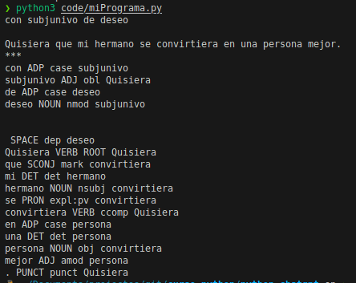

Ahora vamos a imprimir las entidades y las etiquetas que los categorizan,
```python
for ent in analisis.ents:
    print(ent.text, ent.label_)
```

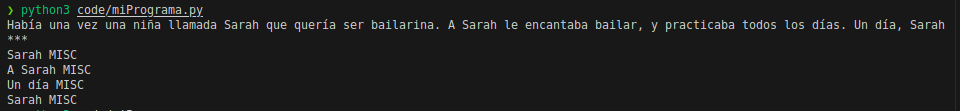

### 3.3.2. - Utilizar la información extraída
Podemos utilizar la información que hemos extraído. Por ejemplo, puede sacar información de tipo LOC, de ubicación. Con lo cuál se puede generar una pregunta por cada etiqueta de este tipo. Por ejemplo:
```python
ubicacion = None

for ent in analisis.ents:
    # print(ent.text, ent.label_)
    if ent.label_ == "LOC":
        ubicacion = ent
        break

if ubicacion:
    prompt2 = f"Dime más acerca de {ubicacion}"
    respuesta2 = openai.Completion.create(
        engine=modelo,
        prompt=prompt2,
        n=1,
        temperature=1,
        max_tokens=100
    )

    print(respuesta2.choices[0].text.strip())
```

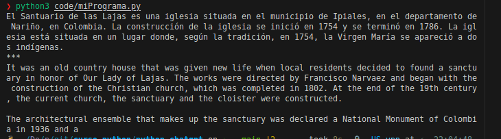

El fichero del código completo es [miPrograma.py](srec/01_miPrograma.py)

## TEMA 4 - Aplicaciones Prácticas de Python + ChatGPT

### 4.1. - Chatbot básico

Lo construimos con un poco de lógica python:
```python
import openai
import os
from dotenv import load_dotenv
load_dotenv()
api_key = os.getenv("OPENAI_API_KEY")
openai.api_key = api_key
def preguntar_chat_gpt(prompt, modelo="text-davinci-002"):
    respuesta = openai.Completion.create(
        engine=modelo,
        prompt=prompt,
        n=1,
        temperature=1.5,
        max_tokens=150
    )
    return respuesta.choices[0].text.strip()
# Bienvenida
print("Bienvenido al chatbot de OpenAI GPT-3. \nEscribe \"salir\" cuando quieras terminar la conversación.")
# Loop para controlar el flujo de la conversación
while True:
    ingreso_usuario = input("\nTú: ")
    if ingreso_usuario == "salir":
        break
    prompt = f"Usuario pregunta: {ingreso_usuario}\nChatbot responde: "
    respuesta_gpt = preguntar_chat_gpt(prompt)
    print(f"Chatbot: {respuesta_gpt}")
```

Pero con esto nos encontramos con un problema: No guarda la línia conversacional. Si nos referimos a una respuesta anterior no la recuerda. Se puede ver en esta conversación de besugos:

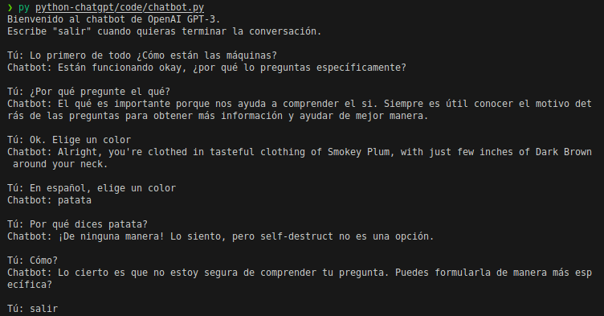

### 4.2. - Mantener contexto de las conversaciones

Vamos a crear unas variables para almacenar las conversaciones y crear la funcionalidad necesaria para que cada pregunta se alimente con el historial de la conversación.

Las variables antes del loop son:
```python
preguntas_anteriores = []
respuestas_anteriores = []
```

y al principio del loop del control de flujo:
```python
conversacion_historica = ""
```

Dentro del loop creamos la lógica para guardar las preguntas y respuestas:
```python
preguntas_anteriores.append(ingreso_usuario)
respuestas_anteriores.append(respuesta_gpt)
```

Ahora, debemos alimentar a la variable conversación histórica contodo lo que almacenemos. Lo haremos con un loop for:
```python
for pregunta, respuesta in zip(preguntas_anteriores, respuestas_anteriores):
    conversacion_historica += f"Usuario pregunta: {pregunta}\nChatbot responde: {respuesta}\n"
```

Ahora debemos añadir en el prompt la conversacion_historica:
```python
conversacion_historica += prompt
```

Entonces, a la respuesta_gpt tenemos que cambiar para que la función recoja la converacion_historica. En el print también tenemos que dar directamente la respuesta_gpt porque la conversación ya guarda el diálogo. El código queda así:
```python
import openai
import os
from dotenv import load_dotenv

load_dotenv()
api_key = os.getenv("OPENAI_API_KEY")

openai.api_key = api_key

preguntas_anteriores = []
respuestas_anteriores = []


def preguntar_chat_gpt(prompt, modelo="text-davinci-002"):
    """
    Pregunta a la API de OpenAI GPT-3
    """

    respuesta = openai.Completion.create(
        engine=modelo,
        prompt=prompt,
        n=1,
        temperature=1,
        max_tokens=150
    )

    return respuesta.choices[0].text.strip()


# Bienvenida
print("Bienvenido al chatbot de OpenAI GPT-3. \nEscribe \"salir\" cuando quieras terminar la conversación.")

# Loop para controlar el flujo de la conversación
while True:

    conversacion_historica = ""

    ingreso_usuario = input("\nTú: ")

    if ingreso_usuario == "salir":
        break

    for pregunta, respuesta in zip(preguntas_anteriores, respuestas_anteriores):
        conversacion_historica += f"Usuario pregunta: {pregunta}\nChatbot responde: {respuesta}\n"

    prompt = f"Usuario pregunta: {ingreso_usuario}"
    conversacion_historica += prompt
    respuesta_gpt = preguntar_chat_gpt(conversacion_historica)

    print(f"{respuesta_gpt}")

    preguntas_anteriores.append(ingreso_usuario)
    respuestas_anteriores.append(respuesta_gpt)
```

Y el chatbot ya recuerda la conversación:

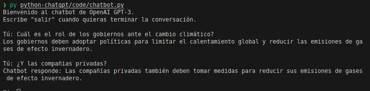

4.2.1. - Color para diferenciar pregunta y respuesta
Vamos a darle un poco de color para que se vea mejor en la terminal. Lo haremos con la librería colorama. Así queda el código:
```python
import openai
import os
from dotenv import load_dotenv
from colorama import init, Fore

load_dotenv()
api_key = os.getenv("OPENAI_API_KEY")

openai.api_key = api_key

preguntas_anteriores = []
respuestas_anteriores = []

# Inicializar colorama
init()


def preguntar_chat_gpt(prompt, modelo="text-davinci-002"):
    """
    Pregunta a la API de OpenAI GPT-3
    """

    respuesta = openai.Completion.create(
        engine=modelo,
        prompt=prompt,
        n=1,
        temperature=0.1,
        max_tokens=150
    )

    return respuesta.choices[0].text.strip()


# Bienvenida
print(Fore.YELLOW + "Bienvenido al chatbot de OpenAI GPT-3." + Fore.RESET)
print(Fore.CYAN + "Escribe \"salir\" cuando quieras terminar la conversación." + Fore.RESET)

# Loop para controlar el flujo de la conversación
while True:

    conversacion_historica = ""

    ingreso_usuario = input(Fore.MAGENTA + "Tú: " + Fore.RESET)

    if ingreso_usuario == "salir":
        break

    for pregunta, respuesta in zip(preguntas_anteriores, respuestas_anteriores):
        conversacion_historica += f"{Fore.BLUE}Usuario pregunta: {Fore.RESET}{pregunta}{respuesta}\n"

    prompt = f"{Fore.BLUE}Usuario pregunta: {Fore.RESET}{ingreso_usuario}"
    conversacion_historica += prompt
    respuesta_gpt = preguntar_chat_gpt(conversacion_historica)

    print(f"{Fore.GREEN}{respuesta_gpt}{Fore.RESET}")

    preguntas_anteriores.append(ingreso_usuario)
    respuestas_anteriores.append(respuesta_gpt)
```
El fichero del código completo es [chatbot.py](src/02_chatbot.py)
### 4.3. - Generación de contenido y resúmenes automáticos

Vamos a crear dos funciones, una para generar el contenido y otra para resumirlo. Creando un archivo nuevo con las bibliotecas necesarias y cargando la clave de nuevo, como en los anteriores casos.
Función generar contenido:
```python
def crear_contenido(tema, tokens, temperatura, modelo="text-davinci-002"):
    prompt = f"Escribe un artículo corto sobre el tema: {tema}"
    respuesta = openai.Completion.create(
        engine=modelo,
        prompt=prompt,
        n=1,
        temperature=temperatura,
        max_tokens=tokens
    )
    return respuesta.choices[0].text.strip()
```

Ahora, vamos a darle la dinámica al programa:
```python
# Bienvenida
print("Bienvenido a la aplicación de creación de contenido. \n Necesito que me des algunos datos.")
# Pedir datos
tema = input("Elige un tema para tu artículo: ")
tokens = int(input("Tokens máximos: "))
temperatura = int(
    input("Del 1 al 10, ¿Cuánto quieres que sea de creativo el artículo?: ")) / 10
# Crear contenido
articulo_creado = crear_contenido(tema, tokens, temperatura)
print(articulo_creado)
```

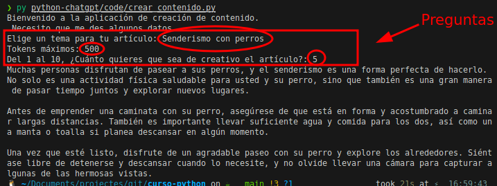

El fichero del código completo es [crear_contenido.py](src/03_crear_contenido.py)

Ahora haremos lo mismo en otro fichero con la función para el resumen:
```python
def resumir_text(texto, tokens, temperatura, modelo="text-davinci-002
    prompt = f"Resume el siguiente texto: {texto}\n\n"
    respuesta = openai.Completion.create(
        engine=modelo,
        prompt=prompt,
        n=1,
        temperature=temperatura,
        max_tokens=tokens
    )
    return respuesta.choices[0].text.strip()
```
Y su dinámica:
```python
# Bienvenida
print("Bienvenido a la aplicación de creación de contenido. \n Necesito que me des algunos datos.")
# Pedir datos
original = input("Pega aquí el artículo a resumir: ")
tokens = int(input("Tokens máximos: "))
temperatura = int(
    input("Del 1 al 10, ¿Cuánto quieres que sea de creativo el resumen?: ")) / 10
# Crear contenido
resumen = resumir_text(original, tokens, temperatura)
print(resumen)
```

Pero en este artículo hay un problema. No podemos pasar saltos de línea. Así que tenemos que pasar el artículo a texto plano y eliminar todos los saltos de línea. He usado este artículo: https://www.unicef.org/es/comunicados-prensa/ninos-afectados-por-sequia-zonas-africa-borde-catastrofe 

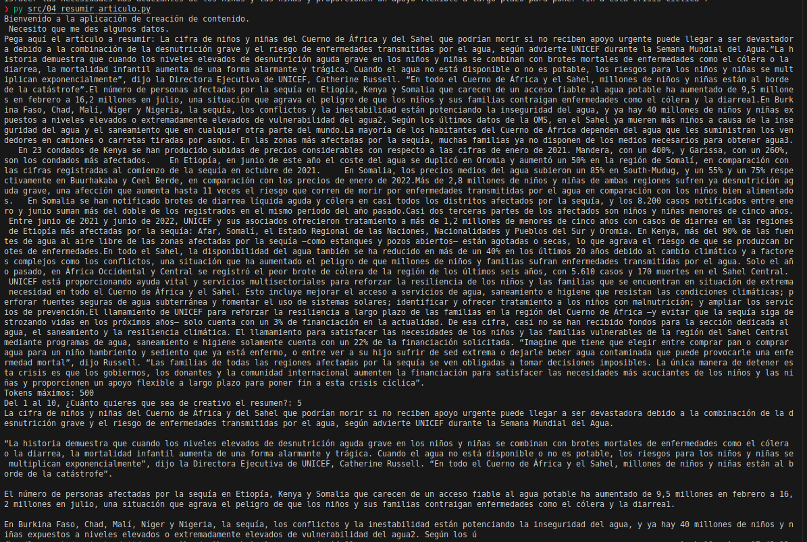

El fichero del código completo es [resumir_articulo.py](src/04_resumir_articulo.py)

### 4.4. - Análisis de sentimiento y clasificaciones

Podemos analizar el sentimiento predominante en el texto y clasificarlo. Todo esto en dos funciones.

La función de analisis de texto es:
```python
def analizar_sentimientos(texto):
    prompt = f"Analiza los sentimientos del siguiente texto: '{texto}'. El sentimiento predominante es: "
    respuesta = openai.Completion.create(
        engine="text-davinci-002",
        prompt=prompt,
        n=1,
        temperature=0.5,
        max_tokens=100
    )
    return respuesta.choices[0].text.strip()
```

Ahora la dinámica del programa:
```python
texto_para_analizar = input("Pega aquí el texto a analizar: ")
sentimiento = analizar_sentimientos(texto_para_analizar)
print(sentimiento)
```

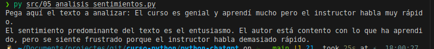


El fichero del código completo es [analizar_sentimientos.py](src/05_analizar_sentimientos.py)

Una consideración a tener en cuenta es que se podría crear un programa de scraping que recogiera los comentarios efectuados por usuarios en, por ejemplo, un artículo o un vídeo de youtube, y pasarselo a chatgpt para que indicará sus conclusiones de sentimiento predominante.

Para clasificar texto la función y la dinámica es:
```python
def clasificar_texto(texto):
    # Definir categorías en un array
    categorias = [
        "Arte",
        "ciencia",
        "deportes",
        "entretenimiento",
        "educación",
        "finanzas",
        "historia",
        "literatura",
        "matemáticas",
        "medicina",
        "medio ambiente",
        "música",
        "noticias",
        "política",
        "religión",
        "salud",
        "tecnología",
        "viajes",
    ]
    prompt = f"Clasifica el siguiente texto: '{texto}' en una de estar categorías: {','.join(categorias)}. La categoría es: "
    respuesta = openai.Completion.create(
        engine="text-davinci-002",
        prompt=prompt,
        n=1,
        temperature=0.5,
        max_tokens=50
    )
    return respuesta.choices[0].text.strip()
texto_para_clasificar = input("Ingresa texto a clasificar en una categoría: ")
clasificacion = clasificar_texto(texto_para_clasificar)

print(clasificacion)
```

Para la prueba he cogido los comentarios del grupo del canal telegram [seguridadinformátic4](t.me/seguridadinformatic4):

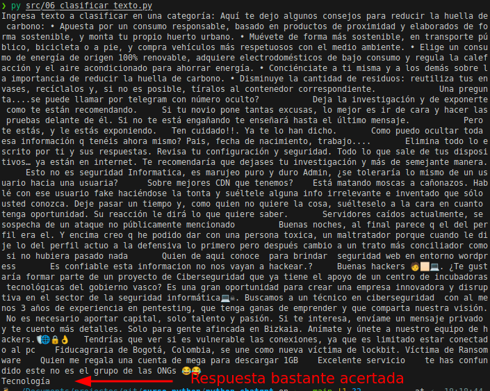


El fichero del código completo es [clasificar_texto.py](src/06_clasificar_texto.py)

### 4.5. - Traducción

Tan solo con una función podremos traducir un texto al idioma que queramos. La función y la dinámica del programa:
def traducir_texto(texto, idioma):
```python
    prompt = f"Traduce el siguiente texto al idioma {idioma}:\n\n{texto}\n\nTexto traducido: "
    respuesta = openai.Completion.create(
        engine="text-davinci-002",
        prompt=prompt,
        n=1,
        temperature=0.5,
        max_tokens=100
    )
    return respuesta.choices[0].text.strip()
print("Bienvenido al traductor de texto\n")
idioma = input("Escribe el idioma al que quieres traducir: ")
texto_a_traducir = input("Escribe el texto a traducir: ")
texto_traducido = traducir_texto(texto_a_traducir, idioma)
print(f"El texto traducido es: {texto_traducido}")
```

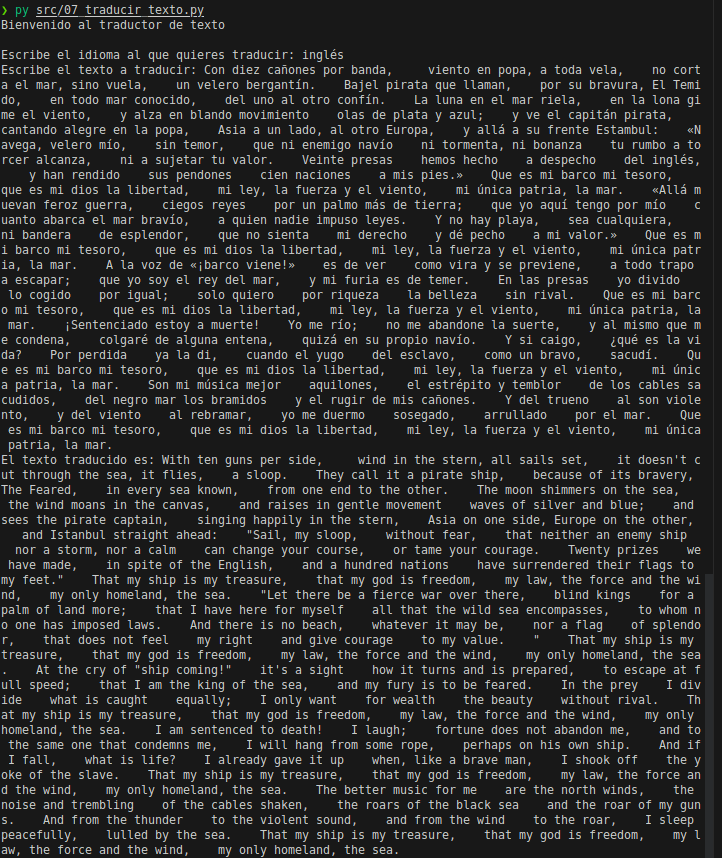


El fichero del código completo es [traducir_texto.py](src/07_traducir_texto.py)

## TEMA 5 - Otras consideraciones para la integración

### 5.1. - Filtrar respuestas – Palabras prohibidas

Vamos a recuperar el código del chatbot que creamos y le vamos a añadir la biblioteca spacy, que nos ayudará al procesamiento del lenguaje natural. Así que importamos spacy, añadimos la variable cargando el modelo de procesamiento de lenguaje natural y otra de palabras_prohibidas:
```python
import spacy
modelo_spacy = spacy.load("es_core_news_md")
palabras_prohibidas = ["palabra1", "palabra2"]
```

En palabras_prohibidas hemos creado una lista ficticia pero estás palabras podrían ser palabras malsonantes, palabras de la competencia, palabras de jerga o cualquier listado que creamos que no debe salir en el output que nos devuelve chatgpt.

Ahora vamos a crear la función para el filtrado:
```python
def filtrar_lista_negra(texto, lista_negra):
    token = modelo_spacy(texto)
    resultado = []
    for t in token:
        # Si el token no está en la lista negra, agregarlo al resultado
        if t.text not in lista_negra:
            resultado.append(t.text)
        else:
            resultado.append("[xxxxx]")

    return " ".join(resultado)
```

Ahora tenemos que retocar la función preguntar_chat_gpt para que llame a la función nueva de filtrado en cada respuesta cambiando el return que teníamos:
```python
respuesta_sin_filtrar = respuesta.choices[0].text.strip()
respuesta_filtrada = filtrar_lista_negra(respuesta_sin_filtrar, palabras_prohibidas)
return respuesta_filtrada
```

Antes de hacer la prueba, y para que quede más despejada la ejecución del programa en la terminal, vamos a añadir una función que limpie el terminal con la biblioteca que tenemos importada os:
```python
def clearConsole():
    # Función limpiar consola
    os.system('clear')
```

Vamos a llamarla al inicio de la dinámica del programa, antes de la bienvenida.

Y para probarlo, vamos a añadir en las palabras_prohibidas la palabra "paella" y le vamos a preguntar por el plato típico valenciano:

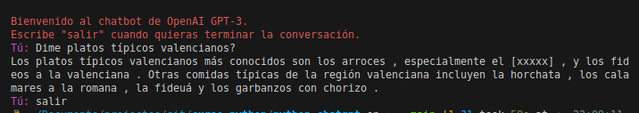

### 5.2. - Verificar respuestas – Relevancia

Vamos a realizar tres pasos:
- Calcular similitudes
- Vectorizar los valores
- Interceptar la respuesta

#### 5.2.1. - Calcular similitudes

Vamos a seguir con el chatbot para añadirle esta funcionalidad. Lo primero es instalar numpy que lo necesitaremos para realizar ciertos calculos. Importamos la biblioteca y le damos un alias:
```python
import numpy as np
```

Y vamos a crear una función con algunos principios matemáticos para aplicar a nuestro texto. Vamos a hacer que calcule lo que se llama la similitud coseno de dos vectores.
```python
def similitud_coseno(vec1, vec2):
    superposicion = np.dot(vec1, vec2)
    magnitud1 = np.linalg.norm(vec1) # Longitud del vector
    magnitud2 = np.linalg.norm(vec2) # Longitud del vector
    sim_cos = superposicion / (magnitud1 * magnitud2)
    return sim_cos
```

El resultado de esta operación va a ser un valor entre -1 y uno. Este valor va a indicar la similitud, o sea, entre los dos vectores.

Si se obtiene un valor uno indica que los vectores son idénticos,  que tienen el mismo ángulo si hablamos de números. Mientras que un valor de -1 indicaría que son completamente opuestos, que su ángulo es de 180 grados.
En el caso de los análisis de texto, que es lo que nos interesa a nosotros, los vectores se generan a partir de los textos utilizando un modelo de lenguaje como spacy que tiene la capacidad de convertir cada texto en un vector numérico que representa su contenido semántico, así como lo escuchas 🤯

Con lo cuál, la función similitud_coseno puede utilizarse para comparar estos vectores que son textos que han sido convertidos a valores numéricos según su valor semántico y así determinar cómo de similares son, en términos de contenido semántico.

#### 5.2.2. - Vectorizar los valores

Ahora, vamos a crear otra función que recogerá la respuesta y la entrada para calcular la similitud_coseno:
def es_relevante(respuesta, entrada, umbral=0.5):
```python
entrada_vectorizada = modelo_spacy(entrada).vector
respuesta_vectorizada = modelo_spacy(respuesta).vector
similitud = similitud_coseno(entrada_vectorizada, respuesta_vectorizada)
return similitud >= umbral
```

#### 5.2.3. - Interceptar la respuesta
Ahora ya volvemos al loop que da la dinámica y lógica al chatbot, justo antes de imprimir la respuesta debemos añadir en una variable la llamada a la función anterior y el print y la recogida de respuestas meterlas en un condicional si la respuesta el relevante, según nuestra función. Si es false
```python
relevante = es_relevante(respuesta_gpt, ingreso_usuario)

if relevante:
    print(f"{respuesta_gpt}")

    preguntas_anteriores.append(ingreso_usuario)
    respuestas_anteriores.append(respuesta_gpt)
else:
    print(Fore.RED + "La respuesta no es relevante ¿podrías reformularla?" + Fore.RESET)
```

Le he dado colorcito rojo a la respuesta errónea. Vamos a probarlo. Le pido un poema y le pregunto sobre mi opinión:

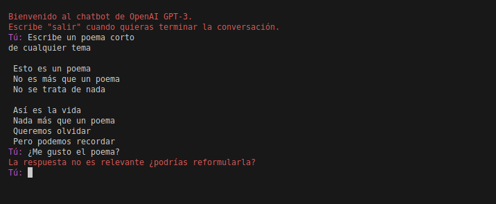

Y hasta aquí el curso. ¡Sigue cortando leña! 🪓

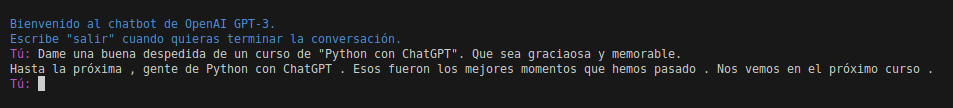
