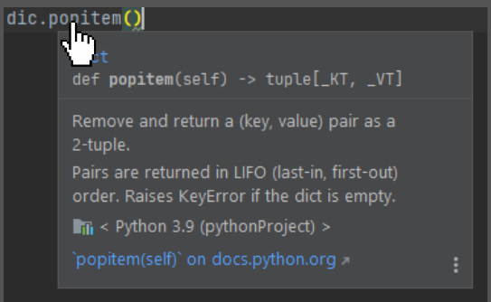
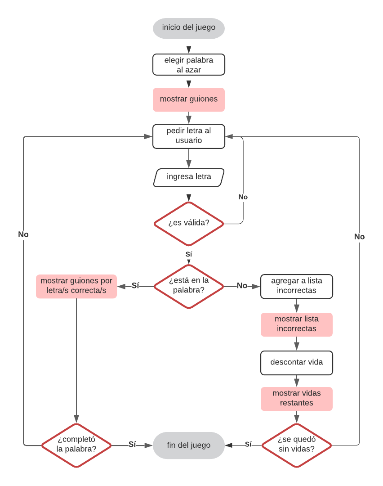

# Día 5 - Programa el juego "El ahorcado"

- [Día 5 - Programa el juego "El ahorcado"](#día-5---programa-el-juego-el-ahorcado)
  - [5.1. - Documentación](#51---documentación)
  - [5.2. - Funciones](#52---funciones)
  - [5.3. - return](#53---return)
  - [5.4. - Funciones dinámicas](#54---funciones-dinámicas)
  - [5.5. - Interacción entre funciones](#55---interacción-entre-funciones)
  - [5.6. - \*args](#56---args)
  - [5.7. - \*\*kwargs](#57---kwargs)
  - [5.8. - Ejercicios](#58---ejercicios)
    - [5.8.1. - Ejercicio 1](#581---ejercicio-1)
    - [5.8.2. - Ejercicio 2](#582---ejercicio-2)
    - [5.8.3. - Ejercicio 3](#583---ejercicio-3)
    - [5.8.4. - Ejercicio 4](#584---ejercicio-4)
  - [5.9. - Proyecto del Día 5](#59---proyecto-del-día-5)
  - [Ficheros y documentación del día 5](#ficheros-y-documentación-del-día-5)

## 5.1. - Documentación
La documentación es nuestra biblioteca de consulta en Python. Al escribir código, es de uso permanentemente para solucionar dudas relacionadas al funcionamiento de métodos y los argumentos que reciben.

Si utilizas PyCharm, sostén el cursor sobre el nombre del método del que deseas obtener información. Se desplegará una ventana flotante.

Esto funcionará en otros IDEs del mismo modo.



También, debes mantener cerca la documentación oficial de Python (o Biblioteca Estándar de Python), que contiene toda la información necesaria: https://docs.python.org/es/3.9/library/index.html

No dejes de buscar en Google tus dudas, para hallar una explicación que se ajuste a ti.
## 5.2. - Funciones

Una función es un bloque de código que solamente se ejecuta cuando es llamada. Puede recibir información (en forma de parámetros), y devolver datos una vez procesados como resultado.

Una función es definida mediante la palabra clave **def**
```python
def mi_funcion(argumento):
```

Los argumentos contienen información que la función utiliza o transforma para devolver un resultado
```python
mi_funcion(mi_argumento)
```

Para llamar a una función, basta utilizar su nombre, entregando los argumentos que la misma requiere entre paréntesis.

## 5.3. - return

Para que una función pueda devolver un valor (y que pueda ser almacenado en una variable, por ejemplo), utilizamos la declaración return.
```python
def mi_funcion():
  return [algo]
```

La declaración return provoca la salida de la función. Cualquier código que se encuentre después en el bloque de la función, no se ejecutará
```python
resultado = mi_funcion()
```

La variable resultado almacenará el valor devuelto por la función mi_funcion( )

## 5.4. - Funciones dinámicas

La integración de diferentes herramientas de control de flujo, nos permite crear funciones dinámicas y flexibles. Si debemos utilizarlas varias veces, lograremos un programa más limpio y sencillo de mantener, evitando repeticiones de código.

- Funciones
- Loops (for/while)
- Estructuras condicionales
- Palabras clave (return, break, continue, pass)

```python
def mi_funcion(argumento):
  for item in ...
    if a == b ...
      ...
    else:
      return ...
  return ...
```

## 5.5. - Interacción entre funciones

Las salidas de una determinada función pueden convertirse en entradas de otras funciones. De esa manera, cada función realiza una tarea definida, y el programa se construye a partir de la interacción entre funciones.
```python
def funcion_1():
  |...
  |return a
def funcion_2(a):
  |...
  |return b
def funcion_3(b):
  |...
  |return c
def funcion_4(a,c):
  |...
  |return d
```

## 5.6. - *args

En aquellos casos en los que no se conoce de antemano el número exacto de argumentos que se deben pasar a una función, se debe utilizar la sintaxis *args para referirse a todos los argumentos adicionales luego de los obligatorios.

El nombre *args no es mandatorio pero si es sugerido como buena práctica.

Cualquier nombre iniciado en * referirá a estos argumentos de cantidad variable.

La función recibirá los argumentos indefinidos *args en forma de tupla, a los que se podrá acceder o iterar de las formas habituales dentro del bloque de código de la función.
```python
def mi_funcion(arg_1, arg_2, *args):
```

```python
mi_funcion("ejemplo", 25, 40, 75, 10):
```

*arg_1*	→ "ejemplo"
*arg_2*   → 25
*args* = (40, 75, 10)

## 5.7. - **kwargs

Los argumentos con palabras clave (keyword arguments, abreviado kwargs), sirven para identificar el argumento por su nombre, independientemente de la posición en la que se pasen a su función. Si no se conoce de antemano su cantidad, se utiliza el parámetro **kwargs que los agrupa en un diccionario.
Al igual que para *args, el nombre **kwargs no es mandatorio pero si es sugerido como buena práctica. Cualquier nombre iniciado en ** referirá a estos argumentos de cantidad variable.
```python
def atributos_persona(**kwargs):
```

```python
atributos_persona(ojos="azules", pelo="corto")
```

*kwargs* = {'ojos': 'azules', 'pelo': 'rubio'}


## 5.8. - Ejercicios

### 5.8.1. - Ejercicio 1

Crea una función llamada devolver_distintos() que reciba 3 integers como parámetros.
- Si la suma de los 3 numeros es mayor a 15, va a devolver el número mayor.
- Si la suma de los 3 numeros es menor a 10, va a devolver el número menor.
- Si la suma de los 3 números es un valor entre 10 y 15 (incluidos) va a devolver el número de valor intermedio.

**Solución:**
```python
def devolver_distintos(num1, num2, num3):
    suma = num1 + num2 + num3
    lista = [num1, num2, num3]
    if suma > 15:
        return max(lista)
    elif suma < 10:
        return min(lista)
    else:
        lista.sort()
        return lista[1]
print(devolver_distintos(6, 5, 3))
```

### 5.8.2. - Ejercicio 2

Escribe una función (puedes ponerle cualquier nombre que quieras) que reciba cualquier palabra como parámetro, y que devuelva todas sus letras únicas (sin repetir) pero en orden alfabético.

Por ejemplo si al invocar esta función pasamos la palabra "entretenido", debería devolver ['d', 'e', 'i', 'n', 'o', 'r', 't']

**Solución:**

```python
def cualquier(palabra):
    mi_set = set()
    for letra in palabra:
        mi_set.add(letra)
    lista = list(mi_set)
    lista.sort()
    return lista
print("\n")
print(cualquier('entretenido'))
```

### 5.8.3. - Ejercicio 3

Escribe una función que requiera una cantidad indefinida de argumentos. Lo que hará esta función es devolver True si en algún momento se ha ingresado al numero cero repetido dos veces consecutivas.

Por ejemplo:

(5,6,1,0,0,9,3,5) >>> True

(6,0,5,1,0,3,0,1) >>> False

**Solución:**
```python
def me_gustan_los_ceros(*noceros):
    contador = 0
    for num in noceros:
        if num == 0:
            contador += 1
            if contador == 2:
                contador = 0
                return True
        elif num != 0:
            contador = 0
        else:
            pass
    return False
print("\n")
print(me_gustan_los_ceros(5, 6, 1, 0, 0, 9, 3, 5))
print(me_gustan_los_ceros(6, 0, 5, 1, 0, 3, 0, 1))
Solución curso:
def ceros_vecinos(*args):
    contador = 0
    for num in args:

        if contador + 1 == len(args):
            return False
        elif args[contador] == 0 and args[contador + 1] == 0:
            return True
        else:
            contador += 1
    return False
print("\n")
print(ceros_vecinos(5, 6, 1, 0, 0, 9, 3, 5))
print(ceros_vecinos(6, 0, 5, 1, 0, 3, 0, 1))
```

### 5.8.4. - Ejercicio 4

Escribe una función llamada contar_primos() que requiera un solo argumento numérico.

Esta función va a mostrar en pantalla todos los números primos existentes en el rango que va desde cero hasta ese número incluido, y va a devolver la cantidad de números primos que encontró.

Aclaración, por convención el 0 y el 1 no se consideran primos.

**Solución:**
```python
def primo(numero):
    if numero == 0 or numero == 1 or numero == 4:
        return False
    for x in range(2, int(numero/2)):
        if numero % x == 0:
            return False
    return True
def primos(rango_max):
    rango_max += 1
    lista_num = [n for n in range(1, rango_max)]
    primos = []
    for numero in lista_num:
        es_primo = primo(numero)
        if es_primo:
            primos.append(numero)
    contar = len(primos)
    rango_max -= 1
    print(f"\nEntre 0 y el {rango_max} hay {contar} números primos.\n")
    print(*primos, sep=' ')
primos(1000)
Solución curso:
def contar_primos(numero):
    primos = [2]
    iteracion = 3

    if numero < 2:
        return 0

    while iteracion <= numero:
        for n in range(3, iteracion, 2):
            if iteracion % n == 0:
                iteracion += 2
                break
        else:
            primos.append(iteracion)
            iteracion += 2

    print(primos)
    return len(primos)


print("\n")
print(contar_primos(1000))
```

## 5.9. - Proyecto del Día 5
Hoy vas a programar El Ahorcado. El programa va a elegir una palabra secreta y le va a mostrar al jugador solamente una serie de guiones que representa la cantidad de letras que tiene la palabra. El jugador en cada turno deberá elegir una letra y si la letra se encuentra en la palabra oculta, el sistema le va a mostrar en qué lugares se encuentra. Pero si el jugador dice una letra que no se encuentra en la palabra oculta, pierde una vida.

En el juego real del ahorcado, cada vez que perdemos una vida, se va completando el dibujo del ahorcado miembro por miembro. Pero en nuestro caso, como aún no tenemos elementos gráficos, simplemente le vamos a decir que tiene seis vidas y se las iremos descontando de una en una, cada vez que el jugador elija una letra incorrecta.
Si se agotan las vidas antes de adivinar la palabra, el jugador pierde. Pero si adivina la palabra completa antes de perder todas las vidas, el jugador gana.

Parece sencillo, pero ¿cómo diseñamos todo este código? Bueno, aquí van algunas ayudas:
- Primero vas a crear un código que importe el método choice, ya que lo vas a necesitar para que el sistema pueda elegir una palabra al azar dentro de una lista de palabras que también vas a crear al comienzo.
- Luego de eso, vas a crear tantas funciones como creas necesarias para que el programa haga cosas como pedirle al usuario que elija una letra, para corroborar si lo que el usuario ha ingresado es una letra válida, para chequear si la letra ingresada se encuentra en la palabra o no, para verificar si ha ganado o no, etc.
- Recuerda escribir primero las funciones y luego el código que las implementa ordenadamente.

Creo que este es un proyecto especial y de verdad quiero que sepas que no espero que lo puedas resolver sin ayuda. Las funciones parecen simples, pero cuando empezamos a poner funciones todas juntas en un código real, es difícil seguir mentalmente la sucesión del código porque se vuelve mucho menos lineal que antes. Lo importante es que lo intentes, que tu cabeza se zambulla en el problema y luego veremos cómo llegamos a la solución.



## Ficheros y documentación del día 5
- [01_metodos_ayuda_docs.py](01_metodos_ayuda_docs.py)
- [02_funciones.py](02_funciones.py)
- [03_funciones_dinamicas.py](03_funciones_dinamicas.py)
- [04_ejemplo_funcion.py](04_ejemplo_funcion.py)
- [05_palito_mas_corto.py](05_palito_mas_corto.py)
- [06_lanzar_dados.py](06_lanzar_dados.py)
- [07_limpiar_lista_promedio.py](07_limpiar_lista_promedio.py)
- [08_lanzar_moneda.py](08_lanzar_moneda.py)
- [09_args_indeterminados.py](09_args_indeterminados.py)
- [10_problemas_practicos.py](10_problemas_practicos.py)
- [11_programa05.py](11_programa05.py)

[Documentación del día](../doc_curso/05_ahorcado/)

---

Enlaces a todos los días: [dia 1 - creador de nombres](../dia_01/README.md) / [dia 2 - calculador de comisiones](../dia_02/README.md) / [dia 3 - analizador de texto](../dia_03/README.md) / [dia 4 - juego "adivina el número"](../dia_04/README.md) / [dia 5 - juego "El ahorcado"](../dia_05/README.md) / [dia 6 - recetario](../dia_06/README.md) / [dia 7 - cuenta bancaria](../dia_07/README.md) / [dia 8 - consola de turnos](../dia_08/README.md) / [dia 9 - buscador de números de serie](../dia_09/README.md) / [dia 10 - juego "Invasión espacial"](../dia_10/README.md) / [dia 11 - web scraping](../dia_11/README.md) / [dia 12 - gestor de restaurantes](../dia_12/README.md) / [dia 13 - asistente de voz](../dia_13/README.md) / [dia 14 - controlador de asistencia](../dia_14/README.md) / [dia 15 - machine learning](../dia_15/README.md) / [dia 16 - aplicación web de tareas pendientes](../dia_16/README.md)