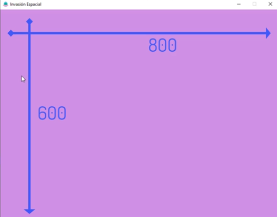
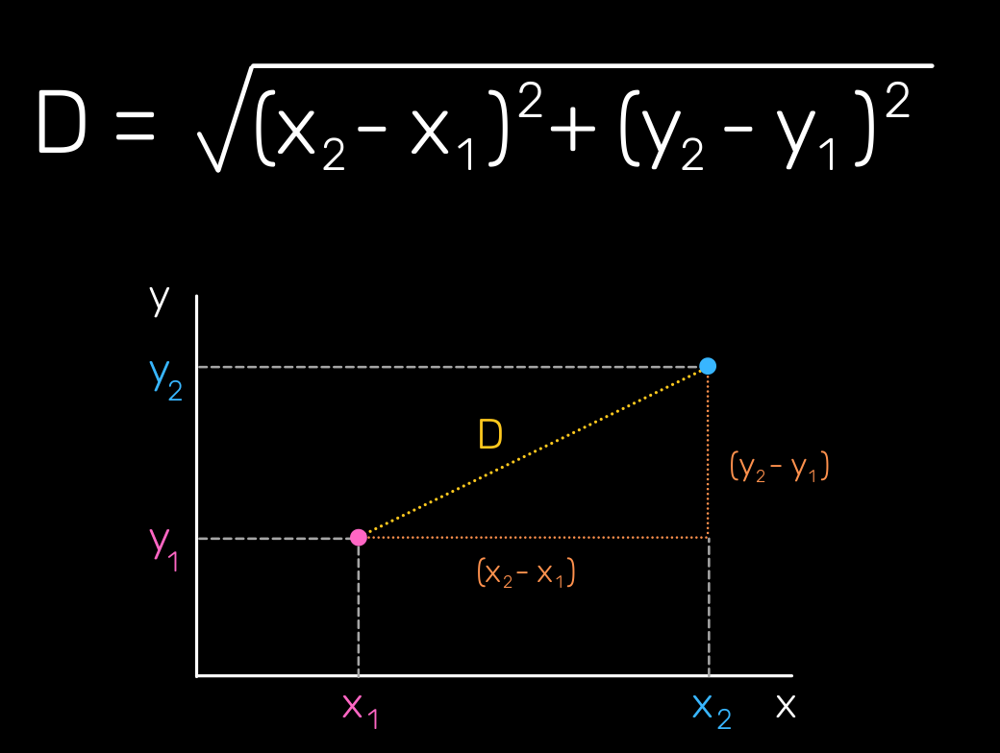
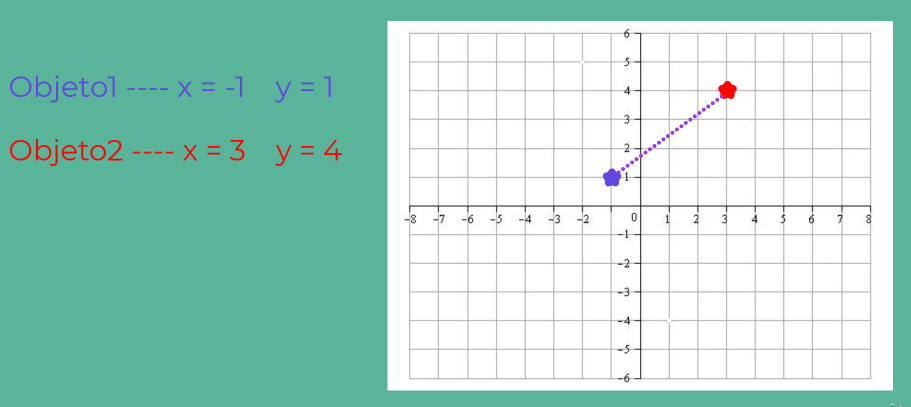
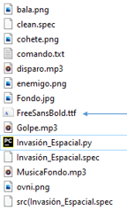
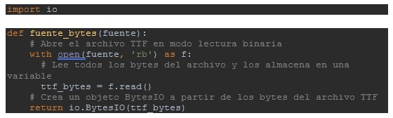
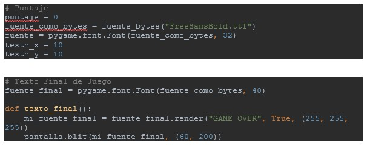
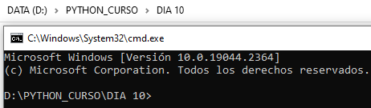
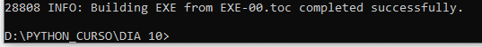
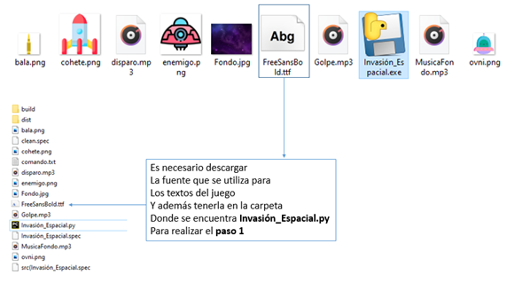

# Día 10 - Programa el juego "Invasión espacial

Biblioteca pygame https://pypi.org/project/pygame/ 
```python
pip install pygame
```

Para descargar iconos: https://www.flaticon.com/

Rueda RGB: https://www.colorspire.com/rgb-color-wheel/

Debemos tener en cuenta el ancho y alto de la pantalla creada, respecto el eje x e y,  para ubicar objectos en ella.



## Índice
- [Día 10 - Programa el juego "Invasión espacial](#día-10---programa-el-juego-invasión-espacial)
  - [Índice](#índice)
  - [10.1. - Distancia entre dos puntos](#101---distancia-entre-dos-puntos)
  - [10.2. - Convertir el Juego en un Archivo Ejecutable (.exe)](#102---convertir-el-juego-en-un-archivo-ejecutable-exe)
  - [Ficheros y documentación](#ficheros-y-documentación)

## 10.1. - Distancia entre dos puntos

La fórmula de la distancia es una expresión algebraica utilizada para determinar la distancia entre dos puntos de coordenadas (x1 , y1 ) y (x2 , y2 ).



Ejemplo de la fórmula:



D = sqrt[(3 - -1)2 + (4 - 1)2 ]

D = sqrt[(4 )2 + (3)2 ]

D = sqrt[16+ 9 ]

D = sqrt[25 ]

D = 5

Esto nos sirve para ajustar las colisiones en el juego, de la bala con el enemigo o del enemigo con el jugador.

## 10.2. - Convertir el Juego en un Archivo Ejecutable (.exe)

Este es un manual paso a paso para transformar cualquier programa de Python en un programa independiente, para poderlo ejecutar fuera del IDE.

Básicamente el proceso consta de 2 grandes pasos:
1. Convertir las fuentes de tipo Sting a objetos Bytes
2. Utilizar pyinstaller

Vamos por partes:
1. Convertir las fuentes de tipo Sting a objetos Bytes
    1. Descarga la o las fuentes empleadas en el juego, en este caso FreeSansBold.ttf (https://www.download-free-fonts.com/details/2045/free-sans-bold). Luego guárdala en la carpeta donde se encuentra Invasión_Espacial.py como se muestra en la imagen siguiente:

      

    2. Crea una función que transforme el nombre de la fuente (“FreeSansBold.ttf”) de string a objeto Bytes. Para eso importamos la librería io, y pasamos como parámetro el nombre de la fuente al almacenar la función en una variable.

      

    3. Almacena la función en una variable que luego se pasará como objeto Bytes a pygame.font.Font.

      

2. Utilizar pyinstaller
   1. Instala pyinstaller usando:
pip installer pyinstaller
   2. Abre CMD en la carpeta donde se encuentra el archivo Invasión_Espacial.py

      

   3. Escribe el siguiente comando:	
      ```shell
		  pyinstaller --clean --onefile --windowed Invasión_Espacial.py
      ```

      Donde cada expresión significa lo siguiente:

      - `--clean`: elimina todos los archivos temporales y directorios creados por pyinstaller durante la construcción del archivo ejecutable.
      - `--onefile`: crea un archivo ejecutable que contiene todos los archivos necesarios para ejecutar el script, incluyendo los módulos y bibliotecas utilizadas por el script.
      - `--windowed`: crea un archivo ejecutable que se ejecuta en una ventana en lugar de en pantalla completa.
      - `Invasión_Espacial.py`: es el nombre del script Python que se va a convertir en un archivo ejecutable.

    4.  Luego de unos segundos se terminará de correr el comando y la consola mostrará el siguiente mensaje:

      

      Se van a generar dos carpetas, una llamada built y otra llamada dist. En esta última se deberán copiar todos los archivos que son referencias para que el juego funcione:

      

¡Y eso es todo! ¡Espero que te sea de gran ayuda para que peudas compartir tus programas con el mundo!

## Ficheros y documentación

- [fonts](fonts)
- [img](img)
- [main.py](main.py)
- [sound](sound)

[Documentación del día](../doc_curso/10_invasion_espacial/)

Enlaces a todos los días: [dia 1 - creador de nombres](../dia_01/README.md) / [dia 2 - calculador de comisiones](../dia_02/README.md) / [dia 3 - analizador de texto](../dia_03/README.md) / [dia 4 - juego "adivina el número"](../dia_04/README.md) / [dia 5 - juego "El ahorcado"](../dia_05/README.md) / [dia 6 - recetario](../dia_06/README.md) / [dia 7 - cuenta bancaria](../dia_07/README.md) / [dia 8 - consola de turnos](../dia_08/README.md) / [dia 9 - buscador de números de serie](../dia_09/README.md) / [dia 10 - juego "Invasión espacial"](../dia_10/README.md) / [dia 11 - web scraping](../dia_11/README.md) / [dia 12 - gestor de restaurantes](../dia_12/README.md) / [dia 13 - asistente de voz](../dia_13/README.md) / [dia 14 - controlador de asistencia](../dia_14/README.md) / [dia 15 - machine learning](../dia_15/README.md) / [dia 16 - aplicación web de tareas pendientes](../dia_16/README.md)