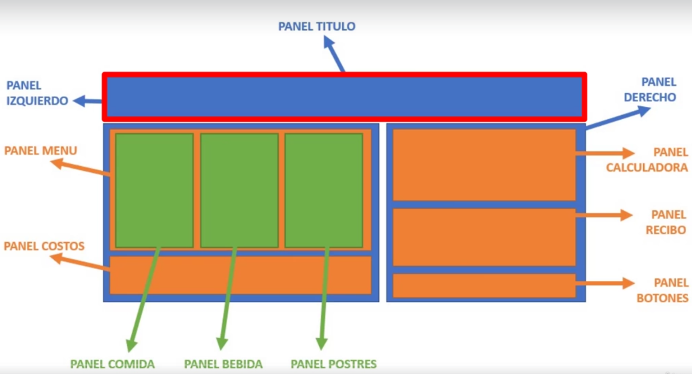
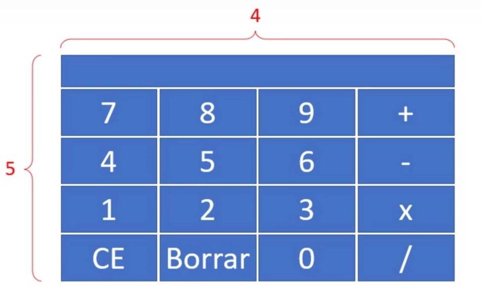

# Día 12 - Programa un gestor de restaurantes

Tkinter sirve para programar interfaces gráficas de usuario.
```python
from tkinter import *
from tkinter import filedialog, messagebox
```

Enlace. Lista de colores de Tkinter: https://es.wikibooks.org/wiki/Python/Interfaz_gr%C3%A1fica_con_Tkinter/Los_nombres_de_los_colores



Para el Frame (marco) podemos indicar el relief con estas opciones:
- Flat
- Raised
- Sunked
- Groove
- Ridge

Para darle una especie de tridimensionalidad.



## Ficheros y documentación

- [lista_precios.txt](lista_precios.txt)
- [mi_restaurante.py](mi_restaurante.py)
- [Primer_recibo.txt](Primer_recibo.txt)
- [segundo_recibo.txt](segundo_recibo.txt)

[Documentación del día](../doc_curso/12_restaurante/)

---

Enlaces a todos los días: [dia 1 - creador de nombres](../dia_01/README.md) / [dia 2 - calculador de comisiones](../dia_02/README.md) / [dia 3 - analizador de texto](../dia_03/README.md) / [dia 4 - juego "adivina el número"](../dia_04/README.md) / [dia 5 - juego "El ahorcado"](../dia_05/README.md) / [dia 6 - recetario](../dia_06/README.md) / [dia 7 - cuenta bancaria](../dia_07/README.md) / [dia 8 - consola de turnos](../dia_08/README.md) / [dia 9 - buscador de números de serie](../dia_09/README.md) / [dia 10 - juego "Invasión espacial"](../dia_10/README.md) / [dia 11 - web scraping](../dia_11/README.md) / [dia 12 - gestor de restaurantes](../dia_12/README.md) / [dia 13 - asistente de voz](../dia_13/README.md) / [dia 14 - controlador de asistencia](../dia_14/README.md) / [dia 15 - machine learning](../dia_15/README.md) / [dia 16 - aplicación web de tareas pendientes](../dia_16/README.md)
