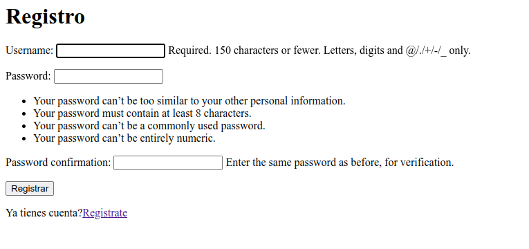
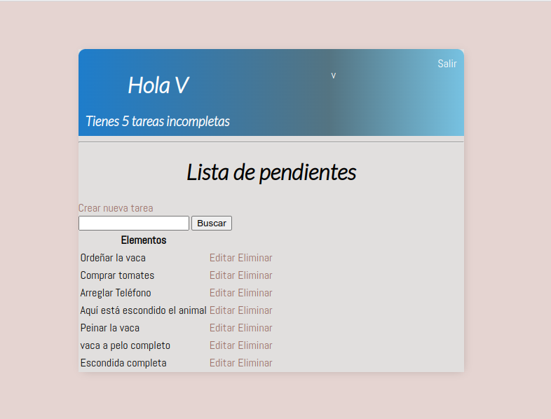

# Día 16 - Programa una aplicación web de tareas pendientes

En la tarea de hoy vamos a describir detalladamente el proceso de creación de una aplicación web de tareas pendientes. Este proyecto es un ejemplo de una aplicación web completa que incluye una base de datos sqlite3, autenticación, listas de tareas, formularios, validación, sesiones, y más. 

El código no está comentado pero veréis en este documento cada detalle, por eso es más largo que los anteriores.

## Índice
- [Día 16 - Programa una aplicación web de tareas pendientes](#día-16---programa-una-aplicación-web-de-tareas-pendientes)
  - [Índice](#índice)
  - [16.1. - Entornos Virtuales](#161---entornos-virtuales)
  - [16.2. - Módulos](#162---módulos)
  - [16.3. - Preparación de estructura de trabajo](#163---preparación-de-estructura-de-trabajo)
  - [16.4. - Configurar url](#164---configurar-url)
  - [16.5. - Crear tabla de tareas](#165---crear-tabla-de-tareas)
  - [16.6. - Configurar la vista](#166---configurar-la-vista)
  - [16.7. - Configurar la vista de Detalle](#167---configurar-la-vista-de-detalle)
  - [16.8. - Crear Links a Detalle](#168---crear-links-a-detalle)
  - [16.9. - Agregar nueva tarea](#169---agregar-nueva-tarea)
  - [16.10. - Formulario para nueva tarea](#1610---formulario-para-nueva-tarea)
  - [16.11. - Editar tarea](#1611---editar-tarea)
  - [16.12. - Eliminar tarea](#1612---eliminar-tarea)
  - [16.13. - Crear la lógica de Logueo / Deslogueo](#1613---crear-la-lógica-de-logueo--deslogueo)
  - [16.14. - Formulario de Logueo / Deslogueo](#1614---formulario-de-logueo--deslogueo)
  - [16.15. - Restringir acceso](#1615---restringir-acceso)
  - [16.16. - Información específica de usuario](#1616---información-específica-de-usuario)
  - [16.17. - Registrar nuevo usuario](#1617---registrar-nuevo-usuario)
  - [16.18. - Barra de búsquedas](#1618---barra-de-búsquedas)
  - [16.19. - Un estilo para todas las vistas](#1619---un-estilo-para-todas-las-vistas)
  - [16.20. - Estilo general](#1620---estilo-general)
  - [16.21. - Estilo de barra superiores](#1621---estilo-de-barra-superiores)
  - [16.22. - Estilo de la lista](#1622---estilo-de-la-lista)
  - [16.23. - Estilo de la barra de búsquedas](#1623---estilo-de-la-barra-de-búsquedas)
  - [16.24. - Terminar el sitio](#1624---terminar-el-sitio)
  - [Ficheros y documentación](#ficheros-y-documentación)

## 16.1. - Entornos Virtuales

Un entorno virtual de Python es una herramienta que permite aislar y gestionar de forma independiente los paquetes y dependencias de un proyecto Python específico. Permite crear un entorno de desarrollo aislado donde se pueden instalar versiones específicas de bibliotecas y paquetes, sin interferir con otros proyectos de Python en el mismo sistema.


Cuando se trabaja en proyectos de Python, es común tener diferentes versiones de paquetes y dependencias para cada proyecto. Esto puede generar conflictos si se instalan globalmente en el sistema, ya que un proyecto podría depender de una versión específica de una biblioteca, mientras que otro proyecto puede requerir una versión diferente.

Al utilizar un entorno virtual, se crea un directorio separado con su propia instalación de Python y su propio espacio de trabajo aislado. Dentro de este entorno, se pueden instalar los paquetes y dependencias necesarios para el proyecto sin afectar el sistema global.

Existen varias herramientas populares para crear y gestionar entornos virtuales en Python, como virtualenv, venv (incorporado en Python 3.3 y versiones posteriores) y conda (utilizado con el gestor de paquetes Anaconda).
Al activar un entorno virtual, se configuran las variables de entorno y se modifica el PATH para que el sistema utilice la instalación y las bibliotecas específicas del entorno virtual. Esto asegura que el proyecto utilice las versiones correctas de las bibliotecas y evita conflictos con otras instalaciones globales.

En resumen, un entorno virtual de Python es una herramienta que permite crear un espacio de trabajo aislado con su propia instalación de Python y bibliotecas. Se utiliza para gestionar y mantener las dependencias de un proyecto específico, evitando conflictos con otras instalaciones y versiones globales de paquetes. Esto facilita el desarrollo y la colaboración en proyectos de Python al garantizar la consistencia en las dependencias utilizadas.
Instalación de virtualenv:

```shell
pip install virtualenv
```
`pip freeze` es un comando utilizado en Python para generar una lista de todas las bibliotecas instaladas y sus versiones en un entorno virtual.
Ahora se hace una estructura de carpetas para diferenciar entornos


En el proyecto1 ejecutamos el comando:
```shell
virtualenv p1
```

Creará la estructura de un entorno


Para activar el entorno se hace con el comando:
```shell
source p1/bin/activate
```

Aparecerá el nombre del entorno en el prompt


Para desactivar:
```shell
deactivate
```

Cuando este el entorno virtual activado, si probamos el comando «pip freeze» veremos que no tenemos ningún módulo instalado en el entorno virtual.

Para instalar una versión distinta, que no sea la última, podemos escogerla con doble igual. Por ejemplo:
```shell
pip install pyjokes==0.4.0
```

Ahora si lo instalamos en el proyecto2 tendremos dos versiones distintas en cada uno de los entornos.


## 16.2. - Módulos

- **asgiref** es un paquete de referencia para la especificación ASGI (Asynchronous Server Gateway Interface), que es una interfaz estándar para servidores web y aplicaciones web en Python. Proporciona una serie de utilidades y adaptadores para facilitar el desarrollo de aplicaciones web asíncronas con soporte para ASGI.  *Documentación oficial*: https://asgiref.readthedocs.io/ 
- **Django** es un framework de desarrollo web de alto nivel y de código abierto, escrito en Python. Proporciona una estructura sólida y un conjunto de herramientas para simplificar el desarrollo de aplicaciones web complejas y escalables. Django se basa en el patrón de diseño MVC (Modelo-Vista-Controlador) y ofrece características como ORM (Object-Relational Mapping), enrutamiento de URLs, autenticación de usuarios, generación de formularios, administración de bases de datos y mucho más.  *Documentación oficial*: https://docs.djangoproject.com/  *Tutorial de mozilla*: https://developer.mozilla.org/es/docs/Learn/Server-side/Django/Introduction 
- **sqlparse** es un analizador y formateador de SQL para Python. Permite analizar consultas SQL y dividirlas en componentes lógicos como palabras clave, identificadores, literales, etc. Además, puede formatear consultas SQL para mejorar su legibilidad al agregar sangría y espacios en blanco adecuados. sqlparse es útil para tareas como resaltar la sintaxis SQL en aplicaciones, depurar consultas SQL y generar consultas SQL legibles.  *Documentación oficial*: https://sqlparse.readthedocs.io/ 
- **tzdata** es un módulo de Python que proporciona información sobre zonas horarias. Contiene una base de datos actualizada con información sobre zonas horarias de todo el mundo, como nombres de zonas horarias, desplazamientos de tiempo, reglas de horario de verano, entre otros. Este módulo es útil para trabajar con conversiones de tiempo y fechas en diferentes zonas horarias. Sin embargo, ten en cuenta que tzdata se utiliza principalmente como dependencia interna y es posible que no encuentres documentación específica para este módulo en sí.

## 16.3. - Preparación de estructura de trabajo

Creamos una carpeta que se llame mi_web y dentro de ella creamos el entorno virtual de la web:
```shell
virtualenv web
```

Debemos instalar django en el entorno virtual.
```shell
Pip install django
```


Se instalan 3 módulos, pero también instalamos tzdata.
```shell
pip install tzdata
```

Ahora creamos una carpeta que hará de fuente, que tradicionalmente es src


Dentro de la carpeta src iniciamos el proyecto django con:
```shell
django-admin startproject proyecto1
```


En «manage.py» se administra todo del proyecto.

Ahora iniciamos desde la carpeta proyecto el servidor para correr la web dentro:
```shell
python manage.py runserver
```

Indica que tenemos 18 migración sin aplicar


También vemos el enlace donde podemos ver la web de django:


Antes de seguir, vamos a migrar los fichero pendientes con el comando:
```shell
python manage.py migrate
```

Y volvemos a ejecutar el servidor


Vemos que ya no tiene esos problemas de migración por aplicar.

En /admin tenemos la entrada del administrador.


Pero Django no tiene un nombre de usuario y contraseña por defecto establecidos. Cuando se crea un proyecto Django, se configura un archivo de configuración llamado "settings.py" donde se definen varias opciones, incluyendo la configuración de la base de datos.

En la configuración de la base de datos, se especifican las credenciales de acceso, como el nombre de usuario y la contraseña para acceder a la base de datos. Estas credenciales deben ser configuradas por el desarrollador según los requisitos del proyecto y la base de datos que se esté utilizando.

Por defecto, Django utiliza una base de datos SQLite, y en la configuración inicial de un proyecto, se establece un archivo de base de datos local. En este caso, no se requiere un nombre de usuario ni contraseña para acceder a la base de datos SQLite.

Sin embargo, es importante tener en cuenta que en un entorno de producción, es recomendable utilizar una base de datos más robusta como MySQL o PostgreSQL, y en esos casos, se deben configurar las credenciales de acceso correspondientes en la configuración de la base de datos de Django.

Para crear el superusuario lo hacemos con el comando:
```shell
python manage.py createsuperuser
```


Voy a dejar que el usuario sea el de mi pc, el correo electrónico lo dejo vacío y es password, que tiene que ser mínimo de 8 caracteres, pongo LaDeSiempre.

Después de ingresar la clave ya veo un escritorio estilo CMS.


## 16.4. - Configurar url

Creamos el fichero de la app donde estará el núcleo de nuestro código, su estructura, los ajustes principales, su lógica principal, etc. Iniciamos la app con el nombre base:
```shell
python manage.py startapp base
```

Esto creará otra estructura de carpetas


Para conectar "base" con "proyecto" vamos a ir al fichero proyecto/settings.py y en INSTALLED_APPS añadimos la línea para que conecte con la clase dentro de apps.py:
```python
'base.apps.BaseConfig',
```


Ahora creamos el fichero urls.py en base e importamos las librerias necesarias y creamos una lista de urls:
```python
from django.urls import path
from . import views
urlpatterns = []
```

Y en base/views.py añadimos esta línea:
```python
from django.http import HttpResponse
```

Además creamos nuestra primera vista:
```python
def lista_pendientes(pedido):
  return HttpResponse('Lista de pendientes')
```

Con lo que en la lista de urls de base/urls.py debemos añadirla:
```python
urlpatterns = [
  path('', views.lista_pendientes, name='pendientes')
]
```

Pero para que el proyecto conozca esta url debemos añadir en proyecto/urls.py la función include:
```python
from django.urls import path, include
```

Además de ioncluir el path en urlpatterns.
```python
Urlpatterns = [
  path('admin/', admin.site.urls),
  path('', include('base.urls')),
]
```

Ahora, en la misma url de django veremos el texto que incluimos en la vista:


## 16.5. - Crear tabla de tareas

Necesitamos que la base de datos almacena las tareas creadas por el usuario.

En Django, la base de datos por defecto que viene integrada se llama SQLite. SQLite es una base de datos ligera y de fácil configuración que se almacena en un archivo local en lugar de ejecutarse en un servidor separado. Esto hace que sea conveniente para el desarrollo y pruebas, ya que no requiere una configuración adicional del servidor de base de datos.

Al trabajar con Django, la configuración de la base de datos se especifica en el archivo settings.py de tu proyecto. Dentro de este archivo, encontrarás una sección llamada DATABASES que contiene la configuración de la base de datos por defecto. Para SQLite, la configuración típica se ve así:
```python
DATABASES = {
  'default': {
    'ENGINE': 'django.db.backends.sqlite3',
    'NAME': BASE_DIR / 'db.sqlite3',
  }
}
```
En este ejemplo, `'ENGINE'`: 'django.db.backends.sqlite3' indica que se utilizará el motor de base de datos **SQLite**, y '`NAME': BASE_DIR / 'db.sqlite3'` especifica la ruta del archivo de base de datos, que se ubicará en el directorio del proyecto.

Es importante tener en cuenta que SQLite es adecuada para proyectos más pequeños o de desarrollo, pero para aplicaciones en producción con requisitos de alto rendimiento o concurrencia, es posible que desees considerar otras bases de datos como PostgreSQL, MySQL o Oracle, entre otras. En esos casos, deberás actualizar la configuración de la base de datos en el archivo settings.py para utilizar el motor y los detalles de conexión correspondientes a la base de datos que elijas.
Documentación bbdd django: https://docs.djangoproject.com/en/3.2/topics/db/

Para crear las tablas debemos hacerlo en base/models.py creando una clase que represente cada tabla. Sus atributos serán las columnas o los campos. 
- En **usuario** especificamos el usuario en concreto mediante un módulo de django que tenemos que importar. Con una relación de 1:n. La función ForeignKey es una clave externa con la que podremos asociar usuarios que se repitan. La función responderá a:
  - **User** que es la biblioteca anterior
  - Definimos un atributo **on_delete** para cuando se elimine un usuario se elimine en cascada sus tareas.
  - **null y blank** en True para poder dejar este campo en blanco
  - En **titulo** haremos que responda a **CharField** que es el campo de caracteres donde ajustamos el valos máximo de carácteres con max_length
- En **descripción** haremos que responda a **TextField** que es parecido al campo de caracteres anterior però tiene algunos atributos extra que no tiene el anterior. Lo único que indicamos es que puede quedar vacío el campo.
- En **completo** vamos a añadir la función **BooleanField** de campo booleano que por defecto este False.
- En **creado** le vamos a indicar el momento en el que se creó la tarea con la función **DateTimeField** y con los atributos le indicamos que se autoconfigure con la fecha now

Ahora vamos a definir un valor STR que es el que nos va a reflejar como valor string si pedimos que imprima una tarea. Será el contenido de titulo.

Además le indicamos en Meta como se va a ordenar las tareas dentro de la tabla, que será por completo.

El documento queda así:
```python
from django.db import models
from django.contrib.auth.models import User
# Create your models here.
class Tarea(models.Model):

    usuario = models.ForeignKey(
        User,
        on_delete=models.CASCADE,
        null=True,
        blank=True
    )

    titulo = models.CharField(max_length=200)
    descripcion = models.TextField(
        null=True,
        blank=True
    )

    completo = models.BooleanField(default=False)

    creado = models.DateTimeField(auto_now_add=True)

    def __str__(self):
        return self.titulo

    class Meta:
        ordering = ['completo']
```

Pero ahora tenemos que migrar la tabla en la terminal, primero creando el fichero con:
```shell
python manage.py makemigrations
```

Esto creará una carpeta migrations en base. Dentro tendrá un fichero 0001_initial.py donde indica que esta preparado para migrar. Con el siguiente comando hacemos efectiva la migración:
```shell
python manage.py migrate
```


Ahora tenemos que registrar el modelo en base/admin.py . Tenemos que importar la función Tarea y añadir la tabla:
```shell
from django.contrib import admin
from .models import Tarea

# Register your models here.
admin.site.register(Tarea)
```

Con lo cual, si vamos a la url de nuestro sitio a /admin veremos que tenemos un nuevo campo de Tareas:


Si añadimos una nueva tarea veremos que nos permite añadir los campos que indicamos a nuestra tabla:


He añadido tres tareas para las pruebas.

## 16.6. - Configurar la vista

Después de la prueba anterior vamos a traer una lista de objetos dinámica desde el fichero `base/views.py`. Importamos ListView:
```python
from django.views.generic.list import ListView
```

Creamos una clase que recoja la función. Para funcionar requiere de un módelo (lista de objetos completa) y un query set que haga la consulta filtrada de objetos. Pero tendremos que importar la Tarea de models:
```python
from .models import Tarea
```

La clase queda así:
```python
class ListaPendientes(ListView):
  model = Tarea
```

Por ahora, el documento base/views.py lo tenemos así:
```python
from django.shortcuts import render
from django.views.generic.list import ListView
from .models import Tarea

# Create your views here.

class ListaPendientes(ListView):
  model = Tarea
```

Vamos a `base/urls.py` donde tendremos que indicar que importar la ListaPendientes:
```python
from .views import ListaPendientes
```
También tenemos que cambiar el path añadiendo la ListaPendientes e indicando que lo lea como vista. El documento queda así:
```python
from django.urls import path
from .views import ListaPendientes

urlpatterns = [
    path('', ListaPendientes.as_view(), name='pendientes')
]
```

Ya hemos conectado la url a nuestra vista pero aun no hemos dicho como debe mostrarlo. Por eso, si entramos en la url nos da un error que nos indica que no existe el template, etc


Entonces, para indicar las plantillas tenemos que ir a proyecto/settings.py e indicar el path de donde coger las plantillas en DIRS. El fragmento de código entero es el siguiente:
```python
TEMPLATES = [
    {
        'BACKEND': 'django.template.backends.django.DjangoTemplates',
        'DIRS': ['../base/templates'],
        'APP_DIRS': True,
        'OPTIONS': {
            'context_processors': [
                'django.template.context_processors.debug',
                'django.template.context_processors.request',
                'django.contrib.auth.context_processors.auth',
                'django.contrib.messages.context_processors.messages',
            ],
        },
    },
]
```

Vamos a crear la plantilla que nos dice, pero en una carpeta dentro de base que le llamaremos templates, y dentro con otro directorio que se llame base. Dentro crearemos el html que nos pide.


En este fichero vamos a añadir el texto html que queramos.
```html
<h1>Lista de pendientes</h1>
<table>
    <tr>
        <th>Elementos</th>
    </tr>
    
    <tr>
        <td>{{ tarea.titulo }}</td>
    </tr>
    
    <h3>No hay elementos en esta lista</h3>
    
</table>
```

Entonces, ya veremos nuestra lista en la url:


Para personalizar el object_list y que sea más legible, vamos a views y añadimos esta línea a la clase ListaPendientes:
```python
context_object_name = 'tareas'
```

Ya lo podemos cambiar por tareas.

## 16.7. - Configurar la vista de Detalle

En base/views vamos a importar la función para los detalles y crearemos una clase más. Quedando el fichero así:
```python
from django.shortcuts import render
from django.views.generic.list import ListView
from django.views.generic.detail import DetailView
from .models import Tarea

# Create your views here.

class ListaPendientes(ListView):
    model = Tarea
    context_object_name = 'tareas'

class DetalleTarea(DetailView):
    model = Tarea
```

Y necesitaremos crear otro fichero html como plantilla. Por defecto será tarea_detail.html, pero luego podemos ver como cambiar el nombre. Tendremos que incluir en base/urls.py el import y el path de la tarea, quedando el documento así:
```python
from django.urls import path
from .views import ListaPendientes, DetalleTarea

urlpatterns = [
    path('', ListaPendientes.as_view(), name='pendientes'),
    path('tarea/<int:pk>', DetalleTarea.as_view(), name='tarea')
]
```

En el nombre del path se ha incluido `<int:pk>` que es el número intenger de la Primary Key.

En el html creado añadimos lo siguiente:
```html
<h1>Tarea: {{object}} </h1>
```

Esto hará que tenga el nombre de la tarea en cada url con un número de primary key válido:


Ahora podemos personalizar el object en base/views.py añadiendo a nuestra clase  context_object_name con tarea y cambiando la palabra object por tarea del html.
Ahora vamos a personalizar el nombre del html de tarea_details.html por tarea.html y lo vamos a incluir en base/views.py, en la clase DetalleTarea, el template_name con la ubicación 'base/tarea.html'.

## 16.8. - Crear Links a Detalle

Simplemente, en la página de tarea_list.html incluimos el encabezado vacío de una nueva columna de la tabla:
```html
<th></th>
```

E incluimos dentro del loop for una nueva columna con el texto Ver que contenga la lógica de la página, con el nombre tarea y el id de tarea:
```html
<td><a href="">Ver</a></td>
```

Quedando así el html:
```html
<h1>Lista de pendientes</h1>
<table>
    <tr>
        <th>Elementos</th>
        <th></th>
    </tr>
    
    <tr>
        <td>{{ tarea.titulo }}</td>
        <td><a href="">Ver</a></td>
    </tr>
    
    <h3>No hay elementos en esta lista</h3>
    
</table>
```

Y así la vista en el navegador:


## 16.9. - Agregar nueva tarea

Seguimos editando base/views.ppy y base/urls.py. En views.py importamos una clase más:
```python
from django.views.generic.detail import DetailView
```

Creamos la clase CreaTarea que tendrá una lógica un poco más compleja porque el sistema que recoja un pedido que creará un nuevo elemento que se incluirá en la lista. Esta clase tomará un formulario por defecto de models.py basados en los campos que incluimos.

Se puede incluir en la clase una lista con todos los elementos que queremos en el formulario:
```python
fields= ['titulo', 'descripcion', 'completo', 'creado']
```

Pero en este caso queremos todos los campos, así que utilizaremos 
```python
fields= '__all__'
```
Y para asegurarnos que cuando se envíe el formulario con éxito el usuario vaya a otra página distinta tenemos que importar otra herramienta:
```python
from django.urls import reverse_lazy
```

reverse_lazy se ocupa de redirigir la página cuando encuentre el evento que se le indique. Cargamos la url donde se redirige con success_url
```python
success_url = reverse_lazy('tareas')
```
Pero al poner tareas tenemos que asegurarnos que en el fichero urls.py tengamos los mismo, que no es así. Tenemos «Pendientes», así que vamos a cambiar este nombre por tareas que tiene más lógica. 

De nuevo, tendremos que añadir la nueva página en el fichero urls.py, importando la clase y añadiendo el path. Quedando el documento así:
```python
from django.urls import path
from .views import ListaPendientes, DetalleTarea, CrearTarea

urlpatterns = [
    path('', ListaPendientes.as_view(), name='tareas'),
    path('tarea/<int:pk>', DetalleTarea.as_view(), name='tarea'),
    path('crear-tarea/', CrearTarea.as_view(), name='crear-tarea')
]
```

Ahora necesitaremos un nuevo fichero html en templates que le llamaremos tarea_form.html que es el nombre por defecto. Para las pruebas tan solo ponemos un título:
```html
<h1>Formulario de tareas</h1>
```

Y por último, para que la página principal tenga un enlace que redirija a la página nueva, tendremos que editar tareas_list.html añadiendo este fragmento de código html:
```html
<a href="">Crear nueva tarea</a>
```

Ahora ya podemos ver el enlace que nos lleva a la nueva página creada:


## 16.10. - Formulario para nueva tarea

Vamos a darle brilo al html del formulario "tarea_form.html". Los campos del formulario se añaden automáticamente con `{{form}}`, pero tenemos que darle un método para que se vea mejor. Por defecto es as_table:


Horrible, pero tenemos dos métodos más. Formato lista con as_ul:


O como párrafo, as_p, que es el que dejaremos:


Ya podemos probarlo, pero tendremos un error. Nos falta un fragmento de código:
```python

```
El código `` es una directiva utilizada en algunas plantillas o sistemas de generación estática de sitios web, como Hugo o Jekyll.

Esta directiva se utiliza para generar un token de seguridad CSRF (Cross-Site Request Forgery) y se inserta en un formulario HTML. El token CSRF ayuda a prevenir ataques de falsificación de solicitudes entre sitios, asegurando que las solicitudes enviadas al servidor sean legítimas y no provengan de fuentes maliciosas.

El token se genera y se incluye en el formulario para que cuando el usuario envíe el formulario, el servidor pueda verificar que el token es válido y corresponde a la sesión actual del usuario. Esto ayuda a proteger contra ataques en los que un tercero intenta enviar solicitudes maliciosas en nombre del usuario.

Ahora ya podemos crear tareas desde la página creada y que nos reenvíe a la página principal 😎

Para rematar, vamos a poner un enlace para volver desde la página del formulario a la página principal:
```html
<a href="">Volver</a>
```


## 16.11. - Editar tarea

En base/views.py vamos a importar una nueva clase:
```python
from django.views.generic.edit import CreateView, UpdateView
```

Y añadimos una nueva clase:
```python
class EditarTarea(UpdateView):
model = Tarea
fields = '__all__'
success_url = reverse_lazy('tareas')
```

Y podemos ir a base/urls.py para añadir una nueva página. Importamos EditarTarea y añadimos el path:
```python
path('editar-tarea/<int:pk>', EditarTarea.as_view(), name='editar-tarea')
```

Entonces, el html de editar tarea tiene que tener una nueva columna con el hipervínculo de modificar la tarea. Tenemos que añador la celda de cabecera `<th></th>` y la del enlace `<td><a href="">Editar</a></td>`.

Dará este resultado:


## 16.12. - Eliminar tarea

Esto será muy parecido a lo anterior. Vayamos por documentos.
Añadimos en tarea_list.html:
```html
<th></th>
```

y:
```html
<td><a href="">Eliminar</a></td>
```

En views.py importamos la clase DeleteView 
```python
from django.views.generic.edit import CreateView, UpdateView, DeleteView
```

y añadimos una nueva clase:
```python
class EliminarTarea(DeleteView):
    model = Tarea
    context_object_name = 'tarea'
    success_url = reverse_lazy('tareas')
```

Ahora abrimos un nuevo html que le llamaremos como el sistema lo marca por defecto, tarea_confirm_delete.html y añadimos:
```html
<a href="">Volver</a>

<form method="post" action="">
    
    <p>Vas a eliminar esta tarea: "{{tarea}}"</p>
    <input type="submit" value="Eliminar">
</form>
```

Ahora nos queda importar EliminarTarea en urls.py y añadir el path:

```python
path('eliminar-tarea/<int:pk>', EliminarTarea.as_view(), name='eliminar-tarea')
```

Ya podemos eliminar tareas 😎


## 16.13. - Crear la lógica de Logueo / Deslogueo

Vamos a adaptar el fichero principal tarea_list.html para que tenga una condicional que detecte si el usuario está logueado o que enlace una página de logueo. También incluimos una barra horizontal para separarlo del contenido.
```html
<p>
    {{request.user}}
</p>
<hr>
```

Podemos ver el logueo con "Inspeccionar elemento" / Application /cookies / sessionid


Si lo borramos nos deslogueamos y aparecerá como usuario anonimo.


Vamos a poner el anterior fragmento de código dentro de un if, quedando así:
```html


    <p>
        {{request.user}}
    </p>
    <a href="">Salir</a>



    <a href="">Iniciar sesión</a>


```

En el siguiente punto veremos como construir el formulario de logueo.

## 16.14. - Formulario de Logueo / Deslogueo

Nos vamos a views.py, importamos la siguiente vista:
```python
from django.contrib.auth.views import LoginView
```

Y añadimos la siguiente clase, que tiene sentido que este arriba del todo, y dentro de la clase definimos el nombre del template, que queremos todos los campos que contiene LoginView, activar la redirección después de la autenticación y redefinimos la función get_success_url para que vaya a la página principal después del loguearse:
class Logueo(LoginView):
```python
template_name = "base/login.html"
field = '__all__'
redirect_authenticated_user = True
def get_success_url(self):
    return reverse_lazy('tareas')
```
Ahora vamos a configurar las urls.py para que llegue al path. Importamos Logueo y añadimos el path:
```python
path('login/', Logueo.as_view(), name='login'),
```

Creamos el fichero en login.html en template/base con el siguiente contenido:
```html
<h1>Ingresar</h1>

<form method="post" action="">

    

    {{form.as_p}}
    <input type="submit" value="Ingresar">

</form>
```

Para desloguear vamos a usar directamente el formulario que nos brinda django. En urls.py importamos la siguiente clase:
```python
from django.contrib.auth.views import LogoutView
```

y añadimos el path:
```python
path('logout/', LogoutView.as_view(next_page='login'), name='logout'),
```

## 16.15. - Restringir acceso

Nos vamos a views.py e importamos nueva clase:
```python
from django.contrib.auth.mixins import LoginRequiredMixin
```

Con esta clase podríamos gestionar los atributos de un determinado usuario, si va a ser administrador, si va a tener alguna otra autorización especial, si va a ser un usuario común. Etc También la restricción de las vistas.

Tendremos que incluirlo en las clase que queramos que herede esta opción, como en ListaPendientes, en DetalleTarea y en definitiva, en todas las clases menos en la de logueo.

Pero si ahora intentamos entrar sin estar logueados nos saldrá un página de error de django. Para personalizarla tenemos que ir a settings.py y vamos a incluir esta línea de código antes de Static Files:
```python
LOGIN_URL = 'login'
```

Así nos desviará a la página de logueo sin no estamos registrados.

## 16.16. - Información específica de usuario

Cada usuario debe ver tan solo sus tareas, para eso vamos a añadir un nuevo usuario en el panel de administración de django. Así que en views.py vamos añadir el método GetContentData y sobreescribirlo en la calse de ListaPendientes:
```python
def get_context_data(self, **kwarg):
    context = super().get_context_data(**kwarg)
    context['tareas'] = context['tareas'].filter(usuario=self.request.user)
    context['count'] = context['tareas'].filter(completo=False).count()
    return context
```

Se puede ver dos filtros al contexto, el primero es para que solo se vea las tareas del usuario registrado y el segundo es para que solo se vean las tareas que no estén completas.

Ahora, con el nuevo usuario creado no veremos las tareas del anterior usuario:


Ahora, si un usuario crea una tarea queremos que se le asigne a si mismo, así que vamos a views.py y en la clase de CrearTarea redefinimos la función de form_valid:
```python
def form_valid(self, form):
    form.instance.usuario = self.request.user
    return super(CrearTarea, self).form_valid(form)
```

Y en la misma clase, donde tenemos que aparezcan todos los campos con __all__ tenemos que dar la lista para que no de la opción de escoger el usuario. También lo tendremos que hacer en EditarTarea:
```python
fields = ['titulo', 'descripcion', 'completo']
```


## 16.17. - Registrar nuevo usuario

> Siempre vamos cambiando lo mismo: Enlace, formulario, vista y urls.

Empezamos por el enlace en la login.html: 
```html
<p>No tienes cuenta<a href="">Registrate</a></p>
```

Ahora vamos a crear un nuevo fichero en templates que se llame registro.html:
```html
<h1>Registro</h1>

<form method="post" action="">
    
    {{form.as_p}}
    <input type="submit" value="Registrar">

</form>

<p>Ya tienes cuenta?<a href="">Registrate</a></p>
```

Ahora creamos una vista para esto en views.py. No hay una vista específica en Django para crear registros, pero podemos aprovechar una vista genérica. Tenemos que añadir 3 clases/métodos:
```python
from django.views.generic.edit import CreateView, UpdateView, DeleteView, FormView
from django.contrib.auth.forms import UserCreationForm
from django.contrib.auth import login
```

Y añadimos la clase PaginaRegistro:
```python
class PaginaRegistro[FormView]:
    template_name = 'base/registro.html'
    form_class = UserCreationForm
    redirect_authenticated_user = True
    success_url = reverse_lazy('tareas')
```

Ahora podemos crear el path en la url, antes importando la clase
```python
path('registro/', PaginaRegistro.as_view(), name='registro'),
```

Ahora mismo tenemos el formulario en inglés:



Pero lo podemos cambiar al castellano o a muchos otros idiomas en settings.py:
```python
LANGUAGE_CODE  = 'es-es'
```

Cuando actualicemos la página de registro lo tendremos en español: 


Para asegurarnos que se loguee el usuario una vez se registre, tenemos que ir a views para sobreescribir PaginaRegistro con una función:
```python
def form_valid(self, form):
    usuario = form.save()
    if usuario is not None:
        login(self.request, usuario)
    return super(PaginaRegistro, self).form_valid(form)
```

Y para asegurarnos de que un usuario registrado no pueda entrar en la página de registro de nuevo, vamos a modificar de nuevo la clase. Con esto último, la clase entera queda así:
```python
class PaginaRegistro(FormView):
    template_name = 'base/registro.html'
    form_class = UserCreationForm
    redirect_authenticated_user = True
    success_url = reverse_lazy('tareas')

    def form_valid(self, form):
        usuario = form.save()

        if usuario is not None:
            login(self.request, usuario)

        return super(PaginaRegistro, self).form_valid(form)

    def get(self, *args, **kwargs):

        if self.request.user.is_authenticated:

            return redirect('tareas')

        return super(PaginaRegistro, self).get(*args, **kwargs)
```


## 16.18. - Barra de búsquedas

Para las pruebas necesitamos varias tareas que contengan una misma palabra.
Entonces, en tarea_list.html tenemos que añadir otro form. Como es para obtener información pondremos el método get:
```html
<form method="get" action="">
    
    <input type="text" name="area-buscar">
    <input type="submit" value="Buscar">
</form>
```

Ahora en views.py vamos a incorporar otro filtro en la clase ListaPendientes, dentro de get_context_data. Hacemos una variable para guardar la cerca que se ingrese en el formulario anterior y antes de devolver el contexto, cambiaremos el filtro del contexto para chequear el título contengan el valor, con un if para que se ejecute si la variable es verdadera:
```python
valor_buscado = self.request.GET.get('area-buscar') or ''
if valor_buscado:
    context['tareas'] = context['tareas'].filter(
        titulo__incontains=valor_buscado)
```

Ahora ya funciona, he buscado vaca:


Para mantener la palabra buscada en el formulario debe hacer algún cambio más. Tenemos que añadir esta línea a la anterior función, antes del return:
```python
context['valor_buscado'] = valor_buscado
```

Y al input del formulario, el de la caja de búsqueda, tenemos que añadir el valor de la variable creada:
```html
value="{{valor_buscado}}"
```

Ahora ya se queda la palabra:


## 16.19. - Un estilo para todas las vistas

Vamos a crear un estilo para todas las vistas.
Para empezar, vamos a quitar la columna "ver" que ya no necesitamos. Tan solo de tarea_list.html eliminamos su línea:
```html
<td><a href="">Ver</a></td>
```

Ahora necesitamos un html completo, con una estructura básica, que le vamos a llamar principal.html y es donde vamos a incluir los estilos. Por ahora le damos un color al fondo para probar y dentro de un div creamos la estructura:
```html
<!DOCTYPE html>
<html lang="es">

    <head>
        <meta charset="UTF-8">
        <title>Lista de Pendientes</title>

        <style>

            body {
                background-color: aqua;
            }

        </style>

    </head>
    <body>

        <div class="container">
            

            
        </div>

    </body>
</html>
```

Ahora vamos a tarea_list.html para indicar que tenga de base el anterior html:
```html




```

Dentro de "block content" se debe incluir el contenido de toda la página tarea_list.html y ahora ya veremos el color aqua de background:


Ahora tenemos que repetir la operación en cada una de las páginas para que principal.html tenga el estilo de todas.

## 16.20. - Estilo general

Vamos a coger una fuente de google font y añadir el link en el head de principal, justo antes de style:
```html
<link rel="preconnect" href="https://fonts.googleapis.com">
<link rel="preconnect" href="https://fonts.gstatic.com" crossorigin>
<link href="https://fonts.googleapis.com/css2?family=Abel&display=swap" rel="stylesheet">
```

Y añadimos al estilo de body la fuente:
```html
font-family: 'Abel', sans-serif;
```
También:
- En body:
  - Vamos a añadir color con ayuda de una paleta online: https://html-color.codes/ y cambiamos el color horrible de aqua.
  - También le añadimos un padding top. 
- Creamos otro encapsulamiento css en .container, que es la clase que le dimos al div de principal donde contiene el resto de páginas. A este le damos:
  - un tamaño máximo, 
  - un margen automático, 
  - un color de background, 
  - y una sombra
- Le damos estilo a los encabezados (h1,h2,...), con:
  -  una fuente distinta 
  -  y lo centramos.
- Le damos un color distinto a los enlaces y quitamos el subrayado.

En definitiva, hemos incluido esto en style:
```html
        <style>
            body {
                background-color: #E5D4D1;
                font-family: 'Abel', sans-serif;
                padding-top: 60px;
            }
            .container {
                max-width: 550px;
                margin: auto;
                background-color: #E1DFDE;
                -webkit-box-shadow: 2px 2px 13px -4px rgba(0,0,0,0.21);
                box-shadow:  2px 2px 13px -4px rgba(0,0,0,0.21);
                padding: 30px;
            }
            h1,h2,h3,h4,h5,h6 {
                font-family: 'Lato', sans-serif;
                text-align: center;
            }
            a {
                text-decoration: none;
                color: #996E66;
            }
        </style>
```

Y por ahora queda así:


## 16.21. - Estilo de barra superiores

En tarea_list.html, añadimos un div al principio del "block content" con un h1 de saludo al usuario (El nombre se transforma con title, para que la primera letra sea mayúscula) y un h3 que muestre las tareas incompletas (Lo muestra en singular y en plural con {{count|pluralize}} ). Tendremos que añadir en el div el bloque de usuario que ya construimos. Queda así:
```html
<div class="barra_superior">
    <div>
        <h1>Hola {{request.user|title}}</h1>
        <h3 style="margin:0">Tienes <i>{{count}}</i> tarea{{count|pluralize}} incompleta{{count|pluralize}}</h3>
    </div>
    
    <p>
        {{request.user}}
    </p>
    <a href="">Salir</a>
    
    <a href="">Iniciar sesión</a>
    
</div>
```

Ahora vamos a darle estilo en la página principal.html para que se aplique a la clase del div:
```html
.barra_superior {
    display: flex;
    justify-content: space-between;
    color: #fff;
    padding: 10px;
    border-radius: 5px 5px 0 0;
    background: linear-gradient(90deg, #1e7dcb 0%, #547482 65%, #77c2e2 100%);
}
.barra_superior a {
    color: #fff;
}
```

Por ahora tenemos esto:



Ha cambiado alguna cosa del estilo anterior ;) 


## 16.22. - Estilo de la lista

En tarea_list.html eliminamos el hr y el h1 de Lista de pendientes.
Por ahora comentamos el código del enlace de crear nueva tarea y del formulario de búsqueda.
Vamos así:


Ahora vamos a eliminar la tabla, pero antes vamos a ubicarlo en otro div con una nueva clase. Vamos a meter el loop for de la tareas, tan solo el principio y el final, con el empty. Dentro ponemos otro div con una nueva clase. Dentro añadimos las tareas completas con un if y otro div. 

Por ahora, este código descrito es esto:
```html
<div class="envoltorio-items-tarea">
    
    <div class="envoltorio-tarea">
        
        <div class="titulo-tarea">
        </div>
    </div>
    
    <h3>No hay elementos en esta lista</h3>
    
</div>
```

Ahora, dentro del div con la clase titulo-tarea hacemos una estructura de divs en la que por ahora ponemos tareas completas con la url de la tarea en cursiva y tachado. 

Tenemos este código:
```html
<div class="envoltorio-items-tarea">
    
    <div class="envoltorio-tarea">
        
        <div class="titulo-tarea">
            <div class="icono-tarea-completa">
            </div>
            <i><s><a href="">{{tarea}}</a></s></i>
        </div>
        
    </div>
    
    <h3>No hay elementos en esta lista</h3>
    
</div>
```

Y se ve esto:


Completamos con un else la tarea no completa, que será igual que la anterior pero cambiando la clase a incompleta y quitando la cursiva y el tachado:
```html

<div class="titulo-tarea">
    <div class="icono-tarea-incompleta">
    </div>
    <a href="">{{tarea}}</a>
</div>
```

Ahora vamos a incluir el icono de un x para eliminar las tareas. Aprovechando el enlace que ya teníamos de eliminar tarea pero le vamos a dar clase al enlace y le añadimos el icono x de esta web: https://www.htmlsymbols.xyz/

Escogemos estas aspas: https://www.htmlsymbols.xyz/unicode/U+2A2F

Se tendrá que poner antes del endif y del else para que los dos tipos de tarea (completa|incompleta) tengan el aspa:
```html
<a class="enlace--eliminar" href="">&#x2A2F;</a>
```
Ahora ya podemos eliminar toda la tabla.

Vamos a darle estilo:
```css
.envoltorio-tarea {
    display: flex;
    align-items: center;
    justify-content: space-between;
    padding: 20px;
    background-color: #fff;
    border-top: 1px solid rgb(225,225,225);
}
.titulo-tarea {
    display: flex;
}
.titulo-tarea a {
    text-decoration: none;
    color: #4B5156;
    margin-left: 10px;
}
.icono-tarea-completa {
    width: 20px;
    height: 20px;
    background-color: #4CAF50;
    border-radius: 50%;
}
.icono-tarea-incompleta {
    width: 20px;
    height: 20px;
    background-color: #FFC107;
    border-radius: 50%;
}
.enlace-eliminar {
    text-decoration: none;
    font-weight: 900;
    color: #FF0000;
    font-size: 22px;
    line-height: 0;
}
```

Queda así:


Verás que voy corrigiendo otros errores... 

## 16.23. - Estilo de la barra de búsquedas

Vamos a descomentar el form de busquedas para añadirlo también.
Para darle estilo en vez de clase le damos un id ya que será solo una vez que se usará. Metemos el buscador y agregar nueva tarea en un div con id.
Le damos estilo al form con el parámetro:
```css
style="margin-top: 20px;display: flex;
```

Al enlace de crear tarea le damos también un id. Y el texto también lo cambiamos por un signo: https://www.htmlsymbols.xyz/unicode/U+002B

Ahora a darle estilo:
```css
#envoltorio-agregar-buscar {
    display: flex;
    justify-content: space-between;
    align-items: center;
    padding: 10px;
}

#enlace-agregar {
    text-decoration: none;
    color: #fff;
    background-color: #4CAF50;
    padding: 10px 15px;
    border-radius: 5px;
    font-size: 1.1em;
    font-weight: 900;
}
```

Ahora para darle estilo al botón de buscar tenemos que añadirle una clase al input. Y volvemos a principal a darle estilo:
```css
input[type=text], 
input[type=password], 
textarea {
    padding: 10px;
    border-radius: 5px;
    border: 1px solid #EB796F;
    width: 90%;
    font-size: 1.1em;
    font-weight: 900;
}
label {
    padding-top: 10px !important;
    display: block;
    font-size: 1.1em;
    font-weight: 900;
}
.boton {
    text-decoration: none;
    color: #fff;
    background-color: #4CAF50;
    padding: 10px 15px;
    border-radius: 5px;
    font-size: 1.1em;
    font-weight: 900;
}
```

Nos queda así:


## 16.24. - Terminar el sitio

Vamos a tareas_form.html para poner un enlace que permita volver al inicio:
```html
<div class="barra_superior">
    <a href="">&#x1F860; Volver</a>
</div>
```
- Le agregamos una flecha con un icono html.
- En el input del boton incluimos la clase creada al botón de la página principal.

El formulario completo lo metemos en un div con otra clase para darle estilo:
```html



<div class="barra_superior">
    <a href="">&#x2190; Volver</a>
</div>

<div class="cuerpo-tarjeta">
    <form method="post" action="">
        
        {{form.as_p}}
        <input class="" type="submit" value="Enviar">
    </form>
</div>


```

A darle estilo:
```css
.cuerpo-tarjeta {
    padding: 10px 20px;
}
```

Queda así:


Vamos a tarea_confirm_delete.html y copiamos lo que hemos hecho anteriormente para volver. Y encapsulamos el form en un div con la misma clase que antes, también en el input de submit:
```html


<div class="barra_superior">
    <a href="">&#x2190; Volver</a>
</div>
<div class="cuerpo-tarjeta">
    <form method="post" action="">
        
        <p>Vas a eliminar esta tarea: "{{tarea}}"</p>
        <input  class="boton" type="submit" value="Eliminar">
    </form>
</div>

```

Ya tiene el estilo, lo único que le doy otro color al botón:


Ahora le toca a login.html. Creamos el div de la clase barra_superio pero sin volver, esta vez ponemos el h1 de la página. Metemos el form y la pregunta 쯊ienes cuenta?  en un div con clase cuerpo-tarjeta y, por último, le damos la clase al input submit:
```html


<div class="barra_superior">
    <h1>Ingresar</h1>
</div>
<div class="cuerpo-tarjeta">
    <form method="post" action="">
        
        {{form.as_p}}
        <input class="boton" type="submit" value="Ingresar">
    </form>
    <p>쯅o tienes cuenta?<a href="">Registrate</a></p>
</div>

```

Queda así:


En registro.html es igual. Pero además, vamos a modificar el form por defecto poniendo uno a uno los inputs para que no se vea el texto aclaratorio y le damos una aclaración de estilo al input submit para separar el botón del último input:
```html


<div class="barra_superior">
    <h1>Registro</h1>
</div>
<div class="cuerpo-tarjeta">
    <form method="post" action="">
        
        <label>{{form.username.label}} </label>
        {{form.username}}
        <label>{{form.password1.label}} </label>
        {{form.password1}}
        <label>{{form.password2.label}} </label>
        {{form.password2}}
        <input style="margin-top: 12px;" class="boton" type="submit" value="Registrar">
    </form>
    <p>Ya tienes cuenta? <a href="">Login</a></p>
</div>

```

Y queda así:


## Ficheros y documentación
- [mi_web](mi_web/)
- [web_Python_Total](web_Python_Total/)

[Documentación del día](../doc_curso/16_aplicacion_web/)

---

Enlaces a todos los días: [dia 1 - creador de nombres](../dia_01/README.md) / [dia 2 - calculador de comisiones](../dia_02/README.md) / [dia 3 - analizador de texto](../dia_03/README.md) / [dia 4 - juego "adivina el número"](../dia_04/README.md) / [dia 5 - juego "El ahorcado"](../dia_05/README.md) / [dia 6 - recetario](../dia_06/README.md) / [dia 7 - cuenta bancaria](../dia_07/README.md) / [dia 8 - consola de turnos](../dia_08/README.md) / [dia 9 - buscador de números de serie](../dia_09/README.md) / [dia 10 - juego "Invasión espacial"](../dia_10/README.md) / [dia 11 - web scraping](../dia_11/README.md) / [dia 12 - gestor de restaurantes](../dia_12/README.md) / [dia 13 - asistente de voz](../dia_13/README.md) / [dia 14 - controlador de asistencia](../dia_14/README.md) / [dia 15 - machine learning](../dia_15/README.md) / [dia 16 - aplicación web de tareas pendientes](../dia_16/README.md)

