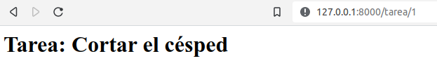

# Día 16 - Programa una aplicación web de tareas pendientes

## Índice
- [Día 16 - Programa una aplicación web de tareas pendientes](#día-16---programa-una-aplicación-web-de-tareas-pendientes)
  - [Índice](#índice)
  - [16.1. - Entornos Virtuales](#161---entornos-virtuales)
  - [16.2. - Módulos](#162---módulos)
  - [16.3. - Preparación de estructura de trabajo](#163---preparación-de-estructura-de-trabajo)
  - [16.4. - Configurar url](#164---configurar-url)
  - [16.5. - Crear tabla de tareas](#165---crear-tabla-de-tareas)
  - [16.6. - Configurar la vista](#166---configurar-la-vista)
  - [16.7. - Configurar la vista de Detalle](#167---configurar-la-vista-de-detalle)
  - [16.8. - Crear Links a Detalle](#168---crear-links-a-detalle)
  - [16.9. - Agregar nueva tarea](#169---agregar-nueva-tarea)
  - [16.10. - Formulario para nueva tarea](#1610---formulario-para-nueva-tarea)
  - [16.11. - Editar tarea](#1611---editar-tarea)
  - [16.12. - Eliminar tarea](#1612---eliminar-tarea)
  - [16.13. - Crear la lógica de Logueo / Deslogueo](#1613---crear-la-lógica-de-logueo--deslogueo)
  - [16.14. - Formulario de Logueo / Deslogueo](#1614---formulario-de-logueo--deslogueo)
  - [16.15. - Restringir acceso](#1615---restringir-acceso)
  - [16.16. - Información específica de usuario](#1616---información-específica-de-usuario)
  - [16.17. - Registrar nuevo usuario](#1617---registrar-nuevo-usuario)
  - [16.18. - Barra de búsquedas](#1618---barra-de-búsquedas)
  - [16.19. - Un estilo para todas las vistas](#1619---un-estilo-para-todas-las-vistas)
  - [16.20. - Estilo general](#1620---estilo-general)
  - [16.21. - Estilo de barra superiores](#1621---estilo-de-barra-superiores)
  - [16.22. - estilo de la lista](#1622---estilo-de-la-lista)
  - [16.23. - Estilo de la barra de cerca](#1623---estilo-de-la-barra-de-cerca)
  - [16.24. - Terminar el sitio](#1624---terminar-el-sitio)
  - [Ficheros y documentación](#ficheros-y-documentación)

## 16.1. - Entornos Virtuales

Un entorno virtual de Python es una herramienta que permite aislar y gestionar de forma independiente los paquetes y dependencias de un proyecto Python específico. Permite crear un entorno de desarrollo aislado donde se pueden instalar versiones específicas de bibliotecas y paquetes, sin interferir con otros proyectos de Python en el mismo sistema.


Cuando se trabaja en proyectos de Python, es común tener diferentes versiones de paquetes y dependencias para cada proyecto. Esto puede generar conflictos si se instalan globalmente en el sistema, ya que un proyecto podría depender de una versión específica de una biblioteca, mientras que otro proyecto puede requerir una versión diferente.

Al utilizar un entorno virtual, se crea un directorio separado con su propia instalación de Python y su propio espacio de trabajo aislado. Dentro de este entorno, se pueden instalar los paquetes y dependencias necesarios para el proyecto sin afectar el sistema global.

Existen varias herramientas populares para crear y gestionar entornos virtuales en Python, como virtualenv, venv (incorporado en Python 3.3 y versiones posteriores) y conda (utilizado con el gestor de paquetes Anaconda).
Al activar un entorno virtual, se configuran las variables de entorno y se modifica el PATH para que el sistema utilice la instalación y las bibliotecas específicas del entorno virtual. Esto asegura que el proyecto utilice las versiones correctas de las bibliotecas y evita conflictos con otras instalaciones globales.

En resumen, un entorno virtual de Python es una herramienta que permite crear un espacio de trabajo aislado con su propia instalación de Python y bibliotecas. Se utiliza para gestionar y mantener las dependencias de un proyecto específico, evitando conflictos con otras instalaciones y versiones globales de paquetes. Esto facilita el desarrollo y la colaboración en proyectos de Python al garantizar la consistencia en las dependencias utilizadas.
Instalación de virtualenv:

```shell
pip install virtualenv
```
`pip freeze` es un comando utilizado en Python para generar una lista de todas las bibliotecas instaladas y sus versiones en un entorno virtual.
Ahora se hace una estructura de carpetas para diferenciar entornos


En el proyecto1 ejecutamos el comando:
```shell
virtualenv p1
```

Creará la estructura de un entorno


Para activar el entorno se hace con el comando:
```shell
source p1/bin/activate
```

Aparecerá el nombre del entorno en el prompt


Para desactivar:
```shell
deactivate
```

Cuando este el entorno virtual activado, si probamos el comando «pip freeze» veremos que no tenemos ningún módulo instalado en el entorno virtual.

Para instalar una versión distinta, que no sea la última, podemos escogerla con doble igual. Por ejemplo:
```shell
pip install pyjokes==0.4.0
```

Ahora si lo instalamos en el proyecto2 tendremos dos versiones distintas en cada uno de los entornos.


## 16.2. - Módulos

- **asgiref** es un paquete de referencia para la especificación ASGI (Asynchronous Server Gateway Interface), que es una interfaz estándar para servidores web y aplicaciones web en Python. Proporciona una serie de utilidades y adaptadores para facilitar el desarrollo de aplicaciones web asíncronas con soporte para ASGI.  *Documentación oficial*: https://asgiref.readthedocs.io/ 
- **Django** es un framework de desarrollo web de alto nivel y de código abierto, escrito en Python. Proporciona una estructura sólida y un conjunto de herramientas para simplificar el desarrollo de aplicaciones web complejas y escalables. Django se basa en el patrón de diseño MVC (Modelo-Vista-Controlador) y ofrece características como ORM (Object-Relational Mapping), enrutamiento de URLs, autenticación de usuarios, generación de formularios, administración de bases de datos y mucho más.  *Documentación oficial*: https://docs.djangoproject.com/  *Tutorial de mozilla*: https://developer.mozilla.org/es/docs/Learn/Server-side/Django/Introduction 
- **sqlparse** es un analizador y formateador de SQL para Python. Permite analizar consultas SQL y dividirlas en componentes lógicos como palabras clave, identificadores, literales, etc. Además, puede formatear consultas SQL para mejorar su legibilidad al agregar sangría y espacios en blanco adecuados. sqlparse es útil para tareas como resaltar la sintaxis SQL en aplicaciones, depurar consultas SQL y generar consultas SQL legibles.  *Documentación oficial*: https://sqlparse.readthedocs.io/ 
- **tzdata** es un módulo de Python que proporciona información sobre zonas horarias. Contiene una base de datos actualizada con información sobre zonas horarias de todo el mundo, como nombres de zonas horarias, desplazamientos de tiempo, reglas de horario de verano, entre otros. Este módulo es útil para trabajar con conversiones de tiempo y fechas en diferentes zonas horarias. Sin embargo, ten en cuenta que tzdata se utiliza principalmente como dependencia interna y es posible que no encuentres documentación específica para este módulo en sí.

## 16.3. - Preparación de estructura de trabajo

Creamos una carpeta que se llame mi_web y dentro de ella creamos el entorno virtual de la web:
```shell
virtualenv web
```

Debemos instalar django en el entorno virtual.
```shell
Pip install django
```


Se instalan 3 módulos, pero también instalamos tzdata.
```shell
pip install tzdata
```

Ahora creamos una carpeta que hará de fuente, que tradicionalmente es src


Dentro de la carpeta src iniciamos el proyecto django con:
```shell
django-admin startproject proyecto1
```


En «manage.py» se administra todo del proyecto.

Ahora iniciamos desde la carpeta proyecto el servidor para correr la web dentro:
```shell
python manage.py runserver
```

Indica que tenemos 18 migración sin aplicar


También vemos el enlace donde podemos ver la web de django:


Antes de seguir, vamos a migrar los fichero pendientes con el comando:
```shell
python manage.py migrate
```

Y volvemos a ejecutar el servidor


Vemos que ya no tiene esos problemas de migración por aplicar.

En /admin tenemos la entrada del administrador.


Pero Django no tiene un nombre de usuario y contraseña por defecto establecidos. Cuando se crea un proyecto Django, se configura un archivo de configuración llamado "settings.py" donde se definen varias opciones, incluyendo la configuración de la base de datos.

En la configuración de la base de datos, se especifican las credenciales de acceso, como el nombre de usuario y la contraseña para acceder a la base de datos. Estas credenciales deben ser configuradas por el desarrollador según los requisitos del proyecto y la base de datos que se esté utilizando.

Por defecto, Django utiliza una base de datos SQLite, y en la configuración inicial de un proyecto, se establece un archivo de base de datos local. En este caso, no se requiere un nombre de usuario ni contraseña para acceder a la base de datos SQLite.

Sin embargo, es importante tener en cuenta que en un entorno de producción, es recomendable utilizar una base de datos más robusta como MySQL o PostgreSQL, y en esos casos, se deben configurar las credenciales de acceso correspondientes en la configuración de la base de datos de Django.

Para crear el superusuario lo hacemos con el comando:
```shell
python manage.py createsuperuser
```


Voy a dejar que el usuario sea el de mi pc, el correo electrónico lo dejo vacío y es password, que tiene que ser mínimo de 8 caracteres, pongo LaDeSiempre.

Después de ingresar la clave ya veo un escritorio estilo CMS.


## 16.4. - Configurar url

Creamos el fichero de la app donde estará el núcleo de nuestro código, su estructura, los ajustes principales, su lógica principal, etc. Iniciamos la app con el nombre base:
```shell
python manage.py startapp base
```

Esto creará otra estructura de carpetas


Para conectar "base" con "proyecto" vamos a ir al fichero proyecto/settings.py y en INSTALLED_APPS añadimos la línea para que conecte con la clase dentro de apps.py:
```python
'base.apps.BaseConfig',
```


Ahora creamos el fichero urls.py en base e importamos las librerias necesarias y creamos una lista de urls:
```python
from django.urls import path
from . import views
urlpatterns = []
```

Y en base/views.py añadimos esta línea:
```python
from django.http import HttpResponse
```

Además creamos nuestra primera vista:
```python
def lista_pendientes(pedido):
  return HttpResponse('Lista de pendientes')
```

Con lo que en la lista de urls de base/urls.py debemos añadirla:
```python
urlpatterns = [
  path('', views.lista_pendientes, name='pendientes')
]
```

Pero para que el proyecto conozca esta url debemos añadir en proyecto/urls.py la función include:
```python
from django.urls import path, include
```

Además de ioncluir el path en urlpatterns.
```python
Urlpatterns = [
  path('admin/', admin.site.urls),
  path('', include('base.urls')),
]
```

Ahora, en la misma url de django veremos el texto que incluimos en la vista:


## 16.5. - Crear tabla de tareas

Necesitamos que la base de datos almacena las tareas creadas por el usuario.

En Django, la base de datos por defecto que viene integrada se llama SQLite. SQLite es una base de datos ligera y de fácil configuración que se almacena en un archivo local en lugar de ejecutarse en un servidor separado. Esto hace que sea conveniente para el desarrollo y pruebas, ya que no requiere una configuración adicional del servidor de base de datos.

Al trabajar con Django, la configuración de la base de datos se especifica en el archivo settings.py de tu proyecto. Dentro de este archivo, encontrarás una sección llamada DATABASES que contiene la configuración de la base de datos por defecto. Para SQLite, la configuración típica se ve así:
```python
DATABASES = {
  'default': {
    'ENGINE': 'django.db.backends.sqlite3',
    'NAME': BASE_DIR / 'db.sqlite3',
  }
}
```
En este ejemplo, `'ENGINE'`: 'django.db.backends.sqlite3' indica que se utilizará el motor de base de datos **SQLite**, y '`NAME': BASE_DIR / 'db.sqlite3'` especifica la ruta del archivo de base de datos, que se ubicará en el directorio del proyecto.

Es importante tener en cuenta que SQLite es adecuada para proyectos más pequeños o de desarrollo, pero para aplicaciones en producción con requisitos de alto rendimiento o concurrencia, es posible que desees considerar otras bases de datos como PostgreSQL, MySQL o Oracle, entre otras. En esos casos, deberás actualizar la configuración de la base de datos en el archivo settings.py para utilizar el motor y los detalles de conexión correspondientes a la base de datos que elijas.
Documentación bbdd django: https://docs.djangoproject.com/en/3.2/topics/db/

Para crear las tablas debemos hacerlo en base/models.py creando una clase que represente cada tabla. Sus atributos serán las columnas o los campos. 
- En **usuario** especificamos el usuario en concreto mediante un módulo de django que tenemos que importar. Con una relación de 1:n. La función ForeignKey es una clave externa con la que podremos asociar usuarios que se repitan. La función responderá a:
  - **User** que es la biblioteca anterior
  - Definimos un atributo **on_delete** para cuando se elimine un usuario se elimine en cascada sus tareas.
  - **null y blank** en True para poder dejar este campo en blanco
  - En **titulo** haremos que responda a **CharField** que es el campo de caracteres donde ajustamos el valos máximo de carácteres con max_length
- En **descripción** haremos que responda a **TextField** que es parecido al campo de caracteres anterior però tiene algunos atributos extra que no tiene el anterior. Lo único que indicamos es que puede quedar vacío el campo.
- En **completo** vamos a añadir la función **BooleanField** de campo booleano que por defecto este False.
- En **creado** le vamos a indicar el momento en el que se creó la tarea con la función **DateTimeField** y con los atributos le indicamos que se autoconfigure con la fecha now

Ahora vamos a definir un valor STR que es el que nos va a reflejar como valor string si pedimos que imprima una tarea. Será el contenido de titulo.

Además le indicamos en Meta como se va a ordenar las tareas dentro de la tabla, que será por completo.

El documento queda así:
```python
from django.db import models
from django.contrib.auth.models import User
# Create your models here.
class Tarea(models.Model):

    usuario = models.ForeignKey(
        User,
        on_delete=models.CASCADE,
        null=True,
        blank=True
    )

    titulo = models.CharField(max_length=200)
    descripcion = models.TextField(
        null=True,
        blank=True
    )

    completo = models.BooleanField(default=False)

    creado = models.DateTimeField(auto_now_add=True)

    def __str__(self):
        return self.titulo

    class Meta:
        ordering = ['completo']
```

Pero ahora tenemos que migrar la tabla en la terminal, primero creando el fichero con:
```shell
python manage.py makemigrations
```

Esto creará una carpeta migrations en base. Dentro tendrá un fichero 0001_initial.py donde indica que esta preparado para migrar. Con el siguiente comando hacemos efectiva la migración:
```shell
python manage.py migrate
```


Ahora tenemos que registrar el modelo en base/admin.py . Tenemos que importar la función Tarea y añadir la tabla:
```shell
from django.contrib import admin
from .models import Tarea

# Register your models here.
admin.site.register(Tarea)
```

Con lo cual, si vamos a la url de nuestro sitio a /admin veremos que tenemos un nuevo campo de Tareas:


Si añadimos una nueva tarea veremos que nos permite añadir los campos que indicamos a nuestra tabla:


He añadido tres tareas para las pruebas.

## 16.6. - Configurar la vista

Después de la prueba anterior vamos a traer una lista de objetos dinámica desde el fichero `base/views.py`. Importamos ListView:
```python
from django.views.generic.list import ListView
```

Creamos una clase que recoja la función. Para funcionar requiere de un módelo (lista de objetos completa) y un query set que haga la consulta filtrada de objetos. Pero tendremos que importar la Tarea de models:
```python
from .models import Tarea
```

La clase queda así:
```python
class ListaPendientes(ListView):
  model = Tarea
```

Por ahora, el documento base/views.py lo tenemos así:
```python
from django.shortcuts import render
from django.views.generic.list import ListView
from .models import Tarea

# Create your views here.

class ListaPendientes(ListView):
  model = Tarea
```

Vamos a `base/urls.py` donde tendremos que indicar que importar la ListaPendientes:
```python
from .views import ListaPendientes
```
También tenemos que cambiar el path añadiendo la ListaPendientes e indicando que lo lea como vista. El documento queda así:
```python
from django.urls import path
from .views import ListaPendientes

urlpatterns = [
    path('', ListaPendientes.as_view(), name='pendientes')
]
```

Ya hemos conectado la url a nuestra vista pero aun no hemos dicho como debe mostrarlo. Por eso, si entramos en la url nos da un error que nos indica que no existe el template, etc


Entonces, para indicar las plantillas tenemos que ir a proyecto/settings.py e indicar el path de donde coger las plantillas en DIRS. El fragmento de código entero es el siguiente:
```python
TEMPLATES = [
    {
        'BACKEND': 'django.template.backends.django.DjangoTemplates',
        'DIRS': ['../base/templates'],
        'APP_DIRS': True,
        'OPTIONS': {
            'context_processors': [
                'django.template.context_processors.debug',
                'django.template.context_processors.request',
                'django.contrib.auth.context_processors.auth',
                'django.contrib.messages.context_processors.messages',
            ],
        },
    },
]
```

Vamos a crear la plantilla que nos dice, pero en una carpeta dentro de base que le llamaremos templates, y dentro con otro directorio que se llame base. Dentro crearemos el html que nos pide.


En este fichero vamos a añadir el texto html que queramos.
```html
<h1>Lista de pendientes</h1>
<table>
    <tr>
        <th>Elementos</th>
    </tr>
    
    <tr>
        <td>{{ tarea.titulo }}</td>
    </tr>
    
    <h3>No hay elementos en esta lista</h3>
    
</table>
```

Entonces, ya veremos nuestra lista en la url:


Para personalizar el object_list y que sea más legible, vamos a views y añadimos esta línea a la clase ListaPendientes:
```python
context_object_name = 'tareas'
```

Ya lo podemos cambiar por tareas.

## 16.7. - Configurar la vista de Detalle

En base/views vamos a importar la función para los detalles y crearemos una clase más. Quedando el fichero así:
```python
from django.shortcuts import render
from django.views.generic.list import ListView
from django.views.generic.detail import DetailView
from .models import Tarea

# Create your views here.

class ListaPendientes(ListView):
    model = Tarea
    context_object_name = 'tareas'

class DetalleTarea(DetailView):
    model = Tarea
```

Y necesitaremos crear otro fichero html como plantilla. Por defecto será tarea_detail.html, pero luego podemos ver como cambiar el nombre. Tendremos que incluir en base/urls.py el import y el path de la tarea, quedando el documento así:
```python
from django.urls import path
from .views import ListaPendientes, DetalleTarea

urlpatterns = [
    path('', ListaPendientes.as_view(), name='pendientes'),
    path('tarea/<int:pk>', DetalleTarea.as_view(), name='tarea')
]
```

En el nombre del path se ha incluido `<int:pk>` que es el número intenger de la Primary Key.

En el html creado añadimos lo siguiente:
```html
<h1>Tarea: {{object}} </h1>
```

Esto hará que tenga el nombre de la tarea en cada url con un número de primary key válido:




Ahora podemos personalizar el object en base/views.py añadiendo a nuestra clase  context_object_name con tarea y cambiando la palabra object por tarea del html.
Ahora vamos a personalizar el nombre del html de tarea_details.html por tarea.html y lo vamos a incluir en base/views.py, en la clase DetalleTarea, el template_name con la ubicación 'base/tarea.html'.

## 16.8. - Crear Links a Detalle

Simplemente, en la página de tarea_list.html incluimos el encabezado vacío de una nueva columna de la tabla:
```html
<th></th>
```

E incluimos dentro del loop for una nueva columna con el texto Ver que contenga la lógica de la página, con el nombre tarea y el id de tarea:
```html
<td><a href="">Ver</a></td>
```

Quedando así el html:
```html
<h1>Lista de pendientes</h1>
<table>
    <tr>
        <th>Elementos</th>
        <th></th>
    </tr>
    
    <tr>
        <td>{{ tarea.titulo }}</td>
        <td><a href="">Ver</a></td>
    </tr>
    
    <h3>No hay elementos en esta lista</h3>
    
</table>
```

Y así la vista en el navegador:


## 16.9. - Agregar nueva tarea

Seguimos editando base/views.ppy y base/urls.py. En views.py importamos una clase más:
```python
from django.views.generic.detail import DetailView
```

Creamos la clase CreaTarea que tendrá una lógica un poco más compleja porque el sistema que recoja un pedido que creará un nuevo elemento que se incluirá en la lista. Esta clase tomará un formulario por defecto de models.py basados en los campos que incluimos.

Se puede incluir en la clase una lista con todos los elementos que queremos en el formulario:
```python
fields= ['titulo', 'descripcion', 'completo', 'creado']
```

Pero en este caso queremos todos los campos, así que utilizaremos 
```python
fields= '__all__'
```
Y para asegurarnos que cuando se envíe el formulario con éxito el usuario vaya a otra página distinta tenemos que importar otra herramienta:
```python
from django.urls import reverse_lazy
```

reverse_lazy se ocupa de redirigir la página cuando encuentre el evento que se le indique. Cargamos la url donde se redirige con success_url
```python
success_url = reverse_lazy('tareas')
```

De nuevo, tendremos que añadir la nueva página en el fichero urls.py, importando la clase y añadiendo el path. Quedando el documento así:
```python
from django.urls import path
from .views import ListaPendientes, DetalleTarea, CrearTarea

urlpatterns = [
    path('', ListaPendientes.as_view(), name='pendientes'),
    path('tarea/<int:pk>', DetalleTarea.as_view(), name='tarea'),
    path('crear-tarea/', CrearTarea.as_view(), name='crear-tarea')
]
```

Ahora necesitaremos un nuevo fichero html en templates que le llamaremos tarea_form.html que es el nombre por defecto. Para las pruebas tan solo ponemos un título:
```html
<h1>Formulario de tareas</h1>
```

Y por último, para que la página principal tenga un enlace que redirija a la página nueva, tendremos que editar tareas_list.html añadiendo este fragmento de código html:
```html
<a href="">Crear nueva tarea</a>
```

Ahora ya podemos ver el enlace que nos lleva a la nueva página creada:


## 16.10. - Formulario para nueva tarea

## 16.11. - Editar tarea

## 16.12. - Eliminar tarea

## 16.13. - Crear la lógica de Logueo / Deslogueo

## 16.14. - Formulario de Logueo / Deslogueo

## 16.15. - Restringir acceso

## 16.16. - Información específica de usuario

## 16.17. - Registrar nuevo usuario

## 16.18. - Barra de búsquedas

## 16.19. - Un estilo para todas las vistas

## 16.20. - Estilo general

## 16.21. - Estilo de barra superiores

## 16.22. - estilo de la lista

## 16.23. - Estilo de la barra de cerca

## 16.24. - Terminar el sitio

## Ficheros y documentación
- [mi_web](mi_web/)
- [web_Python_Total](web_Python_Total/)

[Documentación del día](../doc_curso/16_aplicacion_web/)

---

Enlaces a todos los días: [dia 1 - creador de nombres](../dia_01/README.md) / [dia 2 - calculador de comisiones](../dia_02/README.md) / [dia 3 - analizador de texto](../dia_03/README.md) / [dia 4 - juego "adivina el número"](../dia_04/README.md) / [dia 5 - juego "El ahorcado"](../dia_05/README.md) / [dia 6 - recetario](../dia_06/README.md) / [dia 7 - cuenta bancaria](../dia_07/README.md) / [dia 8 - consola de turnos](../dia_08/README.md) / [dia 9 - buscador de números de serie](../dia_09/README.md) / [dia 10 - juego "Invasión espacial"](../dia_10/README.md) / [dia 11 - web scraping](../dia_11/README.md) / [dia 12 - gestor de restaurantes](../dia_12/README.md) / [dia 13 - asistente de voz](../dia_13/README.md) / [dia 14 - controlador de asistencia](../dia_14/README.md) / [dia 15 - machine learning](../dia_15/README.md) / [dia 16 - aplicación web de tareas pendientes](../dia_16/README.md)

