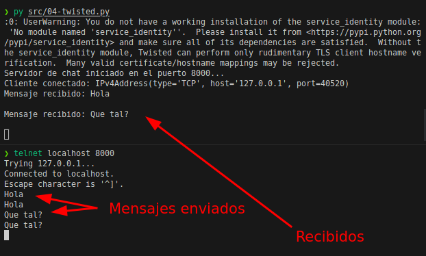

# Ejercicios con bibliotecas para hacking ético

Estos ejercicios se han creado directamente usando Inteligencias Artificales.


Índice:
- [Bibliotecas](#bibliotecas)
- [Ejercicios propuestos por copilot](#ejercicios-propuestos-por-copilot)
- [Ejercicio propuesto por chatGPT](#ejercicio-propuesto-por-chatgpt)


## Bibliotecas

Bibliotecas útiles para la manipulación de paquetes de red, la programación de red asincrónica, la generación de datos falsos, la criptografía, la creación de exploits y pruebas de penetración, etc
- **Python-nmap**: es una biblioteca de Python que se utiliza para interactuar con el escáner de puertos nmap. Proporciona una interfaz de Python para nmap y permite a los usuarios realizar escaneos de red, descubrir hosts y puertos abiertos, y obtener información detallada sobre los sistemas y servicios de red. *Documentación*: https://pypi.org/project/python-nmap/
- **IMPacket**: es una biblioteca de Python para la manipulación de paquetes de red. Proporciona una amplia gama de herramientas para la creación, manipulación y envío de paquetes de red, y es muy útil en aplicaciones de pruebas de penetración y seguridad de red. *Documentación*: https://pypi.org/project/impacket/
- **Requests**: es una biblioteca de Python para hacer solicitudes HTTP. Proporciona una interfaz fácil de usar para realizar solicitudes HTTP, como GET y POST, y permite a los usuarios interactuar con servidores web y API. *Documentación*: https://docs.python-requests.org/en/latest/
- **Twisted**: es una biblioteca de Python para programación de red asincrónica. Proporciona una amplia gama de herramientas para crear servidores y clientes de red asincrónicos, y es muy útil en aplicaciones de comunicación de red en tiempo real, como chat y videoconferencia. *Documentación*: https://twistedmatrix.com/documents/current/
- **Faker**: es una biblioteca de Python para generar datos falsos. Proporciona una amplia gama de herramientas para generar nombres, direcciones, números de teléfono y otra información falsa, y es muy útil en aplicaciones de pruebas y simulaciones de datos. *Documentación*: https://faker.readthedocs.io/en/master/
- **Scapy**: es una biblioteca de Python para la manipulación de paquetes de red. Proporciona una amplia gama de herramientas para la creación, manipulación y análisis de paquetes de red, y es muy útil en aplicaciones de pruebas de penetración y seguridad de red. *Documentación*: https://scapy.readthedocs.io/en/latest/
- **Cryptography**: es una biblioteca de Python para la criptografía. Proporciona una amplia gama de herramientas para la encriptación y desencriptación de datos, y es muy útil en aplicaciones de seguridad y protección de datos. *Documentación*: https://cryptography.io/en/latest/
- **Pwntools**: es una biblioteca de Python para la creación de exploits y pruebas de penetración. Proporciona una amplia gama de herramientas para la creación y ejecución de exploits, así como para la manipulación de memoria y otros aspectos de la seguridad informática. *Documentación*: https://docs.pwntools.com/
- **Paramiko**: es una biblioteca de Python para la conexión y el manejo de servidores SSH. Proporciona una interfaz fácil de usar para la conexión y la gestión de servidores SSH, y es muy útil en aplicaciones de automatización y administración de servidores. *Documentación*: http://docs.paramiko.org/en/latest/
- **Pylibnet**: es una biblioteca de Python para la creación y manipulación de paquetes de red. Proporciona una amplia gama de herramientas para la creación y manipulación de paquetes de red personalizados, y es muy útil en aplicaciones de pruebas de penetración y seguridad de red. *Documentación*: https://pypi.org/project/pylibnet/

Ten en cuenta que este ejercicio es solo una simulación y no debe utilizarse para actividades ilegales o no éticas. La seguridad y la integridad de los sistemas informáticos deben ser siempre respetadas.

## Ejercicios propuestos por copilot

- **Ejercicio 1**: instalar la biblioteca de Python `python-nmap` y realizar un escaneo de puertos a la dirección IP `192.168.1.1`
- **Ejercicio 2**: instalar la biblioteca de Python `impacket` y realizar un escaneo de puertos a la dirección IP `192.168.1.1`
- **Ejercicio 3**: instalar la biblioteca de Python `requests` y realizar una solicitud HTTP a la dirección URL `proof.local`
- **Ejercicio 4**: instalar la biblioteca de Python `twisted` y crear un servidor de chat que permita a los usuarios enviar mensajes a todos los demás usuarios conectados
- **Ejercicio 5**: instalar la biblioteca de Python `faker` y generar 10 nombres aleatorios
- **Ejercicio 6**: instalar la biblioteca de Python `scapy` y crear un paquete de red personalizado que contenga un mensaje de texto
- **Ejercicio 7**: instalar la biblioteca de Python `cryptography` y encriptar el mensaje ``
- **Ejercicio 8**: instalar la biblioteca de Python `pwntools` y crear un exploit que permita a un usuario ejecutar comandos en un servidor remoto
- **Ejercicio 9**: instalar la biblioteca de Python `paramiko` y crear un cliente SSH que permita a un usuario ejecutar comandos en un servidor remoto
- **Ejercicio 10**: instalar la biblioteca de Python `pylibnet` y crear un paquete de red personalizado que contenga un mensaje de texto

---

### Soluciones según chatGPT:
#### Solución ejercicio 1:

En este ejercicio, utilizamos la biblioteca python-nmap para realizar un escaneo de puertos a una dirección IP específica. Creamos un objeto de PortScanner, luego llamamos al método scan para escanear los puertos en la dirección IP especificada. Finalmente, iteramos sobre los resultados del escaneo para imprimir el estado de cada puerto. 

Antes de nada se debe instalar la dependencia:
```shell
pip install python-nmap
```

```python
import nmap

# Crear un objeto de escáner de puertos
scanner = nmap.PortScanner()

# Escanear los puertos en la dirección IP
result = scanner.scan('192.168.1.1', '1-1000')

# Imprimir los resultados del escaneo
for port in result['scan']['192.168.1.1']['tcp']:
    state = result['scan']['192.168.1.1']['tcp'][port]['state']
    print(f"Puerto {port} está {state}")
```

#### Solución ejercicio 2:

En este ejercicio, utilizamos la biblioteca impacket para realizar un escaneo de puertos utilizando el protocolo SMB (Server Message Block). Creamos un objeto de SMB cliente y nos conectamos al servidor SMB en la dirección IP especificada. Luego, llamamos al método scan_ports para escanear los puertos. Finalmente, iteramos sobre los puertos encontrados e imprimimos los puertos abiertos.

Antes de nada se debe instalar la dependencia:
```shell
pip install impacket
```

```python
from impacket import smb

# Crear un objeto de cliente SMB
client = smb.SMB('*SMBSERVER', '192.168.1.1')

# Conectarse al servidor SMB
client.connect()

# Escanear los puertos
ports = client.scan_ports()

# Imprimir los puertos abiertos
for port in ports:
    print(f"Puerto {port} está abierto")
```

#### Solución ejercicio 3:

En este ejercicio, utilizamos la biblioteca requests para realizar una solicitud HTTP GET a una URL específica. Utilizamos la función get de requests pasando la URL como argumento. La respuesta se almacena en la variable response, y podemos acceder al código de estado utilizando response.status_code y al contenido de la respuesta utilizando response.text. Finalmente, imprimimos el código de estado y el contenido de la respuesta.

```python
import requests

# Realizar una solicitud GET a la URL
response = requests.get('http://proof.local')

# Imprimir el código de estado y el contenido de la respuesta
print(f"Código de estado: {response.status_code}")
print(f"Contenido de la respuesta: {response.text}")
```

#### Solución ejercicio 4:

En este ejercicio, utilizamos la biblioteca twisted para crear un servidor de chat básico. Creamos una clase ChatServer que hereda de protocol.Protocol, y en ella mantenemos una lista de todas las conexiones de cliente. Cuando un cliente se conecta, lo agregamos a la lista de conexiones y cuando un cliente se desconecta, lo eliminamos de la lista. Cuando se recibe un mensaje de un cliente, lo imprimimos y luego lo enviamos a todos los otros clientes conectados.

La clase ChatServerFactory hereda de protocol.Factory y se utiliza para construir instancias de ChatServer cuando se establece una nueva conexión. Luego, utilizamos reactor.listenTCP para iniciar el servidor en el puerto 8000.

Antes de nada se debe instalar la dependencia:
```shell
pip install twisted
```


```python
from twisted.internet import protocol, reactor

class ChatServer(protocol.Protocol):
    connections = []

    def connectionMade(self):
        print("Cliente conectado:", self.transport.getPeer())
        self.connections.append(self)

    def connectionLost(self, reason):
        print("Cliente desconectado:", self.transport.getPeer())
        self.connections.remove(self)

    def dataReceived(self, data):
        message = data.decode()
        print("Mensaje recibido:", message)

        # Enviar el mensaje a todos los clientes conectados
        for client in self.connections:
            client.transport.write(data)

class ChatServerFactory(protocol.Factory):
    def buildProtocol(self, addr):
        return ChatServer()

# Iniciar el servidor de chat
if __name__ == '__main__':
    reactor.listenTCP(8000, ChatServerFactory())
    print("Servidor de chat iniciado en el puerto 8000...")
    reactor.run()
```

Una vez que el servidor de chat se haya iniciado correctamente, deberías ver el mensaje "Servidor de chat iniciado en el puerto 8000...".

Una vez se ejecute, el servidor de chat quedará esperando conexiones de clientes en el puerto 8000. 


Puedes conectar clientes al servidor utilizando aplicaciones o bibliotecas que admitan el protocolo de chat utilizado por este servidor. Por ejemplo, puedes usar Telnet en la línea de comandos para conectarte al servidor de chat:

```shell
telnet localhost 8000
```



#### Solución ejercicio 5:

En este ejercicio, utilizamos la biblioteca faker para generar nombres aleatorios. Creamos un objeto de Faker y luego utilizamos el método name para generar nombres aleatorios. Utilizamos un bucle for para generar y mostrar 10 nombres aleatorios.

Antes de nada se debe instalar la dependencia:
```shell
pip install twisted
```

```python
from faker import Faker

# Crear un objeto de Faker
fake = Faker()

# Generar 10 nombres aleatorios
for _ in range(10):
    name = fake.name()
    print(name)
```

#### Solución ejercicio 6:

En este ejercicio, utilizamos la biblioteca scapy para crear un paquete de red personalizado. Creamos un paquete IP utilizando la función IP de scapy.all y especificamos la dirección IP de destino como "192.168.1.1". Añadimos una capa ICMP al paquete utilizando ICMP(). Luego, asignamos el mensaje de texto "Hola, este es un mensaje" al cuerpo del paquete.

Finalmente, utilizamos la función send de scapy.all para enviar el paquete a la red.

```python
from scapy.all import *

# Crear un paquete IP con un mensaje de texto
packet = IP(dst="192.168.1.1")/ICMP()/"Hola, este es un mensaje"

# Enviar el paquete
send(packet)
```

#### Solución ejercicio 7:

En este ejercicio, utilizamos la biblioteca cryptography para encriptar un mensaje utilizando el algoritmo de cifrado Fernet. Generamos una clave de cifrado utilizando Fernet.generate_key(). Luego, creamos un objeto Fernet con la clave generada.

Definimos un mensaje en la variable message y utilizamos el método encrypt del objeto Fernet para encriptar el mensaje. El mensaje encriptado se almacena en la variable encrypted_message. Finalmente, imprimimos el mensaje encriptado.

```python
from cryptography.fernet import Fernet

# Generar una clave de cifrado
key = Fernet.generate_key()

# Crear un objeto Fernet con la clave generada
cipher = Fernet(key)

# Mensaje a encriptar
message = b"Hola, este es un mensaje"

# Encriptar el mensaje
encrypted_message = cipher.encrypt(message)

# Imprimir el mensaje encriptado
print(f"Mensaje encriptado: {encrypted_message}")
```

#### Solución ejercicio 8:

En este ejercicio, utilizamos la biblioteca pwntools para crear un exploit que se conecta a un servidor remoto y ejecuta comandos. Utilizamos la función remote para establecer la conexión con la dirección IP del servidor y el puerto especificado.

Enviamos comandos al servidor utilizando el método sendline de la conexión. En este ejemplo, enviamos los comandos "ls" y "whoami". Recibimos la salida del servidor utilizando el método recvall y la decodificamos en una cadena de texto.

Finalmente, cerramos la conexión SSH utilizando client.close().

```python
from pwn import *

# Conexión al servidor remoto
conn = remote('192.168.1.1', 1337)

# Envío de comandos al servidor
conn.sendline('ls')
conn.sendline('whoami')

# Recibir y mostrar la salida del servidor
output = conn.recvall().decode()
print(output)

# Cerrar la conexión
conn.close()
```

#### Solución ejercicio 9:

En este ejercicio, utilizamos la biblioteca paramiko para crear un cliente SSH que se conecta a un servidor remoto y ejecuta comandos. Creamos una instancia de SSHClient.

Luego, configuramos el cliente para aceptar automáticamente la clave del servidor utilizando set_missing_host_key_policy. A continuación, nos conectamos al servidor SSH utilizando connect, especificando la dirección IP, nombre de usuario y contraseña.

Utilizamos el método exec_command para ejecutar comandos en el servidor. En este ejemplo, ejecutamos el comando "ls". La salida se lee desde el objeto stdout y se almacena en la variable output.

Finalmente, cerramos la conexión SSH utilizando client.close().

```python
import paramiko

# Crear una instancia del cliente SSH
client = paramiko.SSHClient()

# Configurar el cliente para aceptar automáticamente la clave del servidor
client.set_missing_host_key_policy(paramiko.AutoAddPolicy())

# Conectar al servidor SSH
client.connect('192.168.1.1', username='usuario', password='contraseña')

# Ejecutar comandos en el servidor
stdin, stdout, stderr = client.exec_command('ls')
output = stdout.read().decode()
print(output)

# Cerrar la conexión SSH
client.close()

```

#### Solución ejercicio 10:

En este ejercicio, utilizamos la biblioteca pylibnet para crear un paquete de red personalizado. Primero, creamos un paquete Ethernet utilizando libnet_create_packet y especificamos el tipo de enlace como LINKTYPE_ETHERNET.

Luego, definimos la dirección MAC de origen y destino. El mensaje de texto se define en la variable message.

Utilizamos libnet_build_ethernet para construir el paquete Ethernet, especificando la dirección MAC de destino, la dirección MAC de origen, el tipo de protocolo (en este caso, ETHERTYPE_IP), el contenido del mensaje y su longitud.

Finalmente, utilizamos libnet_write para enviar el paquete a la red.

```python
from pylibnet import *

# Crear un paquete Ethernet
packet = libnet_create_packet(LINKTYPE_ETHERNET)

# Definir la dirección MAC de origen y destino
src_mac = "00:11:22:33:44:55"
dst_mac = "AA:BB:CC:DD:EE:FF"

# Definir el mensaje de texto
message = "Hola, este es un mensaje"

# Construir el paquete Ethernet
libnet_build_ethernet(
    dst=dst_mac,
    src=src_mac,
    type=ETHERTYPE_IP,
    payload=message,
    payload_s=len(message),
    packet=packet
)

# Enviar el paquete
libnet_write(packet)
```


## Ejercicio propuesto por chatGPT
El ejercicio consistirá en crear un script de pruebas de penetración que realice lo siguiente:

- Utilizar la biblioteca Faker para generar datos falsos de un usuario, como nombre, dirección, número de teléfono, etc.
- Utilizar la biblioteca Cryptography para encriptar los datos generados con un algoritmo de cifrado.
- Utilizar la biblioteca Pwntools para crear un exploit que explote una vulnerabilidad conocida en un programa o servicio específico. En este caso, utilizaremos una vulnerabilidad de desbordamiento de búfer en un servidor FTP ficticio.
- Utilizar la biblioteca IMPacket para manipular paquetes de red y enviar el exploit al servidor FTP.
- Utilizar la biblioteca Twisted para programar una conexión asincrónica al servidor FTP y recibir la respuesta.
- Utilizar la biblioteca Scapy para analizar la respuesta del servidor FTP y extraer información relevante.
- Utilizar la biblioteca Python-nmap para realizar un escaneo de puertos en un host específico.
- Utilizar la biblioteca Requests para enviar una solicitud HTTP a un servidor web y obtener información sobre el sistema operativo y el servidor web utilizado.
- Utilizar la biblioteca Paramiko para establecer una conexión SSH con un servidor remoto y ejecutar comandos en él.
- Utilizar la biblioteca Pylibnet para crear y enviar paquetes de red personalizados.


**Solución según chatGPT:**

```python
from faker import Faker
from cryptography.fernet import Fernet
from twisted.internet import reactor, protocol

# Generar datos falsos de usuarios con Faker
fake = Faker()

class MessageServer(protocol.Protocol):
    def connectionMade(self):
        print("Cliente conectado:", self.transport.getPeer())

    def dataReceived(self, data):
        # Desencriptar el mensaje recibido
        decrypted_message = decrypt_message(data)

        # Procesar el mensaje y enviar una respuesta al cliente
        response = process_message(decrypted_message)
        self.transport.write(encrypt_message(response))

    def connectionLost(self, reason):
        print("Cliente desconectado:", self.transport.getPeer())

def decrypt_message(message):
    # Desencriptar el mensaje utilizando la clave secreta
    cipher_suite = Fernet(b'secret_key')
    decrypted_message = cipher_suite.decrypt(message)
    return decrypted_message.decode()

def encrypt_message(message):
    # Encriptar el mensaje utilizando la clave secreta
    cipher_suite = Fernet(b'secret_key')
    encrypted_message = cipher_suite.encrypt(message.encode())
    return encrypted_message

def process_message(message):
    # Aquí puedes implementar la lógica para procesar el mensaje recibido
    # y generar una respuesta
    return "Respuesta al mensaje: " + message

def start_server():
    # Iniciar el servidor de mensajería
    factory = protocol.ServerFactory()
    factory.protocol = MessageServer
    reactor.listenTCP(8000, factory)
    print("Servidor de mensajería iniciado en el puerto 8000...")
    reactor.run()

def send_message(message):
    # Enviar un mensaje al servidor de mensajería
    client = protocol.ClientCreator(reactor, protocol.Protocol)
    client.connectTCP('localhost', 8000).addCallback(
        lambda p: p.transport.write(encrypt_message(message)))

# Ejemplo de uso
if __name__ == '__main__':
    start_server()

    # Simular el envío de un mensaje desde el cliente
    message = "Hola, este es un mensaje de prueba"
    send_message(message)

```

La clave secreta utilizada en el ejemplo (b'secret_key') no es segura y debería ser generada y manejada de manera adecuada en un escenario real.

Es importante mencionar que la implementación real de una aplicación de mensajería segura implicaría una planificación y desarrollo más profundos para garantizar la seguridad y la funcionalidad adecuada.

---

Enlaces a todos los días: [dia 1 - creador de nombres](../dia_01/README.md) / [dia 2 - calculador de comisiones](../dia_02/README.md) / [dia 3 - analizador de texto](../dia_03/README.md) / [dia 4 - juego "adivina el número"](../dia_04/README.md) / [dia 5 - juego "El ahorcado"](../dia_05/README.md) / [dia 6 - recetario](../dia_06/README.md) / [dia 7 - cuenta bancaria](../dia_07/README.md) / [dia 8 - consola de turnos](../dia_08/README.md) / [dia 9 - buscador de números de serie](../dia_09/README.md) / [dia 10 - juego "Invasión espacial"](../dia_10/README.md) / [dia 11 - web scraping](../dia_11/README.md) / [dia 12 - gestor de restaurantes](../dia_12/README.md) / [dia 13 - asistente de voz](../dia_13/README.md) / [dia 14 - controlador de asistencia](../dia_14/README.md) / [dia 15 - machine learning](../dia_15/README.md) / [dia 16 - aplicación web de tareas pendientes](../dia_16/README.md)
